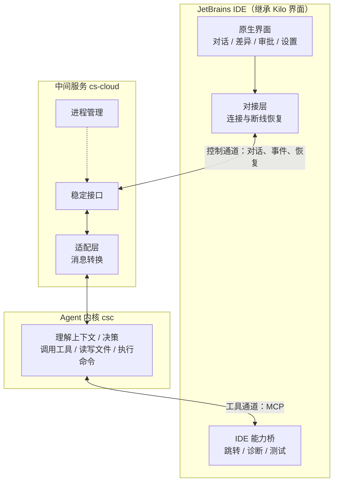
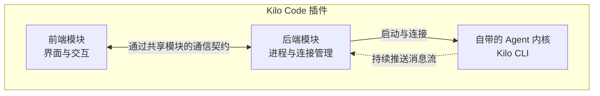

# JetBrains AI 编程插件 · 技术方案评审材料

> **定位：** 技术方向已定，本文聚焦三件事——Kilo Code 现状架构、改造目标架构、改造边界与关键技术事项。不含代码级细节。
> **前置结论（已定）：** 以 Kilo Code 插件为基础改造，采用 **JetBrains 原生 UI + cs-cloud + csc** 的三层技术方向。

---

## 一、方案总览

> **改造前：** Kilo 插件自带一个 Agent 内核（Kilo CLI），由插件直接驱动。
> **改造后：** 插件只做界面和 IDE 能力，Agent 内核换成自有的 csc，中间加一层稳定中间服务（cs-cloud）对接。

图中**两条通道**是关键（详见 3.3）：控制通道统一走中间服务，工具通道走 MCP。

---

## 二、Kilo Code 插件现状与复用价值

### 2.1 它是什么

Kilo Code 的 JetBrains 插件是一个**成熟的、完整的 AI 编程插件**：

- Kotlin + Swing 原生插件（IntelliJ 官方技术栈、非 WebView 套壳）；
- **具备一个 AI 插件所需的全部界面和交互**：侧边栏对话、流式文字显示、改动差异对比、权限确认、多会话、设置、远程开发支持；
- 代码量集中在界面层（**300 多个 Kotlin 文件**），并有大量真实 IDE 环境的测试。

**结论：它是我们改造的最优基础，而不是需要重写的半成品。**

### 2.2 它的内部结构：前后端分离的模块设计

Kilo 插件内部按**前后端分离**组织为三个模块，这是它最有价值的架构资产：

| 模块 | 职责 |
|---|---|
| 前端模块 | 界面与交互：工具窗口、编辑器标签、对话视图、差异视图、设置，以及"当前会话"的状态管理 |
| 共享模块 | 前后端通信契约（RPC）：接口定义与数据格式，不依赖界面和网络 |
| 后端模块 | 后端服务：启动 Agent 内核、建立连接、管理工作区与会话、把 Agent 内核返回的数据转换为界面可用的格式 |

**两个关键洞察：**

1. **"界面"和"Agent 内核"本来就是分开的**——前端只管界面，后端管 Agent 内核进程和连接，与目标三层结构天然吻合：界面原样继承，只需换后端"连哪个 Agent 内核"这一段。
2. **它已支持多会话、多工作区**——同一个后端可同时服务侧边栏和多个编辑器会话，不必每个界面各起一个 Agent 内核进程。

### 2.3 复用价值结论

| 复用对象 | 处理方式 |
|---|---|
| 全部界面、交互、状态管理（前端模块） | **直接继承** |
| 前后端通信骨架（共享模块 + 分离结构） | **直接继承** |
| 进程管理、异常退出、干净关闭样板 | **直接继承** |
| 后端模块里"连接自带 Agent 内核（Kilo CLI）"这一段 | **替换**为连接我们的中间服务 |

一句话：**要改的集中在一个点上——后端模块的连接层。**

---

## 三、改造后的目标架构

### 3.1 改造前后对照

| | 改造前（Kilo 原样） | 改造后（我们的目标） |
|---|---|---|
| 界面层 | Kilo 前端模块 | **继承，基本不动** |
| 通信骨架 | Kilo 共享模块 + RPC | **继承** |
| 对接层 | 后端模块直接连 Kilo CLI | 改为连接中间服务 cs-cloud |
| 中间服务 | 无 | **cs-cloud**：稳定接口、适配、断线恢复、Agent 内核进程管理 |
| Agent 内核 | Kilo CLI（第三方） | **csc（自有）**：理解上下文、决策、工具调用、读写文件、执行命令 |

### 3.2 三层职责与边界

| 层 | 角色 | 负责 | 明确不负责 |
|---|---|---|---|
| 插件（Kilo Fork） | 界面与 IDE 能力 | 界面、交互、设置；提供 IDE 能力（代码结构、报错、跑测试）给 Agent 内核使用 | 不碰 Agent 内核进程、不直接发模型请求 |
| 中间服务 cs-cloud | 连接与生命周期 | 向插件提供稳定接口；消息转换；断线恢复；启动/监控/关闭 Agent 内核进程 | 不做界面，不做 IDE 特有功能 |
| Agent 内核 csc | 会话执行与工具调用 | 理解上下文、调用工具、读写文件、执行命令、做权限决策 | 不碰界面、不碰 IDE 线程 |

**两条边界原则：**
1. 会话内容和 AI 执行状态，以**Agent 内核**为准；界面展示状态（展开/收起、滚动位置）只存在**插件**。两不越界。
2. 中间服务只做消息转发与格式转换，不做 IDE 功能；IDE 能力由插件以 MCP 提供。

### 3.3 两条通道（理解方案的关键）

**① 控制通道（对话、消息、事件、断线恢复）——统一走中间服务。**
插件的所有 AI 交互（发指令、收消息、审批、重连）都经中间服务，插件只认其稳定接口、不感知 Agent 内核内部细节。Agent 内核升级不影响插件。

**② 工具通道（Agent 内核要用 IDE 能力）——MCP，不经过中间服务。**
Agent 内核需要理解代码结构、跳转定义、查看编译报错、运行测试时，通过 **MCP** 直接调用插件提供的 IDE 能力。中间服务只做配置透传，不接触源码与测试输出。

**为什么要分两条：** 控制类通信需要统一管理和恢复能力；IDE 工具调用需要低延迟和标准协议。

### 3.4 进程与部署

- **默认形态：** 插件启动一个中间服务进程，中间服务再启动一个 Agent 内核进程，同机运行。插件关闭时逐级回收，不留孤儿进程。
- **多项目多会话：** 同一套进程可以服务多个项目和多个会话，但每个会话固定绑定自己的项目空间，互相隔离、不串扰。
- **远程开发模式：** 插件的后端、中间服务和 Agent 内核都在远程服务器运行，界面在本地，代码与进程不穿行本地网络。该能力继承自 Kilo 的分离结构，无需额外设计。

---

## 四、复用与改造清单（工作量分布）

| 类别 | 内容 | 工作量（人/天） | 优先级 |
|---|---|---|---|
| **小改** | 继承大部分界面与交互、前后端分离骨架、进程清理样板、测试设施；进行品牌替换（名称、图标、文档） | 2 | P2 |
| **小改** | 界面数据格式对接新的中间服务； | 3 | P0 |
| **重构** | 后端模块连接层：从"连 Kilo CLI"改为"连中间服务"；会话/工作区隔离：Kilo 的目录级隔离是复用基础，但需升级为规范的工作区标识、授权根目录集合、会话-工作区永久绑定 | 5 | P0 |
| **新增** | 中间服务的稳定性能力（断线恢复、防重复执行、版本协商）；IDE 能力桥；安全加固 | 2 | P1 |
| **替换/删除** | Kilo 的账号系统、云端同步、自带 Agent 内核下载逻辑 | 2 | P1 |
| **costrict服务** | 知识中心、review服务等等 | ？ | P1 |
| **风险时间** | - | 2 |  |
| **总计** | - | **16** |  |

**工作量判断：** 开发量集中在连接层重构、中间服务补强、IDE 能力桥三块，界面层基本不动。风险和工作量都在对接与稳定性。

---

## 五、关键技术事项

### 5.1 稳定对接（防止升级就坏）

插件、中间服务、Agent 内核三者各自独立演进。靠**固定版本组合**（校验 SHA-256）和**自动化对接测试**保证稳定：用真实数据样本做回归，任何一方升级都能立刻发现"消息对不上"，而不是上线后崩。这是整个方案稳定性的地基。

**只维护一条 Agent 内核对接协议（中间服务到 Agent 内核的适配层），不引入第二套 Agent 传输协议**，避免两套逻辑分叉。这是整个方案最重要的战略承诺。

### 5.2 断线恢复（不丢消息、不重复执行）

网络断、进程崩是常态。方案用**编号 + 快照**机制：消息带唯一序号，断线后先从服务端拉取完整快照，再补齐缺失部分，不丢也不重复。快照与事件回放由中间服务统一实现，插件后端负责缓冲和按序补齐，恢复策略不分散。

### 5.3 防重复执行（同一条指令只执行一次）

网络卡顿会导致同一条指令被发送两次。服务端用唯一标记识别，**同一条指令只执行一次**，重复请求直接返回第一次的结果，不会让 AI 重复跑、重复改文件。

### 5.4 IDE 能力桥

Agent 内核通过 MCP 调用插件的 IDE 能力，首批包括：查看报错、查找符号定义/引用、运行/测试。**运行测试、执行命令等危险操作强制先征求用户同意**，只读查询默认征求同意（可由产品策略配置）；权限最小化（只能碰当前项目），这是差异化价值与安全控制的核心。

### 5.5 安全边界

- 登录认证：进程间通信使用随机密钥，本机内部通信，不对外暴露；
- **生产红线：** 中间服务现有默认设置有两处安全隐患——默认密钥为空、默认允许读写任意路径。生产版本必须改为"密钥必填 + 仅授权目录"，未修正不得接入生产；
- 路径限制：Agent 内核只能读写被授权的项目目录，不能越界访问其他文件；
- 危险操作审批：执行命令、运行测试等一律先征求用户同意；
- 凭证保护：模型密钥等敏感信息使用 Agent 内核既有的安全存储，插件不复制。

### 5.6 许可证（已核实，无阻碍）

Kilo Code 是 MIT 开源协议，**可修改、可商用、可再分发**，但需保留 Kilo Code 与 opencode 的版权及完整许可文本。发布前对打包的三方依赖出完整清单做审查，作为合规门禁。

---

## 六、分阶段计划

| 阶段 | 做什么 | 可交付物 |
|---|---|---|
| 第 1 阶段 | 服务端基础：补齐中间服务的接口契约、恢复、防重复；搭好自动化测试 | 稳定性的地基，可在测试环境验证 |
| 第 2 阶段 | Fork Kilo 插件，完成连接层替换，能启动、能连上、能干净关闭 | 验证整条通道是通的 |
| 第 3 阶段 | 核心闭环：能对话、能改代码、能看差异、断线能恢复 | **第一个可用里程碑** |
| 第 4 阶段 | IDE 能力桥：读代码、看报错、跑测试 | 产品价值明显提升 |
| 第 5 阶段 | 稳定与发布：崩溃恢复、安全审计、全 IDE 兼容 | 可公开发布 |

---

## 七、主要风险与应对

| 风险 | 影响 | 应对 |
|---|---|---|
| Agent 内核升级导致消息格式对不上 | 界面显示异常、功能失效 | 固定版本 + 自动化对接测试（5.1），把对接层当长期产品维护 |
| 断线/崩溃后消息丢失、重复 | 体验差，甚至重复执行命令 | 编号 + 快照恢复机制（5.2） |
| 同一条指令被重复发送 | 命令/改文件被执行两次 | 服务端唯一标记防重复（5.3） |
| 上游开源更新难合并 | 长期维护成本 | 改动集中在后端连接层，减少大面积冲突 |
| AI 越权操作 | 安全事件 | 路径限制 + 危险操作审批 + 最小权限（5.5） |
| 许可证/三方依赖不合规 | 无法合法发布 | 已核实 MIT 可商用；发布前出依赖清单并审查 |

**风险判断：没有不可控的方向性风险。** 风险集中在"对接层稳定性"与"安全边界"，两者都可通过测试和规范把控，且已排进第 1、5 阶段。

---
