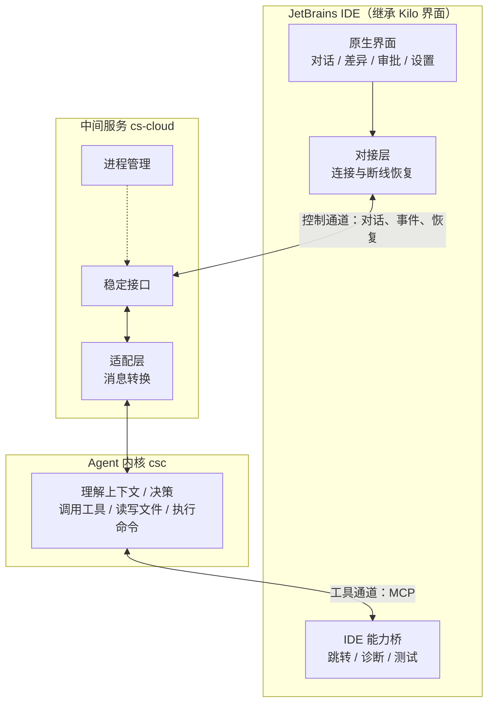
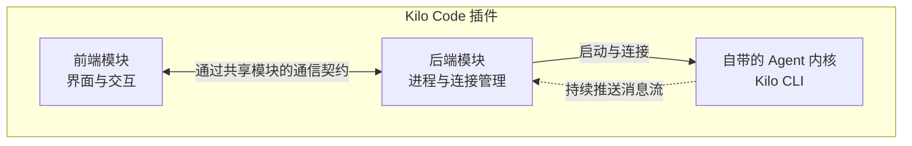

# JetBrains AI 编程插件 · 技术方案评审材料

> **定位：** 技术方向已定，本文聚焦三件事——Kilo Code 现状架构、改造目标架构、改造边界与关键技术事项。不含代码级细节。
> **前置结论（已定）：** 以 Kilo Code 插件为基础改造，采用 **JetBrains 原生 UI + cs-cloud + csc** 的三层技术方向。

---

## 一、方案总览

> **改造前：** Kilo 插件自带一个 Agent 内核（Kilo CLI），由插件直接驱动。
> **改造后：** 插件只做界面和 IDE 能力，Agent 内核换成自有的 csc，中间加一层稳定中间服务（cs-cloud）对接。

图中**两条通道**是关键（详见 3.3）：控制通道统一走中间服务，工具通道走 MCP。

---

## 二、Kilo Code 插件现状与复用价值

### 2.1 它是什么

Kilo Code 的 JetBrains 插件是一个**成熟度较高、核心交互完整的 AI 编程插件**：

- Kotlin + Swing 原生插件（IntelliJ 官方技术栈、非 WebView 套壳）；
- **覆盖 AI 编程插件的核心界面和交互**：侧边栏对话、流式文字显示、改动差异对比、权限确认、多会话、设置、远程开发支持；
- 当前仓库共有 **425 个生产 Kotlin 文件、254 个测试 Kotlin 文件**，代码量主要集中在前端模块，并有大量真实 IntelliJ Application/EDT 环境的测试。

**结论：它是高复用价值的改造基础，不需要重写核心 UI，但仍需改造与 Kilo CLI 语义绑定的产品和领域层。**

### 2.2 它的内部结构：前后端分离的模块设计

Kilo 插件内部按**前后端分离**组织为三个模块，这是它最有价值的架构资产：

| 模块 | 职责 |
|---|---|
| 前端模块 | 界面与交互：工具窗口、编辑器标签、对话视图、差异视图、设置，以及"当前会话"的状态管理 |
| 共享模块 | 前后端通信契约（RPC）：接口定义与数据格式，不依赖界面和网络 |
| 后端模块 | 后端服务：启动 Agent 内核、建立连接、管理工作区与会话、把 Agent 内核返回的数据转换为界面可用的格式 |

**两个关键洞察：**

1. **"界面"和"Agent 内核"本来就是分开的**——前端、共享契约和后端已有清晰模块边界，与目标三层结构吻合；但后端不仅负责连接，还包含会话、消息、工作区、配置、Provider、迁移以及 Kilo CLI DTO 映射，不能按单一连接点替换估算。
2. **它已支持多会话、多工作区**——同一个后端可同时服务侧边栏和多个编辑器会话，不必每个界面各起一个 Agent 内核进程。

### 2.3 复用价值结论

| 复用对象 | 处理方式 |
|---|---|
| 核心界面、交互和状态管理（前端模块） | **优先继承**；删除或调整 Kilo 账号、Provider、云会话和迁移等产品专属界面 |
| 前后端通信骨架（共享模块 + split RPC） | **继承结构**；按 cs-cloud 领域模型调整 DTO 和部分 RPC 契约 |
| 进程管理、异常退出、干净关闭样板 | **复用模式**；替换二进制下载、就绪协议、认证和诊断逻辑 |
| 后端 CLI 集成 | **重构**连接、会话、消息、工作区、配置和事件映射，使其只依赖 cs-cloud 稳定领域 API |

一句话：**改造以插件后端为主，但不是只换连接地址；应通过独立适配边界承接 cs-cloud，尽量保持前端 UI 和 split RPC 骨架稳定。**

---

## 三、改造后的目标架构

### 3.1 改造前后对照

| | 改造前（Kilo 原样） | 改造后（我们的目标） |
|---|---|---|
| 界面层 | Kilo 前端模块 | **复用核心 UI**，调整产品专属设置和领域语义 |
| 通信骨架 | Kilo 共享模块 + RPC | **继承 split-mode 结构**，必要时调整 DTO 和接口 |
| 对接层 | 后端模块直接连 Kilo CLI | 改为连接中间服务 cs-cloud |
| 中间服务 | 无 | **cs-cloud**：稳定接口、适配、断线恢复、Agent 内核进程管理 |
| Agent 内核 | Kilo CLI（第三方） | **csc（自有）**：理解上下文、决策、工具调用、读写文件、执行命令 |

### 3.2 三层职责与边界

| 层 | 角色 | 负责 | 明确不负责 |
|---|---|---|---|
| 插件（Kilo Fork） | 界面、IDE 能力与伴随进程入口 | 界面、交互、设置；插件 backend 启动和监控 cs-cloud；以 MCP 提供代码结构、报错、运行/测试能力 | 不直接管理 csc、不直接发模型请求、不解析 csc 私有协议 |
| 中间服务 cs-cloud | 连接与生命周期 | 向插件提供稳定接口；消息转换；断线恢复；启动/监控/关闭 Agent 内核进程 | 不做界面，不做 IDE 特有功能 |
| Agent 内核 csc | 会话执行与工具调用 | 理解上下文、调用工具、读写文件、执行命令、做权限决策 | 不碰界面、不碰 IDE 线程 |

**两条边界原则：**
1. 会话内容和 AI 执行状态，以**Agent 内核**为准；界面展示状态（展开/收起、滚动位置）只存在**插件**。两不越界。
2. 中间服务只做消息转发与格式转换，不做 IDE 功能；IDE 能力由插件以 MCP 提供。

### 3.3 两条通道（理解方案的关键）

**① 控制通道（对话、消息、事件、断线恢复）——统一走中间服务。**
插件的所有 AI 交互（发指令、收消息、审批、重连）都经中间服务，插件只认其稳定接口、不感知 Agent 内核内部细节。只要 cs-cloud 领域契约保持兼容，csc 升级的影响就应收敛在 cs-cloud 适配层；不兼容升级仍必须经过版本协商和自动化回归。

**② 工具通道（Agent 内核要用 IDE 能力）——MCP，不经过中间服务。**
Agent 内核需要理解代码结构、跳转定义、查看编译报错、运行测试时，由 **csc 作为 MCP 客户端直接调用 Plugin backend 提供的项目级能力桥**。中间服务只校验并透传会话级 MCP 配置，不代理调用、不接触源码与测试输出。

**为什么要分两条：** 控制类通信需要统一管理和恢复能力；IDE 工具调用需要低延迟和标准协议。

### 3.4 进程与部署

- **默认形态：** 每个 JetBrains backend process 启动一个 cs-cloud 伴随进程，cs-cloud 再启动一个 csc 进程。退出时按 Plugin backend → cs-cloud → csc 的顺序关闭并回收进程树。
- **多项目多会话：** 同一套进程可服务多个项目和会话，但这是目标能力，必须先实现规范工作区标识、授权根目录集合、会话与工作区不可变绑定，以及项目关闭后的能力撤销；当前 Kilo 的目录参数路由只能作为复用基础，不能直接等同于隔离保证。
- **远程开发模式：** frontend 在本地，Plugin backend、cs-cloud、csc 和源码在远端主机。源码文件和进程不落到本地，但对话、Diff、诊断等界面必需数据仍会通过 JetBrains split RPC 传给 frontend，因此需要继续遵守传输限量、脱敏和权限边界；该模式可复用 Kilo 的 split-mode 基础，但仍需验证 MCP listener、进程生命周期和重连流程。

### 3.5 上游同步与低合并成本

改造后的插件仍需持续吸收 Kilo Code 上游的功能、兼容性与缺陷修复。**能否低成本同步上游是目标架构的硬性约束，而不是发布后的维护优化项。**

- **保持上游结构稳定：** 不复制、搬迁或重命名上游前端、共享模块和通用后端代码；非必要不修改上游公共接口，避免形成大面积长期分叉。
- **自有能力边界化：** cs-cloud 客户端、事件映射、恢复逻辑和 IDE 能力桥放在 backend 内的独立包或自有目录；csc 私有协议适配只存在于 cs-cloud。上游代码只保留少量、稳定且有测试覆盖的接入点。
- **差异配置化：** 品牌、功能开关、服务地址和打包差异优先通过明确的构建配置、命名资源和依赖注入实现，避免依赖同名资源覆盖，也避免把产品差异散落在上游业务代码中。
- **建立同步基线：** 下游 Fork 配置独立的 `upstream` remote，记录每次已合入的上游提交；持续把 `upstream/main` 小批量合入产品分支，不长期积压后再一次性合并。
- **设置自动门禁：** 每次同步后至少执行 JetBrains 模块 typecheck、相关单元测试、通信契约测试、插件验证和 split-mode 核心冒烟回归，验证继承能力没有退化、自有适配层仍可工作。
- **治理重复冲突：** 同一区域反复发生冲突时，不把人工解冲突固化为日常成本，应调整扩展点或将自有逻辑进一步收敛到独立边界。

目标是让大多数上游更新可以直接合并；需要人工处理的冲突主要集中在少数、明确标识的接入点，并且可通过自动化测试快速验证。

---

## 四、复用与改造清单（相对工作量）

| 类别 | 内容 | 相对工作量 | 优先级/前置条件 |
|---|---|---|---|
| **复用与调整** | 继承核心界面、split-mode 骨架和测试设施；完成品牌及产品入口调整 | 中 | P2 |
| **领域适配** | 对齐 cs-cloud 会话、消息、审批、问题、Diff、模型和 Agent 数据，调整必要的前端状态与 RPC DTO | 中到大 | P0 |
| **后端重构** | 替换 Kilo CLI 进程、OpenAPI/SSE、会话、消息、工作区和配置集成，建立 cs-cloud 防腐层 | 大 | P0 |
| **服务端前置** | 在 cs-cloud/csc 补齐版本协商、原子快照、事件序号与回放、幂等、会话级 MCP 配置和工作区绑定 | 大 | P0，Plugin 接入前完成 |
| **IDE 能力桥** | 实现项目级 MCP listener、PSI/诊断/Run/Test 工具、认证、限流、取消和项目关闭清理 | 大 | P1，依赖会话级 MCP |
| **替换/删除** | 删除或替换 Kilo 账号、云同步、Provider、迁移和 CLI 下载逻辑 | 中 | P1 |
| **CoStrict 服务** | 知识中心、Review 等产品服务 | 待拆分 | 不计入核心 Agent 接入，单独评估 |

**工作量判断：** 原稿的 **16 人天缺少可验证依据，不宜作为承诺排期**。该改造跨 Kilo Plugin、cs-cloud、csc 三个代码库，并包含协议、一致性、进程、安全和 split-mode 风险。应先完成第 0 阶段的契约样例和端到端 Spike，再按可交付任务重新估算；UI 复用能显著减少工作量，但不能抵消服务端前置能力和后端领域适配成本。

---

## 五、关键技术事项

### 5.1 稳定对接（防止升级就坏）

插件、中间服务、Agent 内核三者各自独立演进。通过**固定版本组合**（校验 SHA-256）、**协议版本/能力协商**和**自动化对接测试**共同保证稳定：固定版本防止意外漂移，版本协商负责快速拒绝不兼容组合，真实数据回归负责发现语义偏差，三者不能互相替代。

**只维护一条 Agent 内核对接协议（中间服务到 Agent 内核的适配层），不引入第二套 Agent 传输协议**，避免两套逻辑分叉。这是整个方案最重要的战略承诺。

### 5.2 断线恢复（不丢消息、不重复执行）

网络断、进程崩是常态。目标方案用**实例标识 + 单调序号 + 原子快照 + 水位后回放**机制：先订阅并缓冲事件，再获取同一实例的权威快照，最后从快照水位后顺序补齐。该能力当前尚未完整具备，必须由 cs-cloud/csc 先提供一致的序号、快照和有限回放窗口；插件后端只负责缓冲、去重和 gap recovery，不能用多个非原子列表拼接出快照。

### 5.3 防重复执行（同一条指令只执行一次）

网络卡顿会导致同一条指令被发送两次。目标方案为每个 Prompt 生成稳定的幂等键，服务端按“会话 + 幂等键”原子去重：相同请求返回首次结果，不同内容复用同一键则返回冲突。该语义必须在 cs-cloud 持久化，并由 csc 对稳定 `messageID` 再做一层防重；仅靠插件本地去重无法覆盖超时和进程重启。

### 5.4 IDE 能力桥

Plugin backend 通过仅监听 loopback 的项目级 MCP endpoint 向 csc 提供 IDE 能力，首批包括：查看报错、查找符号定义/引用、列出运行配置和运行/测试。每个项目使用独立 capability ID 和随机令牌，会话创建时绑定，项目关闭后立即撤销。**运行/测试等有副作用的操作强制经过权限策略**；只读查询默认询问或由产品策略显式配置。Bridge 自身仍必须校验项目、参数和输出范围，不能只依赖 csc 的审批结果。

### 5.5 安全边界

- 进程间认证：Plugin backend 为 cs-cloud 和项目级 MCP Bridge 分别生成随机密钥，服务只监听 loopback，密钥不得写入日志、遥测或诊断包；
- **生产红线：** 中间服务现有默认设置有两处安全隐患——默认密钥为空、默认允许读写任意路径。生产版本必须改为"密钥必填 + 仅授权目录"，未修正不得接入生产；
- 路径限制：Agent 内核只能读写被授权的项目目录，不能越界访问其他文件；
- 危险操作审批：执行命令、运行测试等一律先征求用户同意；
- 凭证保护：模型密钥等敏感信息使用 Agent 内核既有的安全存储，插件不复制。

### 5.6 许可证（已核实，无阻碍）

Kilo Code 是 MIT 开源协议，**可修改、可商用、可再分发**，但需保留 Kilo Code 与 opencode 的版权及完整许可文本。发布前对打包的三方依赖出完整清单做审查，作为合规门禁。

---

## 六、分阶段计划

| 阶段 | 做什么 | 可交付物 |
|---|---|---|
| 第 0 阶段 | 固定三个代码库基线；冻结最小领域契约；用真实进程完成“创建会话 → Prompt → SSE → 审批 → Diff → 重连”Spike；验证会话级 MCP 注入路径 | 可运行的端到端样例、协议差距清单和重新估算结果 |
| 第 1 阶段 | 完成可由用户验收的纵向切片：登录、打开插件、输入 Prompt、查看可观察执行轨迹、批准文件操作、文件真实落盘 | **第一个可用里程碑：用户可通过插件生成并运行五子棋小游戏** |
| 第 2 阶段 | 补齐版本协商、恢复、防重复和自动化契约测试；建立上游同步基线并完成一次增量同步演练 | 稳定性地基和可持续同步能力 |
| 第 3 阶段 | 完善 Diff、历史、设置、错误展示、断线恢复和产品专属能力替换 | 完整的核心使用闭环 |
| 第 4 阶段 | IDE 能力桥：完成项目级认证、代码结构/诊断/Run/Test、取消、限流和项目关闭清理 | 产品价值明显提升，并通过安全边界测试 |
| 第 5 阶段 | 稳定与发布：崩溃恢复、安全审计、全 IDE 兼容 | 可公开发布 |

### 6.1 第一阶段完成标准

**用户旅程：** 用户成功登录 csc 或 cs-cloud → 打开 JetBrains 插件 → 在当前项目输入 Prompt → 插件持续展示可观察的 ReAct 执行轨迹 → 用户按权限策略批准文件操作 → 生成文件真实写入当前项目。

“csc 或 cs-cloud”不能长期保留为两个并列且语义不明的登录入口。第 0 阶段必须确定唯一的产品认证入口和令牌所有者；第一阶段可以采用其中任一方案验收，但用户只登录一次，插件复用该认证状态，不要求再次输入密钥。

**ReAct 展示范围：** 展示用户可验证的执行状态、Agent 输出、工具名称与状态、权限请求、文件变更和结果摘要；不展示或要求保存模型隐藏思维链。执行轨迹必须来自真实 cs-cloud/csc 事件，不得由插件用固定文案模拟。

**用户故事：** 作为 JetBrains 用户，我希望在一个空项目中输入“使用原生 HTML、CSS 和 JavaScript 创建一个可直接运行的五子棋小游戏”，由 Agent 自动生成完整项目文件，以便无需离开 IDE 或手工复制代码即可运行和游玩。

**验收条件：**

1. 用户完成一次登录后，插件能够显示已连接状态；Plugin backend、cs-cloud 和 csc 的启动与连接不需要用户手工执行命令。
2. 用户在插件中提交 Prompt 后，能够看到连续且顺序正确的输出、工具调用、权限请求和文件变更状态；正常连接下插件只提交一次。超时重试和重连场景的服务端幂等属于第 2 阶段门禁。
3. Agent 只能在当前授权项目内创建或修改文件；写文件前按照已确定的权限策略请求批准，拒绝后不得落盘。
4. 生成结果至少包含可运行的 HTML、CSS 和 JavaScript 文件，不依赖 React、Vue 等框架，不要求 npm 构建即可通过浏览器或静态文件服务器打开。
5. 五子棋至少支持 15×15 棋盘、黑白交替落子、禁止重复占位、横/竖/两条斜线五子胜负判断、胜负提示和重新开始。
6. 生成页面可正常加载和操作，无阻断游戏的浏览器控制台错误；从落子到胜负判断的主流程可完成。
7. 生成文件可通过 JetBrains 项目视图和外部文件系统同时读取；关闭并重新打开项目后文件仍存在，证明内容已真实落盘而非只保存在插件状态中。
8. 整个验收使用真实的 Plugin → cs-cloud → csc 链路完成，不使用 mock Agent，不允许人工修改生成文件后再判定通过。

**验收证据：** 保留脱敏后的会话 ID、关键事件序列、权限响应、生成文件清单和浏览器自动化结果。五子棋使用浏览器自动化验证落子、重复占位、四个方向胜负判断和重新开始；认证令牌、完整 Prompt 内容和源码正文不得写入日志或验收报告。

---

## 七、主要风险与应对

| 风险 | 影响 | 应对 |
|---|---|---|
| Agent 内核升级导致消息格式对不上 | 界面显示异常、功能失效 | 固定版本 + 自动化对接测试（5.1），把对接层当长期产品维护 |
| 断线/崩溃后消息丢失、重复 | 体验差，甚至重复执行命令 | 编号 + 快照恢复机制（5.2） |
| 同一条指令被重复发送 | 命令/改文件被执行两次 | 服务端唯一标记防重复（5.3） |
| Kilo UI/RPC 与 CLI 领域语义耦合 | 连接成功但消息、Diff、审批或设置行为不一致 | 建立 cs-cloud 防腐层；以真实事件样例做契约测试；允许调整必要 DTO 和前端状态 |
| 上游开源更新难合并 | 无法持续获得功能、兼容性与缺陷修复，长期维护成本上升 | 保持上游目录结构；自有逻辑独立；只留少量稳定接入点；固定周期小批量同步并执行自动化回归（3.5） |
| AI 越权操作 | 安全事件 | 路径限制 + 危险操作审批 + 最小权限（5.5） |
| 许可证/三方依赖不合规 | 无法合法发布 | 已核实 MIT 可商用；发布前出依赖清单并审查 |

**风险判断：架构方向可行，但生产可行性有前置条件。** 第 0、1 阶段用于证明真实用户纵向链路可行；第 2 阶段必须补齐并验证稳定契约、原子恢复、幂等、会话级 MCP 和工作区隔离。未通过第 2 阶段门禁时，只能证明首个场景可运行，不能承诺可发布。长期分叉风险通过第 2 阶段建立同步基线、后续固定周期同步来控制。

---
