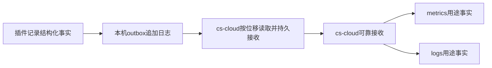

# JetBrains 插件稳定性设计与采集协议

本文是插件侧总体设计、采集事件、文件交接与控制协议的唯一维护位置；业务指标的口径、等级与分母见[稳定性指标：业务价值与统计定义](./jetbrains-plugin-stability-metrics.md)。cs-cloud内部实现由其仓库自维护，不属于本文范围。

| 文档 | 读者与用途 | 唯一维护内容 |
|---|---|---|
| [稳定性指标：业务价值与统计定义](./jetbrains-plugin-stability-metrics.md) | 产品、支持、研发、平台；先理解用户影响，再核对统计 | 24组业务指标、使用优先级（P0/P1）、起止点、分母、统计规则、登记与桶 |
| 本文 | 架构与发布评审；插件和cs-cloud研发 | 边界、设计决定、事实格式、事件字典、路径、交接契约、控制、交付顺序和交接验收 |

## 第一部分：总体设计

### 1. 结论与范围

采用“插件采集结构化事实并落盘，cs-cloud消费文件”的交接方式。插件不发起网络传输。交接面收敛为两个文件级约定：插件向`~/.costrict/telemetry/outbox/`追加NDJSON事实，cs-cloud发布`~/.costrict/telemetry/control/jetbrains.json`控制文件；cs-cloud对接只需第5.3节的路径与文件约定及第6、8、9章的行格式、控制格式与事件字典，无需了解插件实现细节。业务推导（操作终态、卡顿区间、健康增量）由插件完成。

指标与日志是两种独立用途，共用采集器和文件交接设施，不共用统计口径。

| 边界 | 指标 | 日志 |
|---|---|---|
| 目的 | 衡量成功率、耗时分布、可用性和数据完整性 | 还原关键过程、定位故障及关联诊断 |
| 输入用途 | purposes含metrics的计数、结果、区间和样本事实 | purposes含logs的生命周期、状态变化、失败及安全诊断事实 |
| 本地事实 | 计数、结果、区间和样本 | 生命周期、状态变化、失败及安全诊断 |
| 控制 | 独立开关与许可有效期 | 独立开关、许可有效期与详情限频 |

同一业务操作可以提供两种用途的事实，但不要求每条事实同时用于指标和日志。`purposes=["metrics","logs"]`表示该事实只落盘和接收一次，cs-cloud按数组成员将同一`event_id`分别送入指标与日志处理链；不得复制成两条事实。日志事实数量不作为指标分母，日志详情限频不改变指标计数。critical/diagnostic表示本地写入优先级，不等于metrics/logs用途；本地文本诊断日志也不属于结构化事实链路。

目标是回答：用户能否开始工作、操作能否完成、故障后能否恢复，以及监控数据是否可信。不能仅用ERROR日志数量判断插件稳定性。指标分组与P0/P1等级见指标文档总览，按等级排序的交付分期见第12章。

### 2. 已核实的基础

| 证据 | 对设计的影响 |
|---|---|
| [JetBrains AGENTS.md](../packages/kilo-jetbrains/AGENTS.md)定义Split Mode，远程前后端可能在不同机器 | 不能假设共享文件系统，采集必须区分mode/side/producer（数据生产方，即每个IDE采集实例） |
| [KiloLog.kt](../packages/kilo-jetbrains/shared/src/main/kotlin/ai/kilocode/log/KiloLog.kt)写文本日志，文件handler同步写入/flush | 文本继续用于本地诊断；新事实通道异步有界，不直接复用同步handler |
| [LogConfig.kt](../packages/kilo-jetbrains/shared/src/main/kotlin/ai/kilocode/log/LogConfig.kt)支持聊天内容OFF/PREVIEW/FULL | 本地开内容日志不等于允许采集结构化事实，不能自动采集整份日志 |
| [前端遥测](../packages/kilo-jetbrains/frontend/src/main/kotlin/ai/kilocode/client/telemetry/KiloTelemetryService.kt)经RPC，再由[后端遥测](../packages/kilo-jetbrains/backend/src/main/kotlin/ai/kilocode/backend/telemetry/KiloBackendTelemetry.kt)请求telemetry/capture | 连接建立前故障不能依赖该链路；新稳定性事实独立落盘 |
| [CsCloudEndpointResolver.kt](../packages/kilo-jetbrains/cs-cloud/src/main/kotlin/ai/kilocode/cscloud/CsCloudEndpointResolver.kt)读取.costrict/cs-cloud/server_url | 这是连接发现，不是已有文件消费协议 |
| [CsCloudConnectionService.kt](../packages/kilo-jetbrains/cs-cloud/src/main/kotlin/ai/kilocode/cscloud/CsCloudConnectionService.kt)全部必需流建立才Connected，每次成功递增epoch | 多条流不能重复算作多次恢复，epoch变化也不能证明daemon重启 |
| [KiloToolWindowFactory.kt](../packages/kilo-jetbrains/frontend/src/main/kotlin/ai/kilocode/client/KiloToolWindowFactory.kt)中setup失败可能仍继续发送Opened | 现有事件不能直接映射初始化成功，需要唯一终态 |
| [CscLogin.kt](../packages/kilo-jetbrains/cs-cloud/src/main/kotlin/ai/kilocode/cscloud/CscLogin.kt)等待超时仍可能返回ok=true | 插件无自有登录、凭据复用cs-cloud；浏览器认证在cs-cloud侧继续，等待ok=true不等于凭据就绪 |

### 3. 设计决定与取舍

| 决定 | 采用方式与原因 |
|---|---|
| 补齐前置环节 | 吸收安装/启动/凭据/CLI下载/迁移指标作为P1专题（插件观测前置供给动作的结果；前置供给动作指安装、启动、凭据等首次使用的准备，csc/daemon内部过程归其自身遥测），避免只看连接后的幸存用户；不阻塞P0上线 |
| 命名与单位 | 统一jetbrains_plugin_*，本地时长使用毫秒 |
| 逐项源码映射 | 保留接入点和现状差距，明确“已有日志”不等于“口径可靠” |
| 事件字典 | 吸收生命周期、连接、前置供给动作、UI/会话、异常和采集健康事件，并补关键操作与完整性 |
| 对接面最小化 | 上行为outbox目录内每IDE安装范围一个追加式.jsonl，下行为单个控制文件；无登记目录、无状态机后缀、无锁、无救援，cs-cloud按“目录、行格式、位移”三个约定即可独立实现 |
| 派生前移 | 操作终态、EDT卡顿区间、健康增量均由插件结算，落盘事实即终态；cs-cloud不配对、不推导、不做快照差分 |
| 插件不绑定下游格式 | 本地只保存结构化事实，不让下游格式变化牵动插件 |
| 位移即确认 | cs-cloud的持久化消费位移与可靠接收入队原子提交；插件不逐文件确认，位移之前的数据才可能被容量淘汰 |
| 崩溃恢复 | 无锁无救援：追加尾行可能残缺，读取方跳过无LF尾行并计数；不做writer死亡推断，休眠/慢写不影响交接 |
| 时效 | 使用尽量短的flush与目录扫描周期；以事件发生到完成文件交接验收 |
| 多源和重放 | source/run身份与device_id分开；按输入event_id去重，避免文件重读造成重复接收 |
| 采集控制 | 无有效策略默认不限制（fail open，见8）；用户撤销授权或总开关关闭时停止采集并清理待交接数据 |
| 账户与版本 | 采集时固定account_epoch、plugin_version等上下文，不补绑到后来的账户或新版本 |
| 深度诊断 | v1只收安全摘要、有限脱敏插件帧和指纹，不采集完整堆栈或原始异常首行 |

#### 3.1 方案取舍

文件消费让daemon不可用期间的插件故障仍能保留。若用本地HTTP作为唯一数据入口，插件就要自建可靠缓存和重试，职责反而扩大。解析已有文本虽然起步快，却缺成功分母、稳定起止点，且有内容日志风险，因此不作主通道。交接形态取“追加日志+消费位移”而非“分段文件+状态机+双锁”：后者要求cs-cloud实现认领互斥、跨语言文件锁与崩溃救援，任何一项实现不当都会丢数据或死锁；前者把并发安全交给单写者追加与读取幂等（event_id去重），协议只剩路径、行格式与位移语义。

#### 3.2 远程开发覆盖

单体同JVM共用writer；远程frontend/backend的落盘与消费边界、仅部署backend消费器时的覆盖声明、前端消费器可不启动Agent Core以及RPC转运另行设计等结论统一见5.1，不在两处重复维护。

#### 3.3 观测盲区

采集初始化前失败、进程强杀前尚未落盘、磁盘故障、已授权用途的策略过期时段及未接入的远程端都会造成覆盖偏差；首次安装、daemon未运行及本机无控制文件时的凭据未就绪时段按无有效策略默认采集，不再是盲区——daemon运行中显式发布pending/disabled仍按第8章停采，属显式限制而非fail-open。崩溃时未flush的追加尾行丢失（critical至多约30秒），读取方跳过残缺尾行，该损失由health计数表达，没有救援补偿。不能把“没有结束记录”当插件崩溃，也不能把“没有错误记录”当无错误。UI线程卡顿是共享IDE现象，除非有证据，不归因插件。

## 第二部分：共用采集与文件交接协议

### 4. 设计目标与责任

outbox（发件箱）是`~/.costrict/telemetry/outbox/`目录：每个IDE安装范围一个追加式NDJSON文件，插件是其唯一写者。插件只需知道本地记录是否写入outbox，以及是否已由cs-cloud通过持久位移确认接收。



| 责任 | 插件 | cs-cloud |
|---|---|---|
| 业务观测 | 操作起止、结果、耗时、阶段、异常和自身采集健康 | 不从文本猜测业务成功 |
| 本地保存 | 脱敏、异步有界追加及容量重写淘汰 | 按位移读取、校验、持久接收、陈旧IDE文件清理 |
| 用途区分 | 记录metrics/logs用途，不维护下游格式 | 按purposes分流并保留原始上下文 |
| 采集控制 | 执行有效的用户许可及本地策略文件 | 同步服务端策略、账户代号和自身健康 |

不解析或采集整份idea.log/kilo.log。一个本地事实可以同时声明指标与诊断日志用途，避免业务代码分别拼两套格式。新增观测点仍需升级插件。

#### 4.1 cs-cloud侧文件接收总览

本节只定义cs-cloud如何从文件交接面可靠接收数据，不定义接收后的处理方式。

cs-cloud的消费组件随daemon启动，在agent初始化之前完成组装，也不依赖agent是否启动成功（见12.1）。它按下面三个阶段接收插件落盘的事实（交接面的落盘路径、文件与格式总览见5.3）：

| 阶段 | cs-cloud做什么 | 细节见 |
|---|---|---|
| 发现 | 定期扫描`~/.costrict/telemetry/outbox/`目录（建议每5秒一次），文件名即数据源身份；新文件从出现到被首次扫到的时延，计入第13章的时效验收 | 5.2 |
| 读取 | 对每个文件从持久化位移继续读取；按6.1校验每行，跳过无LF的残缺尾行，中间坏行隔离计数；按event_id去重 | 6.1、7.2、7.3 |
| 接收 | 去重后的记录持久保存，随后原子提交该文件的新位移——到这里插件的责任就结束了 | 7.2 |

`purposes` 表示同一事实获准进入的用途集合，不表示事实本身“是指标”或“是日志”。`["metrics","logs"]` 时插件只采集、落盘和交接一次，cs-cloud 按数组成员以同一输入 `event_id` 分别进入指标转换链和日志转换链；两条链生成各自的输出 ID、独立确认和重试，不能用日志受理次数反推指标分母。

位移提交与持久入队必须在同一可恢复事务内完成。文件变短或被写者重写（文件身份变化）时位移归零重读，重复读取由event_id去重吸收，因此读取是幂等的；多个daemon并发读同一文件也是安全的，部署上仍建议单消费者，属资源建议而非协议要求。

控制文件的发布（第8章）与文件消费可以共用同一轮扫描结果，但两件事互不阻塞；身份代际（account_epoch）同样由cs-cloud发布（见8.1）。

### 5. 部署与路径

#### 5.1 单体和远程开发

单体IDE同一JVM内前后端共享一个采集器。Split Mode前后端可能在不同机器，各自有producer、时钟、文件和消费器；backend机器的cs-cloud不能直接读取frontend文件。

插件侧已实现单体采集的追加式NDJSON、控制策略、health增量、`edt.stall`及事实交接；cs-cloud侧文件消费、指标/日志转换和发送仍未实现，不能把本地落盘描述为云端已接入。远程完整覆盖仍要求两端各有cs-cloud文件消费能力。前端仅运行采集组件而不启动Agent Core是待新增部署能力：当前daemon/serve均启动默认agent，不能直接用现有命令宣称实现。该模式未交付时应明确前端未接入，不为补遥测强制启动额外agent。

策略与消费能力都是机器局部的：若frontend机器没有本机消费组件，就没有策略来源，按第8章无有效策略处理——默认不限制，照常采集并落盘；没有本机消费者，数据仅受每IDE文件容量与保留期约束，最终由清理回收。覆盖状态必须显示“前端未接入”，不能把缺失当无故障。RPC文件转运不隐含在v1内，需另行定义持久确认和断连重放。

#### 5.2 路径与文件布局

事实文件与控制文件同根，都位于用户主目录：

```text
~/.costrict/telemetry/
  control/jetbrains.json                    # cs-cloud原子写，插件30秒轮询（第8章）
  outbox/<scope-id>.jsonl                   # 每个IDE安装范围一个，跨启动和插件版本追加
```

producer_id为每JVM采集实例的随机标识，run_id为每次采集生命周期的随机标识，同进程多项目用随机workspace_id区分；scope-id是每个IDE安装范围持久的随机标识（存于IDE配置目录的`kilo-stability-scope-id`文件），同一IDE多次启动及插件升级共享，不同IDE互不相同。文件名只使用scope-id，因此同一IDE的新JVM继续追加同一文件，历史行仍以producer_id和run_id区分来源。正常产品运行依赖IntelliJ对同一配置目录的单应用实例约束，文件由当前JVM单写者追加；人为绕过单实例限制或并行启动共享同一配置目录的开发IDE不在v1支持范围，不为此引入跨进程锁。每行（含行尾LF）由一次write调用写入，行内字段自包含全部来源信息；不再有registrations发现目录、producer.json、锁文件及.open/.ready/.claimed/.done状态机——目录即发现，文件名即IDE身份，位移即确认。

scope文件通过公开`PathManager.getConfigDir()`定位，仅保存15字节随机ID，不保存或上报配置路径。首次创建或损坏重建时先写同目录临时文件，以`FileChannel.force(true)`同步后原子移动，再允许采集启动；不依赖IDE设置保存节流或EDT。合法文件直接复用，JVM内并发创建串行化。读取、同步或原子移动失败时，本次服务生命周期进入`init_failed`并关闭两用途，不生成临时scope或outbox；调用方仍取得关闭的采集入口，错误不传播到IDE业务。修复存储后重启IDE可重新初始化；此顺序保障进程强杀后的复用，不承诺操作系统断电后的目录项持久性。

当前功能处于调试阶段，不兼容旧的`<scope-id>-<producer-id>.jsonl`布局。启用单文件布局时，插件删除本scope下的旧布局文件而不迁移其中事实；不同scope属于不同IDE安装范围，不得由插件删除。

以上为默认profile约定路径，不覆盖cs-cloud的data-dir/auth-path配置。v1自动接入仅针对双方确认的默认profile；自定义profile在完成显式绑定契约前标记不支持，不能回退使用默认控制文件或读取另一个profile的凭据。默认profile的控制文件发布者互斥由cs-cloud自行协调（如单例部署或最后写入者语义），不影响插件读取语义；自定义profile扩展需绑定数据目录、控制、账户代际和接收状态，而不只是换一个数据目录。

记录自身携带全部来源字段（6.1），生产者升级或清理元数据后历史仍可解释。device_id是随机安装标识，重装是否更换取决于IDE持久设置是否保留，不能承诺重装必变。

目录与文件权限：POSIX用户级0700/0600；Windows使用对应用户ACL，不能把chmod数值当作Windows权限实现。消费器只读取文件名匹配`^[a-z0-9][a-z0-9-]*\.jsonl$`的平铺常规文件，验证用户所有权与解析后路径不越出outbox目录，拒绝子目录、符号链接/重解析点越界，不支持远程请求任意指定读取路径。

#### 5.3 对接面总览：路径、文件与格式

插件与cs-cloud在稳定性链路上的对接全部通过本机文件系统完成，插件不发起网络调用：上行是outbox目录内的追加式事实文件，下行只有控制文件。cs-cloud实现消费器时，下表即交接面全部内容，配合第6章行格式、第8章控制格式与第9章事件字典即可独立开发，不需要了解插件实现细节；消费组件的接入任务与可复用边界见12.1。

| 交接物 | 落盘路径 | 写入方→读取方 | 格式与内容 | 细节见 |
|---|---|---|---|---|
| 事实文件 | `~/.costrict/telemetry/outbox/<scope-id>.jsonl` | 插件单写者追加→cs-cloud按位移读取 | NDJSON v1：UTF-8无BOM、LF结尾、每行一个JSON对象、一行一write、普通记录≤32KiB；字段闭集与示例 | 6.1、7.1 |
| 读取与位移 | cs-cloud自有状态存储（不写入outbox目录） | cs-cloud自管 | 每文件持久位移，与可靠接收原子提交；文件变短或身份变化即归零重读，重复由event_id去重吸收 | 7.2 |
| 采集控制 | `~/.costrict/telemetry/control/jetbrains.json` | cs-cloud原子写→插件后台每30秒轮询 | control v1单JSON对象：开关、分用途有效期、account_epoch、account_state、允许事件类别及日志诊断限频；无有效策略（缺失、空、畸形、未知major）默认不限制，限制仅来自当前有效的显式策略 | 8 |
| 机器可读wire契约 | `packages/kilo-jetbrains/shared/src/test/resources/stability/` | 双方共同冻结 | `fact-schema.json`与`control-schema.json`为JSON Schema，已与追加式NDJSON、health增量、`edt.stall`及无有效策略的`unbound`占位语义同步；契约测试覆盖字段、枚举、用途和追加文件形态。cs-cloud仍未实现消费与发送 | 9.1、12 |

唯一根路径为`~/.costrict/telemetry`（默认profile边界、机器局部）：`control/`只存放cs-cloud发布的控制文件，`outbox/`只存放插件追加的事实文件，两个子目录职责不混用——Split Mode下backend机器的cs-cloud读不到frontend机器的outbox（5.1）。事实行内禁止路径与凭据（6.1白名单）；consumer只接受outbox目录下的平铺常规文件并校验解析结果不越界，拒绝符号链接/重解析点（5.2）。

### 6. 本地事实格式v1

#### 6.1 公共字段

UTF-8无BOM，NDJSON，每行一个JSON对象，以LF结束；内嵌换行JSON转义。事实逐行追加写入单文件，一行（含行尾LF）一次write调用。普通记录最大32KiB，message安全摘要最大512字节；v1不自动收集完整异常堆栈。

| 字段 | 类型 | 含义 |
|---|---|---|
| schema_version | string | 1.0；major不兼容，minor只能增加可选字段 |
| event_id | UUID string | 采集时生成，重放不变 |
| timestamp | int64 | 发生时UTC Unix毫秒，不改成接收时间 |
| producer_id、run_id | string | 采集进程及运行周期 |
| channel、seq | enum/int64 | critical/diagnostic；每producer+run+channel从1递增，入队前分配，可用缺口辅助发现丢失 |
| account_epoch | string | 采集时绑定的随机账户代号，不是用户ID或Token |
| policy_revision、purposes | int64/string[] | 采集时策略版本及允许用途metrics/logs |
| source | string | jetbrains-plugin |
| device_id | string | 随机安装标识，非硬件标识 |
| plugin_version、ide_product、ide_build、ide_build_major、os_family、arch | string | 采集时版本和环境，未知使用unknown |
| env、mode、side | enum | prod/dev/test；monolith/split；monolith/frontend/backend |
| connection_provider | enum | cs-cloud/kilo-cli/unknown |
| kind、name | enum | operation/transition/lifecycle/interval/diagnostic/health/sample；name见事件字典 |
| context | object，可选 | 仅允许operation_id、attempt_id、fault_id、trace_id、workspace_id五个闭集键 |
| data | object | 事件专属白名单，禁止任意业务payload |

workspace_id采用项目级随机映射或带本机秘密的HMAC，不用可被字典猜测的普通路径hash。不存在上下文时省略，不能编造用户、设备或项目身份。

```json
{
  "schema_version": "1.0",
  "event_id": "c387ecbf-a8d9-487c-94d4-8b8777982401",
  "timestamp": 1789862400250,
  "producer_id": "pr-7c18",
  "run_id": "run-3e92",
  "channel": "critical",
  "seq": 21,
  "account_epoch": "acct-5b02",
  "policy_revision": 12,
  "purposes": ["metrics", "logs"],
  "source": "jetbrains-plugin",
  "device_id": "device-6d81",
  "plugin_version": "1.0.0",
  "ide_product": "IU",
  "ide_build": "example-build",
  "ide_build_major": "2026.1",
  "os_family": "windows",
  "arch": "x64",
  "env": "prod",
  "mode": "split",
  "side": "frontend",
  "connection_provider": "cs-cloud",
  "kind": "operation",
  "name": "action",
  "context": {"operation_id": "op-713f", "workspace_id": "ws-a3f0"},
  "data": {
    "phase": "end",
    "action": "prompt_submit",
    "result": "timeout",
    "duration_ms": 30000,
    "stage": "rpc",
    "cause": "unknown",
    "error_code": "deadline_exceeded"
  }
}
```

#### 6.2 操作、区间和异常语义

operation使用phase=start/progress/end。start携带deadline_ms（从开始起的观测时限）；end包含result、duration_ms、stage、cause及安全error_code，必须自包含，不能依赖查找原日志文本。插件用单调时钟判定截止；定时器到点或业务完成，先发生者成为终态，超时判定不取消业务本身。progress不计算完成次数。同一operation仅一个end；丢失的start或end无法由cs-cloud配对补全——不推测成功、不生成unknown，缺口由health损失计数与plugin.unclean表达（见10.2）。跨账户切换的操作保留开始时的epoch，不能把end重新绑定给新账户。

断线恢复同时保留逻辑operation_id和传输attempt_id。后台重试会增加attempt，但逻辑操作分母不随之增加。正常取消保留cancelled，不进入error计数。

interval保存begin_timestamp、end_timestamp、duration_ms、state和随机workspace_id，用于活跃/不可用时长，区间不重叠。sample保存单次耗时；高频渲染可对成功耗时受控采样并标明sample_rate。不能只保存count/sum/min/max后声称可重建P95；失败事实和P0结果不采样，不据成功耗时样本估计操作成功率。stall区间由插件推导：探针观测区间内合并明确相交或首尾相接、持续≥2秒的阻塞区间，逐条产出edt.stall事实（duration_ms、observation_id）；合并与失效判定是插件侧规则（见10.3），cs-cloud不从原始样本推导。

diagnostic的data仅允许固定字段：message（固定安全模板加枚举，≤512字节）、error_class、frames（脱敏插件栈帧摘要，最多5帧，不含原始异常message）、fingerprint、count。fingerprint由异常类别及归一化插件类/方法生成，去掉行号等变化值；fault_id区分一次故障，fingerprint用于同类聚集。

health中的drop/write_error为自上一条health事实以来的增量，cs-cloud直接求和，无需差分与首份快照特判；run重启后增量自然从零起算。与操作事实产生的计数不能相加。持续计数只描述可观测损失，崩溃前尚未写出的部分可能丢失。

### 7. 写入、交接与容量

#### 7.1 不影响IDE操作

插件内部提供非阻塞record(event)，只返回queued/dropped/disabled。queued仅表示入内存，不保证落盘。专用后台单writer负责序列化和I/O，EDT（事件分发线程）不写文件、不等待锁、不压缩、不联网。

队列同时限制2000条及4MiB，以先达到者为准；critical预留按两个维度分别预留20%（400条、约820KiB）。优先丢diagnostic，critical仍满则拒绝新记录并计数，不能阻塞IDE或无限分配。入队耗时目标P99<1ms，需测试。

writer后台把队列批量追加到本IDE安装范围的.jsonl文件：队列非空且有积压时最迟30秒flush并fsync一次（满足critical时效；diagnostic随批写出，不设更长延迟），或累计16条/64KiB即flush。只有非空批次参与定时flush；最小批量避免低速率流（如每30秒一条health/availability记录）逐条写盘，具体阈值用真实事件率校准。平台不支持fsync时记健康错误，不假装持久。

最大易失范围包含排队和未flush数据，正常调度下约等于30秒；长暂停、断电或磁盘失败可能更长。不能承诺“强杀IDE数据不丢”。flush周期须满足第13章从事件发生到完成文件交接的时效验收。

#### 7.2 读取、位移与确认

没有交接锁、没有状态机后缀：插件是本文件唯一写者，cs-cloud只读。确认语义从文件状态转为消费位移——cs-cloud为每个文件维护持久化字节位移，含义是“该位移之前的合法行已被可靠接收”，不是仅仅读完。

| 规则 | 约定 |
|---|---|
| 位移提交 | 与可靠接收（含输入event_id去重索引、源记录及消费进度）在同一可恢复事务内提交；可用事务存储或带提交标记与同步规则的journal实现，本轮不替cs-cloud选定数据库 |
| 幂等重读 | 文件变短或文件身份变化（写者容量重写、外部替换）时位移归零重读；重复读取由event_id去重吸收，任何顺序的重读都不得重复累计 |
| 残缺尾行 | 读到无LF结尾的尾部行时跳过并等待下次扫描；写者崩溃可能留下这种行（7.3） |
| 多消费者 | 并发读同一文件安全（读取幂等）；部署建议单消费者，属资源建议而非协议要求 |

consumer崩溃后从上次已提交位移重放，不因文件名或身份变化跳过。未知major或无法解析的版本文件隔离、有界保留并记录不支持，不能误报成功接收。任何必要信息仍只在易失内存中时都不能推进位移。位移提交后插件责任结束。

#### 7.3 崩溃残留和坏行

写者崩溃可能留下无LF的残缺尾行：读取方丢弃该行并记corrupt，不做救援、不做mtime死亡推断、不接管他者文件；休眠、暂停或低活动不影响交接。中间坏行隔离并计数，其他合法行继续处理，不让一行阻塞整个队列；只有明确支持的schema才按逐行容错处理，未知major不能逐行当corrupt清空。

未正常结束的run由插件下一实例判定：读取本scope文件，最后一条plugin.started之后没有同run的plugin.shutdown即产出plugin.unclean。consumer不推断插件崩溃或daemon重启。

#### 7.4 空间和清理

| 范围 | 默认上限 | 责任 |
|---|---|---|
| 内存队列 | 2000条且4MiB | 插件 |
| 每IDE事实文件 | 10MiB | 写者进程后台重写淘汰最旧行，淘汰计入health drop |
| 陈旧IDE事实文件 | 保留期24小时（无新追加） | cs-cloud按scope文件清理 |

文件超过10MiB时由写者进程重写：把最新内容截取至预算内写入临时文件，原子替换后重开追加；被淘汰行按drop原因计数，不改写保留行的内容。consumer通过“文件变短”检测并归零重读（7.2）。插件必须容忍自身文件被清理方删除：下次追加时按原名重建，不视为错误。默认上限需用实际事件率校准。

陈旧清理由cs-cloud按整个scope文件执行，条件是自最后一次追加起超过保留期24小时；活跃IDE至少周期性追加health事实，不会误触。插件不删除其他scope文件。24小时是数据可交接的保留期，不是daemon停用时的物理删除保证；daemon恢复运行后的首轮清理删除过期残留。v1不设outbox目录总配额，跨IDE安装的总量阈值与机制列入第13章评估。

### 8. 采集开关与账户归属

cs-cloud原子写`~/.costrict/telemetry/control/jetbrains.json`，插件后台每30秒检查策略；账户切换另按8.1同步。控制文件按机器生效：远程frontend机器没有本机cs-cloud时无策略来源，按无有效策略默认不限制，也不因backend机器存在策略而改变本机语义。字段：schema_major、revision、enabled、metrics_enabled、metrics_expires_at、logs_enabled、logs_expires_at、account_epoch、account_state（pending/ready/disabled）、expires_at、各用途允许事件类别及日志诊断限频，无凭据。事件固定policy_revision和purposes，便于策略变更后核对采集时用途，不能仅凭当前开关扩大旧数据用途。

**默认值（fail open）。** 无有效策略——文件不存在、为空、畸形或未知major——时默认不限制采集：插件按全用途采集，purposes标metrics与logs，policy_revision=0，account_epoch使用占位值unbound（见8.1）。限制只能来自当前有效的显式策略；策略过期视为显式授权边界已过，仍按过期停采处理，这也是“用户撤销授权且daemon失联无法更新文件”时的安全上限（单项最长24小时）。

| 状态 | 插件行为 |
|---|---|
| 用户许可且有效策略允许 | 采集允许类别 |
| logs_enabled=false | 最迟30秒停止新增日志用途诊断；独立本地运行日志不受影响 |
| metrics_enabled=false | 停止新增指标用途事实；日志仍按独立许可处理 |
| 用户撤销授权、总enabled=false或公共expires_at过期 | 停采并清理待交接数据 |
| 某用途过期或显式关闭 | 仅停止该用途采集，另一有效用途继续 |
| 无有效策略（缺失、空、畸形、未知major） | 默认不限制：全用途采集，purposes全标，epoch用占位值unbound，policy_revision=0 |

日志用途关闭时，仍允许的指标事实可继续采集，但不得补充日志诊断详情。不能在重开后把关闭期间指标事实追溯标记为日志用途，或把仅日志用途的数据追溯标记为指标用途。

控制文件分别提供metrics_expires_at与logs_expires_at，独立判断用途是否有效；公共expires_at仅限制账户绑定及总授权。每项用途的有效截止取自身截止与公共截止的较早值，不取另一个用途的截止。单项允许策略最长有效期建议24小时，且不得超过该用途上游授权或配置有效期。

日志策略过期只停止logs用途，仍有效的metrics继续；指标策略过期亦然。有效策略中某用途关闭或过期即停止该用途，不因另一个用途允许而放行。公共策略失效、账户未就绪（显式pending/disabled）或总授权撤销才同时停止两种用途。默认不限制使首次安装、daemon未运行及凭据未就绪时段也有故障覆盖；若产品后续需要更保守的默认（如仅开指标用途），由cs-cloud发布显式策略实现，不由插件内置缩小或扩大。

#### 8.1 账户切换边界

account_epoch是daemon给当前已验证账户或租户的随机本机代号，事件采集时固定，与device_id不同。无有效策略期间采集的事实使用固定占位值unbound且policy_revision=0：占位epoch不绑定任何账户代际；ready epoch发布后新事实改用该epoch，占位期数据不重绑。账户或租户切换、登出时永久退役旧epoch，清除尚未写出的旧epoch事实；再次登录同一账户也分配新epoch。仅凭据刷新且已验证身份不变时可保留epoch。

追加文件可能混有其他epoch的行，不按行改写文件。内存排队事实可直接按epoch丢弃；插件的容量重写与清理只由写者进程按7.4执行，不受epoch退役影响。

身份代际必须与daemon实际使用的业务身份同步：在启用新身份前发布pending，新身份及许可确认后发布新的ready epoch。外部认证文件变化也必须经过该边界；若cs-cloud不能提供这项保证，账户归属能力不满足阶段0要求，不能用30秒轮询代替。

插件观察到账户变化先暂停带账户归属的采集，清空尚未写出的旧epoch事实，应用新ready策略后再开启新操作上下文。跨端业务关联事实还须确认当前业务连接或响应属于同一身份代际，无法确认的过渡期事实仅留独立本地诊断。插件轮询尚未更新期间可能误带旧epoch，接收方不得将其改绑到新epoch。

### 9. 共用事实字典

下表登记插件可采集的结构化事实name和字段；操作统一start/progress/end。最后一列仅索引指标用途，不表示每条记录都必须生成指标，也不是日志目录。指标采集范围见第10章，日志采集范围见第11章；两者各自按purposes筛选，不根据name或channel推定许可。

| name | kind | 关键专属字段 | 对应指标/业务用途 |
|---|---|---|---|
| plugin.started | lifecycle | run环境快照 | M22、M16，版本与运行分母 |
| plugin.shutdown | lifecycle | end_kind=app_close/unload | M22、M16，正常结束证据 |
| plugin.unclean | lifecycle | previous_run_id、evidence | M22、M16，未正常结束线索，不是崩溃归因 |
| toolwindow.setup | operation | phase、stage=create/setup | M01，面板初始化 |
| backend.load | operation | phase、trigger、reason | M02，资料加载 |
| plugin.readiness | operation | phase、reason | M03，整体可用 |
| connection | operation | phase、trigger、stage | M04，逻辑连接 |
| connection.attempt | operation | phase、stage、error_code | M04，真实尝试 |
| connection.state_changed | transition | from、to、reason、streams_open/total | M05，整体退化；流详情不重复计算恢复 |
| connection.recovery | operation | phase、intervention、attempts | M05，自动或手动恢复 |
| csc.install | operation | phase、package_manager、error_code | M06，安装 |
| csc.start | operation | phase、stage、error_code | M07，启动 |
| credentials.ready | operation | phase、stage=probe/wait、error_code | M08，凭据就绪检测；认证流程归cs-cloud侧 |
| cli.download | operation | phase、stage、cache_hit | M09，备用CLI |
| migration.required | transition | migration_kind | M10，迁移阻断 |
| session.open | operation | phase、session_mode=create | M11，新建 |
| session.restore | operation | phase、session_mode=open/reconnect、stage | M11，历史与状态恢复 |
| action | operation | phase、action | M12，常用操作 |
| availability | interval | state、起止及duration_ms | M13，时间损失 |
| error.uncaught / error.reported | diagnostic | 计数事实：fault_id、error_class、handled、fingerprint、component；详情记录另加6.2的message/frames | M14，异常次数与关联；不等于记录所有IDE错误 |
| protocol.error | diagnostic | transport、stage、error_code | M15，协议兼容 |
| telemetry.health | health | drop/write_error增量、depth_bytes、oldest_age_ms | M16，采集健康与覆盖缺口观测 |
| session.dispose_risk | transition | dispose_source、conversation_active | M18，释放风险 |
| rpc | operation | phase、api_group | M19，通信定位 |
| edt.delay / edt.violation | sample/diagnostic | 探针字段见10.3；违规记录带operation与evidence字段 | M20，延迟和已确认违规分开 |
| edt.stall | sample | duration_ms、observation_id | M20，插件合并≥2秒阻塞区间产出的卡顿区间（见10.3） |
| render.apply | sample | duration_ms、result、component、batch_size_bucket | M21，UI处理 |
| ide.operation | operation | phase、operation | M23，IDE能力 |
| resource.snapshot | sample | resource、count | M24，自有资源数量 |

kind=diagnostic只是数据形态；error/protocol/violation的最小计数事实写critical，受指标许可控制，不因详细日志限频丢计数。详细message/安全栈帧仅在日志许可允许时写diagnostic，引用相同fault_id但不同event_id，不能再次增加故障次数。

当前实现对 `session.status`、SSE 信封字段形状与 file-search 的解码错误均写入一条 `protocol.error`，跨层重复解析不重复计数；包装型 file-search 正常响应不产出协议错误。provider hint 与 recorder 身份创建共用同步锁：创建 recorder 时冻结本次 run，之前到达的提示用于本次，writer 启动等待期间及之后到达的提示只用于下一次 run。长期消费者持有稳定 `Operations` 入口，新操作解析当前 run，已经开始的操作保留原 run。READY 但 profile 为空时，readiness/availability 以 `blocked` 表达，app 状态订阅即时切换可用性区间；真实 MCP bind 以有界的 `ide.operation` start/end 记录 success、failure、blocked 或 cancelled，未提交的监听器在所有退出路径回收，可能已接受的远端绑定按原 epoch/generation 清理。

operation.end包含公共result、duration_ms、cause，未在表内逐行重复。非operation的环境变化、健康和样本字段按上述固定白名单校验，禁止透传任意对象。

事件data可包含未列入指标聚合维度的明细字段（如stage、error_code），明细用于日志与诊断。M16的observation_total由插件侧终态事实直接构成：run级复用plugin.started/shutdown/unclean，操作级复用各operation的end/timeout终态；cs-cloud不配对结算、不推断丢失终态（见10.2），不新增插件业务埋点。M20的stall由插件产出edt.stall；M17为接收侧自观测，不登记插件事实。

## 第三部分：指标事实采集

<a id="metrics-pipeline"></a>
### 10. 指标事实

#### 10.1 采集范围

指标用途只记录purposes包含metrics且指标许可有效的事实，用于成功率、耗时分布、可用性及完整性统计。M01～M24的口径、分母和优先级以[指标文档](./jetbrains-plugin-stability-metrics.md)为准；原始异常message、堆栈详情和日志级别不进入指标事实。

插件保存操作起止/结果、可用性区间、有效探针与资源样本，以及异常最小计数事实。不得从日志事实数量估计成功率，也不得把日志详情采样率用于还原指标分母。异常次数不因同fingerprint日志限频而减少。指标用途独立使用metrics_enabled与metrics_expires_at。

#### 10.2 终态与归窗

业务截止由插件单调时钟结算（6.2）：end或timeout落盘即为可信终态，cs-cloud不再维护pending配对、交接迟到宽限或二次结算，也不能仅凭“当前没收到end”生成timeout或unknown。业务在deadline后才完成时沿用插件已结算的timeout，迟到完成只补安全诊断。

迟到收到的终态（断连、重放、文件归零重读）仍保留原事件timestamp。同源乱序和统计归窗属于下游实现，不改变本地事实。“未收到”通过plugin.unclean与health损失增量表达为覆盖缺口，不是一类终态计数。

#### 10.3 EDT探针事实与卡顿推导

同一JVM仅一个探针所有者，多个可见面板不能各投递一套探针。仅在面板可见且IDE前台时启用，每秒至多投递一次，最多一个未完成探针；EDT回调只记录完成时刻，不等待writer。每次连续观测生成observation_id，暂停、休眠、失去前台或调度中断后更换ID。

edt.delay包含observation_id、probe_seq、scheduled_mono_ms、completed_mono_ms、duration_ms和validity=valid/suspended/scheduler_gap/unknown。时间采用本run内的相对单调时钟毫秒，probe_seq在观测区间内按实际投递递增；通道seq只能辅助判断事实丢失，不能代替探针序号。后台调度器检测自身调度间隔异常并结合平台休眠/恢复通知使未完成样本失效；不能可靠区分休眠的情况记unknown，不算卡顿。恢复后必须开启新观测区间。

插件将valid样本的排队区间在本机合并：单个区间持续≥2秒即构成一个观测到的stall（卡顿区间），不要求阻塞期间仍每秒产生样本；同观测区间内仅合并明确相交或首尾相接的阻塞区间，不跨空白时间猜测连续性。序号缺失、中断标记或observation_id变化打断合并，缺失部分不推断卡顿，但不抹去已完整观测的长延迟样本。合并结果逐条落盘为edt.stall事实（6.2）；该口径衡量探针观测到的排队阻塞，可能低估真实冻结时间，不等同平台freeze检测。cs-cloud按edt.stall事实消费，不从原始样本推导合并。

## 第四部分：日志事实采集

<a id="logs-pipeline"></a>
### 11. 日志事实

插件不请求网络地址、不读取传输凭据，也不写第二套日志文件；critical/diagnostic事实经同一outbox交接。指标关闭但日志允许时仍采集有排障价值的日志用途事实；日志关闭但指标允许时只保留必要计数事实，禁止附带诊断详情。日志事实数量不得作为业务指标分母。

#### 11.1 日志级别与内容

info：正常生命周期和恢复；warn：可自愈退化、风险或采集丢弃；error：明确用户可见失败/非预期异常。timeout按实际操作语义选择warn/error，不因“仍在等待凭据”声称认证失败。普通取消不生成error日志。

message使用固定模板加安全枚举，禁止直接截取异常首行。原始异常可能含凭据、代码、用户名和路径，截短不等于脱敏。v1不采集完整堆栈；最多5个脱敏插件类或方法帧和fingerprint提供归因，深度诊断包另行由用户明确导出。

同fingerprint每分钟默认最多3份详情，由有效策略的 `log_detail_rate_limit.per_fingerprint_max_per_minute`（0～60）覆盖；窗口内收紧立即生效，0 不采详情或摘要。类别许可按记录形态判断，critical-only 不放行同名事件的诊断详情；准入和入盘前均复查类别及许可。额外次数汇入摘要，异常指标次数不被详情限频改变。采集器错误只向独立本地日志限频输出，不递归调用自身写入。

#### 11.2 日志采集范围

默认覆盖插件启动/正常结束、关键操作开始和失败、连接退化/恢复、安装启动及凭据等待结果、异常/协议错误的安全详情和限频摘要。成功的高频操作、每Token渲染和RPC不逐条生成日志事实；需要的计数和分布继续记录为指标用途。同一次故障最小计数与详情共享fault_id。采集器无法落盘时仅能本地限频报错，恢复后health摘要可在日志许可下报告已观测损失，不能递归记录自身错误。


## 第五部分：交付与验收

### 12. 实施顺序与边界

插件侧已实现本版追加式NDJSON交接、控制 schema、事实 schema、health 增量、`edt.stall`以及相应的稳定性观测修复；本轮文档同步这些已审查实现。cs-cloud侧消费、指标/日志转换和发送尚未实现，设计中的 Draft/提案只表示后续对接方向，不能写成已上线能力。下列为后续交付分期。

本次已审查的插件侧实现包括：稳定性 RPC 操作以唯一 deadline 结算 `timeout`；仅撤销一个用途且另一用途仍获准时，终态缺口可由 `telemetry.health` 增量表达，而公共关闭或双用途到期会结束 run、清理文件，不要求随后仍有该增量；`session.status` 与 file-search 解码错误统一产出、跨层去重的 `protocol.error`；provider 预热提示和后续 run hint 均保留实际 `connection_provider`；READY 但 profile 为空以及凭据未就绪均表达为 `blocked`；真实 MCP bind 记录 `start` 及 `success`/`failure`/`blocked` 终态，bind 请求本身有界。

| 阶段 | 共用设施 | 指标事实 | 日志事实 |
|---|---|---|---|
| 0 契约冻结 | 身份切换、许可、远程范围和位移事务 | 冻结口径、分母与终态语义 | 冻结事件选择、详情限频与脱敏规则 |
| 1 最小链路 | writer、追加协议、控制与位移消费 | 接M03、M14、M16、M17和M22基础run事实 | 接生命周期、操作失败与安全异常事实 |
| 2 用户旅程 | 复用已验证事实通道 | 完成11组P0（M01～M05、M11～M14、M16、M17），具备分母及完整性 | 按11.2覆盖关键过程、退化与恢复 |
| 3 灰度 | 验证两种用途的开关、有效期及故障隔离 | 接入13组P1并积累两周基线 | 验证详情限频、脱敏、保留期与覆盖范围 |

插件修改保持在JetBrains/Kilo自有模块，不需要修改共享OpenCode或Agent Core。现有无关产品使用遥测不在本次迁移范围；同一稳定性事实不得同时走旧capture和新链路重复计数。

实现时使用真实临时文件和现有测试基座，测试实际写入、追加、重写、位移重放和状态变化；涉及Swing使用真实Application/EDT。执行受影响模块定向测试与JetBrains typecheck，不默认跑全量；新增平台API需核查公开API及Split Mode适用性。正式用户功能交付再添加changeset。

#### 12.1 cs-cloud文件接入边界

以下为后续 cs-cloud 接入任务；其源码和提案不在本次变更范围内，当前仍不能视为已上线能力。

| 接入任务 | 约束 |
|---|---|
| 消费组件生命周期 | 在agent初始化之前组装；组件失败不阻塞agent；agent启动失败时，已保存事实可由后续消费恢复 |
| profile与控制 | 单profile控制文件发布者互斥；自定义profile完成显式绑定前不得读取默认profile的数据 |
| 插件文件消费 | 扫描outbox目录，按位移续读v1 NDJSON行并校验；路径范围与符号链接检查遵守5.2 |
| 可靠接收 | 位移提交与事实持久接收在同一可恢复事务内完成；按event_id幂等重读 |
| 状态与健康 | 报告文件接入、用途开关、积压、拒绝和覆盖状态；“服务在线”不等于文件链路已接入 |

阶段0优先验证身份边界、位移事务与追加/重写竞争，再落地单体最小链路。远程前端消费模式、自定义profile及在线完整率若尚未支持，应在覆盖或能力状态中明确展示。

#### 指标源码接入点与现状差距

路径相对packages/kilo-jetbrains/，现有日志不代表已具备可靠指标事实。

| 落点 | 指标 | 必须核对的语义 |
|---|---|---|
| frontend/.../KiloToolWindowFactory.kt | M03、M01 | setup失败后可能仍发Opened；补唯一终态和异步失败 |
| backend/.../app/KiloBackendAppService.kt | M03、M02、M10 | load含恢复，起点不是整个插件启动 |
| cs-cloud/.../CsCloudConnectionService.kt、CsCloudSseClient.kt | M05、M04、M15 | 多流、重试去重；epoch不是daemon重启证据 |
| cs-cloud/.../CscInstaller.kt、CsCloudStarter.kt、CscLogin.kt | M06～M08 | 命令退出、健康可用、凭据就绪分开 |
| backend/.../cli/KiloCliDownloader.kt | M09 | 仅kilo-cli，缓存和下载分开 |
| frontend/.../session/controller/SessionController.kt、设置保存 | M11、M12、M18、M21 | pending恢复和UI应用完成才结算 |
| frontend 面板可见性监听与EDT探针（新增接入点） | M13、M20 | 活跃区间不重叠、同项目多面板去重；单JVM一个未完成探针，插件合并≥2秒阻塞区间产出edt.stall，中断不拼接 |
| shared/log及新增采集器 | M14、M16、M22 | 原文本日志保留，新通道异步有界 |
| RPC、IDE能力及资源所有者 | M19、M23、M24 | 自有边界观测，不全局拦截和重复采集 |

### 13. 交接必须确认的事项

| 事项 | 当前设计结论 | 验收证据 |
|---|---|---|
| 可靠接收 | 位移提交与事实持久接收原子，输入按event_id去重 | 在读取、接收、位移提交前后分别执行中断恢复测试 |
| 追加与重写竞争 | 单写者一行一write；容量重写后文件变短触发位移归零 | 插件重写与consumer读取并发不丢行、不重复接收；残缺尾行被跳过并计数 |
| 终态语义 | 插件直接结算唯一终态，接收方不配对或推导 | end、timeout、迟到完成及重放均保持原事实 |
| 远程覆盖 | 本机消费器只能读取本机文件 | 两机器部署验证或明确前端未接入 |
| 运行模式与profile | 自动接入仅支持双方确认的默认profile | 未支持模式显示能力缺口；自定义data-dir/auth-path不误用默认策略 |
| 权限与账户 | 用户禁用优先；无有效策略默认不限制；账户切换不改绑旧epoch | 覆盖控制文件缺失、畸形、过期、账户切换与同账户重登 |
| 用途隔离 | metrics与logs分别校验许可和有效期 | 单独关闭任一用途时，另一用途继续采集 |
| 时效与容量 | 插件参数见第7章，发现节奏见4.1 | 实测事件落盘及IDE文件首次出现到首次接收的时延；单IDE文件预算受控 |
| 残留清理 | 每IDE始终复用单文件且有文件配额，陈旧IDE文件按7.4回收 | daemon不可用并多次重启或升级IDE后仍只有一个scope文件，且不误删其他scope文件 |

### 14. 端到端验收场景

#### 14.1 共用采集与交接

| 场景 | 预期 |
|---|---|
| 正常追加、读取、位移推进 | 合法事实可靠保存后才提交位移，插件无网络依赖 |
| writer写一半崩溃 | 残缺尾行被跳过并计数，不救援，不承诺零损失 |
| IDE休眠或暂停超过30分钟 | 无死亡推断，恢复后继续追加与消费 |
| 多IDE、多daemon并发读 | scope文件隔离；重复读取由event_id去重 |
| consumer在读取、接收、位移提交前后崩溃 | 从已提交位移重放，不重复接收 |
| 插件容量重写与consumer读取并发 | 文件变短触发位移归零重读，不丢合法完整行 |
| 磁盘满、队列满、异常风暴 | 内存及单IDE文件容量受控，不阻塞EDT，详情限频不改变计数事实 |
| 版本升级或账户切换 | 历史版本不变；旧操作end不绑定新账户；旧epoch不改绑 |
| 控制文件缺失、空、畸形或未知major | 默认不限制采集；有效策略出现后按策略执行 |
| daemon不可用且IDE多次重启或升级 | 同scope始终追加同一文件，不产生新的producer文件；其他scope残留由daemon按保留期处理 |
| Split Mode前端无消费器 | 后端正常，前端覆盖缺口明确，不能宣称完整 |
| 输入含路径、凭据或异常消息 | 出盘前按白名单过滤，不写入机密 |
| Windows、Linux、macOS | 验证追加原子性、重写替换、ACL和清理，目录不能越界 |
| 非默认data-dir/auth-path、多daemon发布策略 | 未绑定profile拒绝自动接入；默认控制文件发布互斥由cs-cloud协调 |

#### 14.2 指标与日志事实

| 场景 | 预期 |
|---|---|
| end在截止前完成、交接迟到 | 保留原事件时间与唯一终态，不二次结算，不生成unknown |
| EDT阻塞3秒、休眠、探针调度暂停 | 有效3秒样本产生一次stall；休眠或调度中断记无效，不跨观测ID或缺口拼接 |
| 同设备不同进程及run | producer和run保持独立，device_id不代替来源身份 |
| 同一故障产生计数与详情 | 共享fault_id、event_id各自唯一，详情限频不减少计数 |
| 指标关、日志开 | 只采集允许的日志用途事实 |
| 日志关、指标开 | 只采集必要指标事实，不附带诊断详情 |

验收要点：

- 数值：100次操作95/3/2得到95%；blocked、cancelled、unknown改变到达比例和完整率，不隐藏。
- 语义：初始化错误不同时成功，打开浏览器不等于凭据就绪，epoch变化不等于daemon重启。
- 可靠性：重复文件、consumer或IDE重启不重复接收；历史数据保留原版本和时间，退役账户事实不改绑。
- 覆盖：单体与Split Mode分别验证，未接入端明确显示；采集初始化前、未授权和离线的覆盖偏差单列。
- 时效：逐段记录产生、落盘和可靠接收时间。
