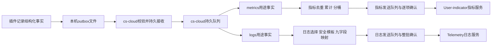

# JetBrains 插件稳定性设计与采集协议

本文是插件侧总体设计、采集事件、文件交接与控制协议的唯一维护位置；业务指标的口径、等级与分母见[稳定性指标：业务价值与统计定义](./jetbrains-plugin-stability-metrics.md)。cs-cloud内部实现由其仓库自维护；本文定义双方交接契约及指标、日志两个出口的必要行为，日志出口遵守[日志采集API](./日志采集API.md)，不另建一套上传协议。

| 文档 | 读者与用途 | 唯一维护内容 |
|---|---|---|
| [稳定性指标：业务价值与统计定义](./jetbrains-plugin-stability-metrics.md) | 产品、支持、研发、平台；先理解用户影响，再核对统计 | 24组业务指标、使用优先级（P0/P1）、起止点、分母、统计规则、登记与桶 |
| 本文 | 架构与发布评审；插件和cs-cloud研发 | 边界、设计决定、事实格式、事件字典、路径、交接契约、控制、交付顺序和联调验收 |

## 第一部分：总体设计

### 1. 结论与范围

采用“插件采集结构化事实并落盘，cs-cloud消费文件、转换为指标和日志并统一上报”。插件不实现云端认证、上报重试、流量控制或存储查询。Agent Core指标继续由cs-cloud负责。

指标与日志是两条独立的数据链路，共用采集器和文件交接设施，不共用统计口径或上传协议。

| 边界 | 指标 | 日志 |
|---|---|---|
| 目的 | 衡量成功率、耗时分布、可用性和数据完整性 | 还原关键过程、定位故障及关联诊断 |
| 输入用途 | purposes含metrics的计数、结果、区间和样本事实 | purposes含logs的生命周期、状态变化、失败及安全诊断事实 |
| cs-cloud转换 | 去重、配对、累计、分桶，按Spec映射 | 选择事件、套用安全模板，映射日志九字段 |
| 输出类型 | counter、histogram、gauge | 带message、level、attributes的日志记录 |
| 上报服务 | User-indicator，client_type=jetbrains | Telemetry，client_type=jetbrains-plugin |
| 请求与确认 | JSON events数组；HTTP 200仍需逐项确认 | NDJSON；HTTP 200空响应体表示整批接口受理 |
| 重放语义 | 独立输出ID，服务端在幂等窗口（重复ID去重期限）内去重 | 稳定输出ID辅助关联，服务端不保证去重 |
| 控制与容量 | 独立开关、许可有效期、累计状态及发送队列 | 独立开关、许可有效期、详情限频及发送队列 |

同一业务操作可以提供两种用途的事实，但不要求每条事实同时产生指标和日志；日志行数不作为指标分母，日志详情限频不改变指标计数。critical/diagnostic表示本地写入优先级，不等于metrics/logs用途；本地文本诊断日志也不属于上传日志链路。

目标是回答：用户能否开始工作、操作能否完成、故障后能否恢复，以及监控数据是否可信。不能仅用ERROR日志数量判断插件稳定性。指标分组与P0/P1等级见指标文档总览，按等级排序的交付分期见第12章。

### 2. 已核实的基础

| 证据 | 对设计的影响 |
|---|---|
| [JetBrains AGENTS.md](../packages/kilo-jetbrains/AGENTS.md)定义Split Mode，远程前后端可能在不同机器 | 不能假设共享文件系统，采集必须区分mode/side/producer（数据生产方，即每个IDE采集实例） |
| [KiloLog.kt](../packages/kilo-jetbrains/shared/src/main/kotlin/ai/kilocode/log/KiloLog.kt)写文本日志，文件handler同步写入/flush | 文本继续用于本地诊断；新事实通道异步有界，不直接复用同步handler |
| [LogConfig.kt](../packages/kilo-jetbrains/shared/src/main/kotlin/ai/kilocode/log/LogConfig.kt)支持聊天内容OFF/PREVIEW/FULL | 本地开内容日志不等于允许上传，不能自动采集整份日志 |
| [前端遥测](../packages/kilo-jetbrains/frontend/src/main/kotlin/ai/kilocode/client/telemetry/KiloTelemetryService.kt)经RPC，再由[后端遥测](../packages/kilo-jetbrains/backend/src/main/kotlin/ai/kilocode/backend/telemetry/KiloBackendTelemetry.kt)请求telemetry/capture | 连接建立前故障不能依赖该链路；新稳定性事实独立落盘 |
| [CsCloudEndpointResolver.kt](../packages/kilo-jetbrains/cs-cloud/src/main/kotlin/ai/kilocode/cscloud/CsCloudEndpointResolver.kt)读取.costrict/cs-cloud/server_url | 这是连接发现，不是已有文件消费协议 |
| [CsCloudConnectionService.kt](../packages/kilo-jetbrains/cs-cloud/src/main/kotlin/ai/kilocode/cscloud/CsCloudConnectionService.kt)全部必需流建立才Connected，每次成功递增epoch | 多条流不能重复算作多次恢复，epoch变化也不能证明daemon重启 |
| [KiloToolWindowFactory.kt](../packages/kilo-jetbrains/frontend/src/main/kotlin/ai/kilocode/client/KiloToolWindowFactory.kt)中setup失败可能仍继续发送Opened | 现有事件不能直接映射初始化成功，需要唯一终态 |
| [CscLogin.kt](../packages/kilo-jetbrains/cs-cloud/src/main/kotlin/ai/kilocode/cscloud/CscLogin.kt)等待超时仍可能返回ok=true | 插件无自有登录、凭据复用cs-cloud；浏览器认证在cs-cloud侧继续，等待ok=true不等于凭据就绪 |
| [指标契约](./user-indicator-spec.md)要求累计counter/histogram，metadata不参与聚合 | 不能直接上传60秒独立窗口桶，必须验证多源累计和重置查询 |
| [日志契约](./日志采集API.md)限定字段、支持jetbrains-plugin、关闭时停采停报，event_id不保证去重 | 本地事实需转换，不能日志计数代替指标，也不能只停上传继续采集待补报 |

#### 2.1 cs-cloud源码核验

核验日期：2026-09-20；cs-cloud（F:\ai-coding\cs-cloud）检出版本：`e05d48db2a29b5bc3d4d58f937ca086083f6cb08`，核验时工作区干净。以下链接按kilocode与cs-cloud为同级目录组织；源码可证明当前实现，Draft提案只能说明计划，均不能证明线上服务已部署。

| 核验对象 | 已有能力或限制 | 对本方案的影响 |
|---|---|---|
| [统一指标提案](../../cs-cloud/docs/in-progress/user-indicator-reporting-module-proposal.md)、[任务清单](../../cs-cloud/todo/user-indicator-reporting-module.md) | 状态分别为Draft、planning；当前internal/cmd未接入统一Registry、MetricEvent Sender或插件文件消费器 | 指标基础设施可对齐该提案，不标作已有组件；JetBrains适配及日志出口需单独列入交付 |
| [daemon入口](../../cs-cloud/internal/cli/daemon.go)、[serve入口](../../cs-cloud/internal/cli/serve.go) | 均调用InitDefaultAgent，启动失败会返回；未提供仅遥测消费运行模式 | 不将“前端无需Agent Core”描述为现有启动能力；消费组件须与agent启动、readiness解耦 |
| [配置模型](../../cs-cloud/internal/config/config.go)、[路径解析](../../cs-cloud/internal/platform/paths.go) | 尚无metrics/log reporting配置段；支持data-dir/auth-path覆盖默认目录 | 控制文件及profile绑定需要新增；不能把自定义profile误接到默认账户的控制文件 |
| [凭据读写](../../cs-cloud/internal/provider/credentials.go)、[网关TokenManager](../../cs-cloud/internal/gateway/costrict/token.go) | LoadCredentials按调用读文件；SaveCredentials直接WriteFile；TokenManager仅首次加载后缓存，刷新仅由实例内mutex串行化 | 不具备全daemon一致的身份代际、外部凭据变化通知或跨进程刷新协调；需共享身份组件 |
| [JWT工具](../../cs-cloud/internal/provider/jwt.go)、[当前用户查询](../../cs-cloud/internal/provider/cloud_user.go) | ParseJWT只解码payload，UserID可回退sub；当前用户DTO未给出完整issuer/tenant绑定 | 不能将解码成功或UserID作为本协议“已验证账户/租户”；日志要求universal_id，不能用sub替代 |
| [云客户端](../../cs-cloud/internal/cloud/client.go)、[HTTP客户端](../../cs-cloud/internal/platform/http.go) | CloudBaseURL默认补/cloud-api，SetUserAuthHeaders固定JSON；HTTPClient通常返回无总超时的http.DefaultClient | 可参考认证与传输封装，但两出口须明确完整地址、Content-Type及独立超时；不能机械复用URL拼接 |
| [工作流outbox](../../cs-cloud/internal/workflowrunner/outbox.go) | 只保存任务结果并按fact_id写pending/done/dead；Add有temp+rename，没有文件Sync及两出口状态事务 | 不是本方案durable spool（持久队列），不能直接作为.done确认的可靠性依据 |
| [原子写入](../../cs-cloud/internal/membertask/atomicfile.go)、[Windows替换](../../cs-cloud/internal/membertask/atomicfile_windows.go)、[Windows权限](../../cs-cloud/internal/membertask/permissions_windows.go) | 已有文件Sync、按平台替换及DACL处理范例，但函数服务于membertask | 可提取通用存储原语并测试，不复用任务数据目录或假设已具备插件跨语言锁协议 |
| [运行事件总线](../../cs-cloud/internal/runtime/eventbus.go) | 每订阅64槽，Emit满时default分支丢弃 | 只能作实时提示，不作为插件事实可靠接收或ACK依据 |
| [本地logger](../../cs-cloud/internal/logger/logger.go) | zap ConsoleEncoder加lumberjack输出app.log/error.log，包含调用者及异常栈；无Telemetry上传 | 本地运行日志不是九字段上传日志，不能整份转发或由计数日志反推指标 |
| [发布配置](../../cs-cloud/.goreleaser.yml) | CGO_ENABLED=0，Linux/macOS/Windows构建，当前排除Windows ARM64 | 新存储、文件锁及权限实现必须适配现有发布矩阵，不能依赖系统SQLite或额外动态库 |

结论：已有daemon宿主、凭据接口及部分存储原语；统一指标设施仍在规划，插件文件交接与日志上报均需新增。本次仅静态核验，未运行cs-cloud服务或验证云端部署。

#### 2.2 与cs-cloud指标提案的对齐边界

| 提案方向 | JetBrains接入约束 |
|---|---|
| Collector/Normalizer→Registry/Series Store→EventBuilder→Spool/Sender | 可复用未来指标核心；插件输入适配器消费本文NDJSON，不套用Codex/csc会话文件解析器 |
| sessiontrace支持collect-only及本地viewer | 这是另一种有独立许可的本地轨迹用途，不放宽插件上传用途禁采规则；本文不新增collect-only模式 |
| counter/histogram按daemon进程重启归零，使用process_epoch | 插件源run与daemon进程独立；消费状态及源累计必须持久恢复，不能仅因consumer（消费方）重启而清零后重放已消费事实 |
| EventBuilder默认cli、cs-cloud版本及设备上下文 | 必须支持保留插件原始client_type、plugin_version、device_id、source/run及业务时间；禁止补成daemon采集时上下文 |
| metrics spool批量fsync并允许小窗口丢失 | 未完成同步的输入不得对插件ACK（确认）；.done之前必须持久保存原事实及必要输出/重建状态；可以批量提交，不能先确认后刷盘 |
| trajectory store与metrics spool分离 | 轨迹viewer数据库不是插件交接ACK，也不是日志待发队列；两出口仍按第10、11章各自转换和确认 |
| 既有提案只设计指标传输 | 日志endpoint发现（向服务端查询上传地址）、NDJSON九字段、整批响应、独立开关和限频是新增工作，不复用指标Sender协议 |

提案中的接口示意、默认参数和source_epoch是候选设计，不是可直接调用的API。尤其是仅将source/run放入metadata、依赖累计下降识别重置，不能代替本方案要求的多源与迟到查询验证。

### 3. 设计决定与取舍

| 决定 | 采用方式与原因 |
|---|---|
| 补齐前置环节 | 吸收安装/启动/凭据/CLI下载/迁移指标作为P1专题（插件观测前置供给动作的结果；前置供给动作指安装、启动、凭据等首次使用的准备，csc/daemon内部过程归其自身遥测），避免只看连接后的幸存用户；不阻塞P0上线 |
| 命名与单位 | 统一jetbrains_plugin_*，云端时长用秒；本地毫秒由cs-cloud转换 |
| 逐项源码映射 | 保留接入点和现状差距，明确“已有日志”不等于“口径可靠” |
| 事件字典 | 吸收生命周期、连接、前置供给动作、UI/会话、异常和采集健康事件，并补关键操作与完整性 |
| 插件不绑定云端格式 | 本地保存结构化事实，cs-cloud按指标文档登记的Spec（指标规格）与桶（histogram分桶边界）执行累计和双出口（指标与日志）映射；不让上报格式升级牵动插件 |
| 持久化后ACK | .done表示已进入daemon可靠队列，插件不等待云端成功；读完不能ACK |
| 崩溃恢复 | writer（插件侧写入方）锁和进程启动身份确认所有权，mtime（文件修改时间）只辅助，休眠不能被当作死亡 |
| 时效 | 使用尽量短的封存（把.open文件定稿为.ready）和扫描周期；以事件发生到受理、看板/告警分别验收 |
| 多源和重放 | source/run身份与device_id分开；先按输入去重再累计；确定性输出ID在重试时保持不变 |
| 采集控制 | 区分临时上传失败、服务端禁采和用户撤销；禁采期间不再新增日志事实，也不保留数据等待将来补报 |
| 账户与版本 | 采集时固定account_epoch、plugin_version等上下文，不补绑到后来的账户或新版本 |
| 深度诊断 | v1只收安全摘要、有限脱敏插件帧和指纹，不自动上传完整堆栈或原始异常首行 |

已有application=costrict-plugin无需重复新增；指标client_type=jetbrains仍需登记，日志client_type=jetbrains-plugin已存在（“已有”指服务端契约枚举已登记，插件现有capture链路不携带这些字段，新链路由cs-cloud上报时填充）。双端指标分别用于定位，禁止相加成总调用量。

#### 3.1 方案取舍

文件消费让daemon不可用期间的插件故障仍能保留，上报策略也集中在cs-cloud维护。若用本地HTTP作为唯一数据入口，插件就要自建可靠缓存和重试，职责反而扩大。解析已有文本虽然起步快，却缺成功分母、稳定起止点，且有内容日志风险，因此不作主通道。

维护收益有边界：新增插件观测能力仍要升级插件；只是调整已有事实映射、上报认证、地址、流控、桶和告警策略时，可以主要升级cs-cloud和平台。

#### 3.2 远程开发覆盖

单体同JVM共用writer；远程frontend/backend的落盘与消费边界、仅部署backend消费器时的覆盖声明、前端消费器可不启动Agent Core以及RPC转运另行设计等结论统一见5.1，不在两处重复维护。

#### 3.3 观测盲区

采集初始化前失败、首次无有效许可、进程强杀前尚未落盘、磁盘故障、离线过期及未接入的远程端都会造成覆盖偏差。不能把“没有结束记录”当插件崩溃，也不能把“没有错误记录”当无错误。UI线程卡顿是共享IDE现象，除非有证据，不归因插件。

## 第二部分：共用采集与文件交接协议

### 4. 设计目标与责任

outbox（发件箱）是插件写下、等待cs-cloud接管的数据目录；durable spool（持久队列）是cs-cloud负责持久保存并重试发送的队列。插件只需知道本地记录是否进入采集队列，不需要知道云端是否上传成功。



| 责任 | 插件 | cs-cloud |
|---|---|---|
| 业务观测 | 操作起止、结果、耗时、阶段、异常和自身采集健康 | 不从文本猜测业务成功 |
| 本地保存 | 脱敏、异步有界写入、封存及未交接数据清理 | 认领、校验、持久接收、接管后的清理 |
| 指标转换 | 保存事实，不维护云端指标名/桶配置 | 去重、累计、单位转换、Spec与标签映射 |
| 日志转换 | 保存安全诊断事实，不拼云端日志请求 | 事件选择、模板、级别及九字段映射 |
| 指标上报 | 无指标HTTP、JWT、上传重试 | 指标认证、JSON批次、逐项确认、幂等及独立退避 |
| 日志上报 | 无日志HTTP、JWT、上传重试 | 日志endpoint发现、NDJSON批次、整批确认及独立退避 |
| 采集控制 | 执行有效的用户许可及本地策略文件 | 同步服务端策略、账户代号和自身健康 |

不解析或上传整份idea.log/kilo.log。一个本地事实可以派生指标与诊断日志，避免业务代码分别拼两套云端格式。修改桶、上报地址或已有事实映射只升级cs-cloud；新增观测点仍需升级插件。

#### 4.1 cs-cloud侧获取与上报总览

本节回答“cs-cloud从哪里获取数据、拿到之后做什么”：把第1章的两条结论展开成cs-cloud侧的完整链路，供cs-cloud研发作为入口阅读。这里只划分阶段和职责边界，具体规则以引用章节为准，避免在两处重复维护。

**获取数据（指标与日志共用）。** cs-cloud的消费组件随daemon启动，在agent初始化之前完成组装，也不依赖agent是否启动成功（见12.1）。它按下面四个阶段把插件落盘的事实接收到自己的可靠队列：

| 阶段 | cs-cloud做什么 | 细节见 |
|---|---|---|
| 发现 | 定期扫描`~/.costrict/telemetry/registrations/`目录（建议每5秒一次，与.ready扫描同周期），发现本机正在运行的IDE；新IDE的登记从出现到被首次扫到的时延，计入第13章的时效验收 | 5.2 |
| 认领 | 对每个通过所有权校验的登记，按其中的outbox_path找到该producer的outbox根目录；在exchange.lock内把.ready改名为.claimed，再在锁外复制并校验内容。同一数据源同一时刻只允许一个消费者，多个daemon靠源锁互斥 | 7.2 |
| 接收 | 校验通过的记录连同当时的账户与许可快照，先持久写入cs-cloud的可靠队列（durable spool），然后才把源文件标记为.done——到这里插件的责任就结束了 | 7.2 |
| 分派 | 记录入队后先按event_id去掉重复，再看purposes字段：包含metrics的进入指标链，包含logs的进入日志链；两种用途都有的事实分别进入两条链，任何一条链失败都不会阻塞另一条 | 14.4 |

控制文件的发布（第8章）与文件消费共用同一轮扫描结果，但两件事互不阻塞；身份代际（account_epoch）同样由cs-cloud发布，并在每次发送前重新校验（见8.1）。

**分流之后两条链完全独立：**

| | 指标链（第10章） | 日志链（第11章） |
|---|---|---|
| 转换 | 配对、累计、分桶，按Spec映射成指标 | 挑选事件、套用安全模板、映射成九字段 |
| 上报 | 发给User-indicator，请求为JSON events数组 | 上传地址来自endpoint发现，以NDJSON发给Telemetry |
| 确认 | HTTP 200后仍要逐项确认每个输出 | 空响应体表示整批已受理 |

两条链的认证与重试、开关与有效期、容量预算、退避策略和幂等窗口都各自维护，既不共用统计口径，也不共用上传协议。

**职责边界（对应第1章结论）。** 插件不实现云端认证、上报重试、流量控制和存储查询：JWT的获取与刷新、endpoint发现、退避与Retry-After、批量与限额、幂等窗口管理，全部由cs-cloud承担；查询和看板是服务端的能力，cs-cloud的职责到上报为止。此外，JetBrains数据只是cs-cloud指标设施中的一个独立输入模块，不会与Agent Core指标混在一起；Agent Core指标继续由cs-cloud自己负责（见2.2、10.1、12.1）。

### 5. 部署与路径

#### 5.1 单体和远程开发

单体IDE同一JVM内前后端共享一个采集器。Split Mode前后端可能在不同机器，各自有producer、时钟、文件和消费器；backend机器的cs-cloud不能直接读取frontend文件。

v1目标支持单体完整采集，前提是插件与cs-cloud均实现本文新协议；当前版本尚不具备该链路。远程完整覆盖要求两端各有cs-cloud文件消费能力。前端仅运行采集组件而不启动Agent Core是待新增部署能力：当前daemon/serve均启动默认agent，不能直接用现有命令宣称实现。该模式未交付时应明确前端未接入，不为补遥测强制启动额外agent。

策略与消费能力都是机器局部的：若frontend机器没有本机消费组件，就没有策略来源，按第8章首次无策略处理——默认关闭上传用途采集，仅保留独立本地文本诊断，不写critical/diagnostic待交接事实，不存在“仅本地保存等待未来交接”的中间形态。覆盖状态必须显示“前端未接入”，不能把缺失当无故障。RPC文件转运不隐含在v1内，需另行定义持久确认和断连重放。

#### 5.2 路径发现与元数据

插件通过PathManager.getLogDir()得到当前IDE日志目录，不从工作目录或硬编码系统路径推测。建议结构：

```text
<ide-log-dir>/costrict-telemetry/v1/<producer-id>/
  producer.json
  writer.lock
  exchange.lock
  critical/<run-id>-<segment-id>.open
  critical/<run-id>-<segment-id>.ready
  diagnostic/<run-id>-<segment-id>.open
  diagnostic/<run-id>-<segment-id>.ready
```

critical保存计数、结果、生命周期和健康事实；diagnostic保存限频诊断详情。每个JVM采集实例一个随机producer_id，每次采集生命周期一个随机run_id；PID只辅助诊断，不作唯一身份。同进程多项目共享writer，用随机workspace_id区分。

插件原子写登记文件`~/.costrict/telemetry/registrations/<producer-id>.json`，包含schema_major、outbox_path、producer_id、pid、process_start、created_at；outbox_path指向该producer的outbox根目录，字段名避开第4节cs-cloud持久队列（durable spool）的术语。cs-cloud扫描该目录发现多个IDE，发现节奏与消费总览见4.1；登记文件只用于本机发现与所有权校验，不进入上报数据。不再使用固定logs/metrics云端预格式化目录。

以上为默认profile发现路径，不覆盖cs-cloud的data-dir/auth-path配置。v1自动接入仅针对双方确认的默认profile；自定义profile在完成显式绑定契约前标记不支持，不能回退使用默认控制文件或读取另一个profile的凭据。默认profile的控制文件由一个持有profile级所有权锁的consumer发布，避免多个daemon覆盖策略；多消费者仍按源锁互斥。自定义profile扩展需绑定登记、控制、账户代际和spool四者，而不只是换一个数据目录。

producer.json固定该源的plugin_version、完整IDE构建号、归一化IDE版本、OS/arch、mode/side、env和device_id。记录本身也保存这些来源字段，避免生产者升级、清理元数据后历史无法解释。device_id是随机安装标识，重装是否更换取决于IDE持久设置是否保留，不能承诺重装必变。

登记及控制子目录由双方约定专用，cs-cloud升级/清理不得误删。POSIX使用用户级0700/0600；Windows使用对应用户ACL，不能把chmod数值当作Windows权限实现。消费器验证用户所有权、解析后目录范围，拒绝符号链接/重解析点越界，不支持远程请求任意指定读取路径。

### 6. 本地事实格式v1

#### 6.1 公共字段

UTF-8无BOM，NDJSON，每行一个JSON对象，以LF结束；内嵌换行JSON转义。普通记录最大32KiB，message安全摘要最大512字节；v1不自动收集完整异常堆栈。

| 字段 | 类型 | 含义 |
|---|---|---|
| schema_version | string | 1.0；major不兼容，minor只能增加可选字段 |
| event_id | UUID string | 采集时生成，重放不变 |
| timestamp | int64 | 发生时UTC Unix毫秒，不改成上传时间 |
| producer_id、run_id | string | 采集进程及运行周期 |
| channel、seq | enum/int64 | critical/diagnostic；每producer+run+channel从1递增，入队前分配，可用缺口辅助发现丢失 |
| account_epoch | string | 采集时绑定的随机账户代号，不是用户ID或Token |
| policy_revision、purposes | int64/string[] | 采集时策略版本及允许用途metrics/logs；发送时还要核对当前许可 |
| source | string | jetbrains-plugin |
| device_id | string | 随机安装标识，非硬件标识 |
| plugin_version、ide_product、ide_build、ide_build_major、os_family、arch | string | 采集时版本和环境，未知使用unknown |
| env、mode、side | enum | prod/dev/test；monolith/split；monolith/frontend/backend |
| connection_provider | enum | cs-cloud/kilo-cli/unknown |
| kind、name | enum | operation/transition/lifecycle/interval/diagnostic/health/sample；name见事件字典 |
| context | object，可选 | 仅允许operation_id、attempt_id、fault_id、trace_id、workspace_id五个闭集键 |
| data | object | 事件专属白名单，禁止任意业务payload |

workspace_id采用项目级随机映射或带本机秘密的HMAC，不用可被字典猜测的普通路径hash。不存在上下文时省略，不能编造用户、设备或项目身份。

```json
{
  "schema_version": "1.0",
  "event_id": "c387ecbf-a8d9-487c-94d4-8b8777982401",
  "timestamp": 1789862400250,
  "producer_id": "pr-7c18",
  "run_id": "run-3e92",
  "channel": "critical",
  "seq": 21,
  "account_epoch": "acct-5b02",
  "policy_revision": 12,
  "purposes": ["metrics", "logs"],
  "source": "jetbrains-plugin",
  "device_id": "device-6d81",
  "plugin_version": "1.0.0",
  "ide_product": "IU",
  "ide_build": "example-build",
  "ide_build_major": "2026.1",
  "os_family": "windows",
  "arch": "x64",
  "env": "prod",
  "mode": "split",
  "side": "frontend",
  "connection_provider": "cs-cloud",
  "kind": "operation",
  "name": "action",
  "context": {"operation_id": "op-713f", "workspace_id": "ws-a3f0"},
  "data": {
    "phase": "end",
    "action": "prompt_submit",
    "result": "timeout",
    "duration_ms": 30000,
    "stage": "rpc",
    "cause": "unknown",
    "error_code": "deadline_exceeded"
  }
}
```

#### 6.2 操作、区间和异常语义

operation使用phase=start/progress/end。start携带deadline_ms（从开始起的观测时限）；end包含result、duration_ms、stage、cause及安全error_code，必须自包含，不能依赖查找原日志文本。插件用单调时钟判定截止；定时器到点或业务完成，先发生者成为终态，超时判定不取消业务本身。progress不计算完成次数。同一operation仅一个end；丢失start或end单列质量缺口，不能推测成功。跨账户切换的操作保留开始时的epoch，不能把end重新绑定给新账户。

断线恢复同时保留逻辑operation_id和传输attempt_id。后台重试会增加attempt，但逻辑操作分母不随之增加。正常取消保留cancelled，不进入error计数。

interval保存begin_timestamp、end_timestamp、duration_ms、state和随机workspace_id，用于活跃/不可用时长，区间不重叠。sample保存单次耗时；高频渲染可对成功耗时受控采样并标明sample_rate，cs-cloud用样本生成分布且看板标注采样。不能只保存count/sum/min/max后声称可重建P95；失败事实和P0结果不采样，不据成功耗时样本估计操作成功率。

diagnostic的data仅允许固定字段：message（固定安全模板加枚举，≤512字节）、error_class、frames（脱敏插件栈帧摘要，最多5帧，不含原始异常message）、fingerprint、count。fingerprint由异常类别及归一化插件类/方法生成，去掉行号等变化值；fault_id区分一次故障，fingerprint用于同类聚集。

health中的drop/write_error使用本run累计快照，cs-cloud对同一源取相邻两次快照的差值，并单独处理第一份快照（没有更早的快照可相减），避免摘要重放造成重复计数；与操作事实产生的计数不能相加。持续计数只描述可观测损失，崩溃前尚未持久化部分可能丢失。

### 7. 写入、交接与容量

#### 7.1 不影响IDE操作

插件内部提供非阻塞record(event)，只返回queued/dropped/disabled。queued仅表示入内存，不保证落盘。专用后台单writer负责序列化和I/O，EDT（事件分发线程）不写文件、不等待锁、不压缩、不联网。

队列同时限制2000条及4MiB，以先达到者为准；critical预留按两个维度分别预留20%（400条、约820KiB）。优先丢diagnostic，critical仍满则拒绝新记录并计数，不能阻塞IDE或无限分配。入队耗时目标P99<1ms，需测试。

每个通道单文件达到1MiB即封存；未满文件在累计16条或64KiB、或自首条写入起超过通道最长延迟（critical 30秒、diagnostic 5分钟）时封存，只有非空文件参与定时封存。最小批量避免低速率流（如每30秒一条health/availability记录）逐条成文件，最长延迟约束告警时效；具体阈值用真实事件率校准。封存执行flush、文件同步、关闭，再同目录原子改名.open→.ready；平台不支持原子改名时不能假装封存成功，应保留原文件并记健康错误。文件改名（目录项）在断电后是否仍然保留，需按操作系统分别实测验证。

最大易失范围包含排队和封存前数据，正常调度下约等于该通道最长封存延迟（critical约30秒）；长暂停、断电或磁盘失败可能更长。不能承诺“强杀IDE数据不丢”。日志和指标共享封存周期，该延迟须满足第13章从发生到受理的时效验收，避免过长轮转导致指标无法及时告警。

#### 7.2 文件状态与ACK

| 状态 | 谁能写/删除 | 含义 |
|---|---|---|
| .open | 插件writer | 正在追加，consumer不得读作完整文件 |
| .ready | 插件可按配额淘汰；consumer可认领 | 已封存，内容不可变 |
| .claimed | cs-cloud | 已认领，复制/校验中；尚未ACK |
| .done | cs-cloud | 所有合法行已进入durable spool，坏行已登记；可清理源文件 |

插件持有writer.lock整个采集生命周期；消费者和清理器仅在后台用exchange.lock串行化.ready认领/淘汰。统一锁顺序为writer.lock→exchange.lock，允许插件在持有writer锁时短暂获取exchange锁，禁止任何执行者持exchange锁再等待writer锁。救援.open须先释放exchange锁，再尝试获取writer锁；插件不能为淘汰文件释放活跃writer锁。consumer先预留容量再在锁内.ready→.claimed，锁外复制和校验；插件永远不碰.claimed。发现ENOENT只说明另一方已认领/淘汰，不能记上传成功。

cs-cloud完成整文件合法行的持久接收、去重索引及消费状态提交后，再.claimed→.done；ACK含义是“进入daemon可靠投递链”，不是读完，也不是云端受理。跨磁盘时复制到spool并同步后才ACK，不能依赖跨盘原子移动。

可靠交接不能直接套用现有workflowrunner.Outbox或提案中的异步fsync默认值。提交必须覆盖输入event_id、源记录及账户/许可快照、消费进度、输出计划或可重建它们的版本信息；映射后的结果尚未产生时，也要能在重启后恢复处理。可用事务存储，或带提交标记和同步规则的journal实现；本轮不替cs-cloud选定数据库。日志与指标的后续投递独立，但任何必要信息仍只在易失内存中时都不能.done。

writer.lock/exchange.lock还需明确JVM与Go的互操作原语及锁范围：Unix不能未经验证混用不互斥的flock与fcntl锁，Windows需匹配字节范围锁及共享打开方式。必须用真实JVM writer和Go consumer跨进程验证互斥、进程死亡释放及休眠保留，不能只用同语言锁测试证明协议成立。

consumer中途崩溃，重新处理.claimed并按稳定input event_id去重；不要因为文件名已变化就跳过。多个daemon对同一源只有一个消费者锁持有者。未知major或无法解析的版本文件隔离、有界保留并记录不支持，不能误报成功接收。

ACK后插件责任结束，云端指标与日志分别维护输出状态。输入记录在必要输出已受理、永久拒绝或按策略过期前保留可恢复信息；一个出口失败不能阻塞另一个。

#### 7.3 崩溃残留和坏行

不能仅凭mtime判writer死亡：休眠、暂停或低活动都可能很久不更新。consumer先取得writer.lock并核查pid/process_start，确认没有活跃writer才救援.open。证据不足等待，不通过超时强行接管；同device_id的新进程也不能随意封存其他进程文件。

救援只保留最后完整LF前的记录；尾部不完整行丢弃并记corrupt。中间坏行隔离并计数，其他合法行继续处理；不要让一行阻塞整个队列。只有明确支持的schema才按逐行容错处理，未知major不能逐行当corrupt清空。

consumer识别旧run未正常结束只能记unclean或unknown，不推断插件崩溃或daemon重启。

#### 7.4 空间和清理

| 范围 | 默认上限 | 责任 |
|---|---|---|
| 内存队列 | 2000条且4MiB | 插件 |
| 每producer未交接文件 | 10MiB，保留期24小时 | 活跃writer清理；死亡producer由后续插件实例或daemon清理 |
| 同IDE日志根目录未交接总量 | v1不设根目录级强制配额 | 每producer独立执行10MiB；跨producer协调机制与总量阈值（如50MiB）列入第13章联调确认，v1不实现 |

同一机器多个IDE日志根目录、同一根目录下多个producer的预算分别计算；v1不做跨producer协调淘汰，根目录总量是否需要阈值及机制用真实多producer场景评估（见第13章）。默认值需用实际事件率校准；“最长24小时”不保证满24小时都存得下。

未交接超限先淘汰最旧diagnostic .ready，再淘汰最旧critical .ready；不改写已封存文件来按行删除内容，以免与消费竞争。仍无空间则拒绝新写入并计数。根目录协调只在后台进行，绝不阻塞业务。

.done持久确认后可立即删除，周期扫尾不晚于1小时，计入daemon容量直到删除；.done已交接完毕，不计入插件侧未交接10MiB/24小时配额。停用/卸载后的残留由已登记且通过所有权校验的daemon清理；producer登记在确认无活跃writer且文件已清空后清除，避免元数据无限增长。不得按目录名通配删除其他IDE日志。

插件后续实例启动时及运行期间每小时，在后台扫描同一IDE日志根目录的已登记旧producer；即使采集禁用或daemon不可用也执行残留清理，清理不产生待上传业务事实。通过路径、所有权、PID/启动身份校验并取得旧writer.lock后，按writer→exchange顺序删除已过保留期的.open/.ready；未过期.open交由正常救援流程，.claimed/.done仍仅由daemon处理。不得持自己的writer锁去等待另一个producer锁，旧源清理采用独立任务及非阻塞试锁。无活跃writer且无数据文件后才移除登记和元数据；锁文件保持稳定；当其他执行者可能持有或打开它时，不得删除后重建（unlink）。

24小时是数据可交接/发送的保留期，不是无人运行时的物理删除保证。插件与daemon均停用时无法执行清理，恢复运行后的首轮清理删除过期残留。v1不承诺跨producer磁盘总量有硬上限；根目录总配额仍是第13章的上线评估项。

### 8. 采集开关与账户归属

cs-cloud原子写`~/.costrict/telemetry/control/jetbrains.json`，插件后台每30秒检查一般策略，consumer发批前检查；账户切换另按8.1同步，不依赖该轮询提供身份正确性。控制文件按机器生效：远程frontend机器没有本机cs-cloud时无策略来源，视同首次无策略，不因backend机器存在策略而放行本机采集。字段：schema_major、revision、enabled、metrics_enabled、metrics_expires_at、logs_enabled、logs_expires_at、account_epoch、account_state（pending/ready/disabled）、expires_at、各用途允许事件类别及日志诊断限频，无JWT。metrics_enabled的服务端权威信号在现有契约中没有对应端点，其来源需在阶段0定义；日志开关由11.3的endpoint发现及明确禁采响应同步。事件固定policy_revision和purposes，便于重开或策略变更后核对原始用途，不能仅凭当前开关扩大旧数据用途。

| 状态 | 插件 | cs-cloud |
|---|---|---|
| 用户许可且有效策略允许 | 采集允许类别 | 正常消费上传 |
| 暂时离线/429限额 | 在有效许可及容量内采集 | 有界缓存，遵循退避/Retry-After |
| 服务端logs_enabled=false | 最迟30秒停止新增上传用诊断；独立本地运行日志不受影响 | 立即停日志新批次；既有缓存只在原保留期内保留，重开后可补发关闭前数据 |
| metrics_enabled=false | 停新增指标事实；日志仍按独立许可处理 | 停指标发送，不把日志开关当指标开关 |
| 用户撤销授权/总enabled=false | 停采并清理待交接数据 | 停发并清理待发数据，不在重开后补报撤销期间数据 |
| 某用途策略缺失或过期 | 仅停止该用途采集，另一有效用途继续 | 仅暂停对应出口，按该用途保留期处理缓存 |
| 公共策略缺失、过期或未知major | 关闭两种上传用途采集，独立本地诊断继续 | 不推定允许，等待有效公共策略 |

服务端关闭日志时，仍允许的指标事实可继续采集，但不得派生新的日志输出。每种输出都必须同时满足采集时purposes与发送时许可，不能在重开后把关闭期间指标事实追溯转为日志，或把仅日志用途的数据追溯转为指标。已在途请求不能保证撤回，关闭行为需标明生效边界。

控制文件分别提供metrics_expires_at与logs_expires_at，独立判断用途是否有效；公共expires_at仅限制账户绑定及总授权。每项用途的有效截止取自身截止与公共截止的较早值，不取另一个用途的截止。单项允许策略最长有效期建议24小时，且不得超过该用途上游授权/配置有效期；日志用途还受endpoint发现缓存有效期约束（expires_in单位为分钟），不能用24小时覆盖已过期的5小时日志配置。

日志策略过期只停止logs用途，仍有效的metrics继续；指标策略过期亦然。缺少某用途策略即关闭该用途，不因另一个用途允许而放行。公共策略失效、账户未就绪或总授权撤销才同时停止两条链路。既有数据仅在各自保留期内等待有效策略。默认关闭会降低首次安装/凭据未就绪时的故障覆盖，属于3.3节的观测盲区；如果产品已有明确生效的采集默认策略，接入同一有效许可规则，不由文档私自扩大权限。

#### 8.1 账户切换边界

account_epoch是daemon给当前已验证账户/租户的随机本机代号，事件采集时固定，与device_id不同。v1采用保守丢弃策略：账户或租户切换、登出时永久退役旧epoch，清除其尚未发送的输入和派生输出；再次登录同一账户也分配新epoch，不恢复旧epoch队列。仅Token刷新且已验证身份不变时可保留epoch。

清除针对记录用途和输出状态执行；已封存文件可能混有其他epoch，不按行改写或整文件误删。consumer持久登记退役行已丢弃，处理完文件其他合法行后才能清理源文件；已认领文件仍由consumer负责。内存排队事实可直接按epoch丢弃，任何一方都不得因此突破7.2的文件所有权规则。

身份代际必须与daemon实际使用的业务凭据同步：在启用新身份前持久化旧epoch退役并阻止其新批次，再发布pending；新身份及许可确认后发布新的ready epoch。发送器每批次校验当前已验证身份与epoch的绑定，不能仅相信尚未刷新的控制文件。外部认证文件变化也必须经过该边界；若cs-cloud不能提供这项保证，账户归属能力不满足阶段0要求，不能用30秒轮询代替。

源码核验显示，当前provider读文件与gateway.TokenManager缓存并存，尚无上述统一边界。应提取共享身份/TokenProvider：协调刷新、检测外部替换及登出，提供不可变的Token与身份代际快照，发送和业务请求使用同一代际。SaveCredentials当前直接覆盖文件，需要原子替换和并发刷新防覆盖；仅增加fsnotify不能保证在新凭据生效前退役旧epoch。无法可靠协调的外部写入路径按归属未就绪处理，不能继续上传归属不明的事实。

“已验证”必须来自可信认证响应或与服务端一致的身份验证，不能来自provider.ParseJWT的payload解码。身份绑定至少区分issuer、universal_id和tenant；tenant缺失时按服务端默认租户契约处理，非法值不回退。现有UserID()的sub回退及登录时machineID回退不能用于日志授权，也不能把本地APIKey、device token或工作流专用凭据当作上传用户JWT。两个出口各自完成认证/授权检查，不能由某一个HTTP 200推定另一个出口也获准。

插件观察到账户变化先暂停带账户归属的采集，清空尚未写出的旧epoch事实，应用新ready策略后再开启新操作上下文。跨端业务关联事实还须确认当前业务连接/响应属于同一身份代际，无法确认的过渡期事实仅留独立本地诊断。插件轮询尚未更新期间误带旧epoch的记录，由consumer按永久退役集合丢弃；不得改绑新epoch。已在途的旧账户请求无法保证撤回，仍只能使用发送时旧账户凭据。退役判定信息至少保留到关联输入、spool、重放窗口全部结束，清理时不能遗忘后又接受旧文件。

### 9. 共用事实字典与输出身份

下表登记插件可采集的结构化事实name和字段；操作统一start/progress/end。最后一列仅索引指标用途，不表示每条记录都必须生成指标，也不是日志目录。指标范围与转换见第10章，日志范围与转换见第11章；两者各自按purposes筛选，不根据name或channel推定许可。

| name | kind | 关键专属字段 | 对应指标/业务用途 |
|---|---|---|---|
| plugin.started | lifecycle | run环境快照 | M22、M16，版本与运行分母 |
| plugin.shutdown | lifecycle | end_kind=app_close/unload | M22、M16，正常结束证据 |
| plugin.unclean | lifecycle | previous_run_id、evidence | M22、M16，未正常结束线索，不是崩溃归因 |
| toolwindow.setup | operation | phase、stage=create/setup | M01，面板初始化 |
| backend.load | operation | phase、trigger、reason | M02，资料加载 |
| plugin.readiness | operation | phase、reason | M03，整体可用 |
| connection | operation | phase、trigger、stage | M04，逻辑连接 |
| connection.attempt | operation | phase、stage、error_code | M04，真实尝试 |
| connection.state_changed | transition | from、to、reason、streams_open/total | M05，整体退化；流详情不重复计算恢复 |
| connection.recovery | operation | phase、intervention、attempts | M05，自动或手动恢复 |
| csc.install | operation | phase、package_manager、error_code | M06，安装 |
| csc.start | operation | phase、stage、error_code | M07，启动 |
| credentials.ready | operation | phase、stage=probe/wait、error_code | M08，凭据就绪检测；认证流程归cs-cloud侧 |
| cli.download | operation | phase、stage、cache_hit | M09，备用CLI |
| migration.required | transition | migration_kind | M10，迁移阻断 |
| session.open | operation | phase、session_mode=create | M11，新建 |
| session.restore | operation | phase、session_mode=open/reconnect、stage | M11，历史与状态恢复 |
| action | operation | phase、action | M12，常用操作 |
| availability | interval | state、起止及duration_ms | M13，时间损失 |
| error.uncaught / error.reported | diagnostic | 计数事实：fault_id、error_class、handled、fingerprint、component；详情记录另加6.2的message/frames | M14，异常次数与关联；不等于记录所有IDE错误 |
| protocol.error | diagnostic | transport、stage、error_code | M15，协议兼容 |
| telemetry.health | health | drop/write_error累计、depth_bytes、oldest_age_ms | M16，采集健康；consumer的迟到质量另见10.2 |
| session.dispose_risk | transition | dispose_source、conversation_active | M18，释放风险 |
| rpc | operation | phase、api_group | M19，通信定位 |
| edt.delay / edt.violation | sample/diagnostic | 探针字段见10.3；违规记录带operation与evidence字段 | M20，延迟和已确认违规分开 |
| render.apply | sample | duration_ms、result、component、batch_size_bucket | M21，UI处理 |
| ide.operation | operation | phase、operation | M23，IDE能力 |
| resource.snapshot | sample | resource、count | M24，自有资源数量 |

kind=diagnostic只是数据形态；error/protocol/violation的最小计数事实写critical，受指标许可控制，不因详细日志限频丢计数。详细message/安全栈帧仅在日志许可允许时写diagnostic，引用相同fault_id但不同event_id，不能再次增加故障次数。

operation.end包含公共result、duration_ms、cause，未在表内逐行重复。非operation的环境变化、健康和样本字段按上述固定白名单校验，禁止透传任意对象。

事件data可包含未列入指标聚合维度的明细字段（如stage、error_code），cs-cloud只取登记维度作标签，明细用于日志与诊断。M16的observation_total由cs-cloud推导：run级started/terminal/unknown计数复用M22的plugin.started/shutdown/unclean事件，操作级缺口按10.2完成配对和最终结算，不新增插件业务埋点。M20推导及每个派生输出的身份分别见10.3、9.1；M17为cs-cloud对两出口的自观测，不登记插件事实。

#### 9.1 派生输出身份与版本

输入event_id仅用于事实去重，不能直接复用为所有派生指标的输出ID。同一operation.end的次数counter、耗时histogram及诊断日志必须各有独立ID。单事实输出用UUIDv5生成：固定命名空间加规范化数组`[input_event_id, sink, output_name, mapping_version]`（sink为输出用途，取metrics或logs）；数组元素顺序和编码固定，不能用无分隔字符串拼接；命名空间常量值及数组规范化编码在阶段0一并冻结，跨版本不得更换。36字符满足指标≤64和日志≤128字符的限制，重试与崩溃恢复保持ID和内容不变。

累计快照、限频摘要及配对结算等多事实输出，使用持久化的聚合键和输出序号代替input_event_id作为确定性输入；聚合键含producer/run、account_epoch、用途、指标及登记标签、映射版本。输入去重、累计更新、输出序号和输出内容须作为一个可恢复提交，禁止重放时重新分配ID。映射升级只作用于尚未派生的新输入，旧输出按原内容重试；修正已拒绝且确定未写入的日志可用新的映射修订生成替代输出，不因升级重复计入已接受的业务事实。

## 第三部分：指标采集、转换与上报

### 10. 指标链路

#### 10.1 采集范围与累计转换

指标仅消费purposes包含metrics且指标许可有效的事实，用于成功率、耗时分布、可用性及完整性统计。M01～M24的口径、分母、优先级、Spec与桶以[指标文档](./jetbrains-plugin-stability-metrics.md)为准；原始异常message、堆栈详情和日志级别不进入指标值或自由文本标签。

插件保存操作起止/结果、可用性区间、有效探针与资源样本，以及异常最小计数事实。cs-cloud先按输入ID去重，再配对、累计、分桶并持久化指标输出；counter/histogram为同源累计，gauge为瞬时值，毫秒耗时转秒。不得从日志行数估计成功率，也不得把日志详情采样率用于还原指标分母。异常次数不因同fingerprint日志限频而减少。

指标独立使用metrics_enabled与metrics_expires_at。指标服务故障只积压指标发送队列；日志成功不能将指标输出标为已受理。指标输出身份采用9.1，累计键包括来源、账户代际、标签与映射版本；多源、重置和迟到分别验证。

查询侧按“同一序列”对累计值做delta，但现有指标契约没有承载producer/run序列身份的字段：session_id、trace_id是join字段不参与聚合，labels必须落在Spec白名单内、枚举型取值受受控词表约束且高基数标识被治理规则排除，Prometheus语义的序列key（指标名加标签集）在契约中仅为隐含约定，多上报方场景的序列组成没有显式定义。序列键的承载方式（新增顶层字段、登记高基数label或平台专用序列概念）必须在阶段0与指标服务定案，它决定全部24组指标的Spec登记形状；这是需要契约演进的缺口，不是仅靠查询验证能关闭的事项。

JetBrains输入应作为cs-cloud未来metrics核心的一个独立模块接入：输入是插件事实，不是agent.SessionObservation。插件来源上下文必须由适配器显式传入EventBuilder，保留采集时版本和producer/run，不能套用提案中的daemon版本、cli及cs-cloud默认值。consumer重启恢复同一源的去重/累计状态；consumer自身process_epoch仅用于自观测，不得替换插件run_id。Metrics模块关闭也不能关闭独立的日志文件消费与发送。

#### 10.2 业务截止与交接迟到

业务deadline不是consumer等待文件的超时。end在deadline内发生，即使因封存、断连或重放较晚收到，仍按其可信终态结算；业务在deadline后才完成则沿用插件已结算的timeout，迟到完成只补安全诊断。consumer不能仅凭“当前没收到end”生成timeout。

有start无end时先记为配对状态pending，不立即增加unknown累计值；暂定看板展示“等待交接确认”，不能算成功或可信终态。默认在业务截止后再容忍24小时的交接迟到，宽限结束前收到有效end即可完成配对。宽限结束仍缺end才最终记unknown；之后到达的记录仅由consumer记late_after_finalization质量计数，不再次改变已结算结果。这个宽限控制配对状态保留，不延长原始文件或日志输出的保留期。

暂定完整率由查询侧读取配对状态，最终unknown才进入累计指标。cs-cloud必须持久化配对状态、结算标志及确定性输出，重启不得重开宽限或二次结算。历史终态计入事件发生时的原批次，不能把今天收到的昨天成功算作今天的操作。累计输出还必须处理同源乱序：在确定顺序前缓存，已发出的累计快照不能换内容或插入破坏单调性的快照；暂定视图与按原批次累计所需的查询支持列入阶段0验证。平台未支持前不宣称实时完整率与历史累计同时正确。

#### 10.3 EDT探针事实与卡顿推导

同一JVM仅一个探针所有者，多个可见面板不能各投递一套探针。仅在面板可见且IDE前台时启用，每秒至多投递一次，最多一个未完成探针；EDT回调只记录完成时刻，不等待writer。每次连续观测生成observation_id，暂停、休眠、失去前台或调度中断后更换ID。

edt.delay包含observation_id、probe_seq、scheduled_mono_ms、completed_mono_ms、duration_ms和validity=valid/suspended/scheduler_gap/unknown。时间采用本run内的相对单调时钟毫秒，probe_seq在观测区间内按实际投递递增；通道seq只能辅助判断事实丢失，不能代替探针序号。后台调度器检测自身调度间隔异常并结合平台休眠/恢复通知使未完成样本失效；不能可靠区分休眠的情况记unknown，不算卡顿。恢复后必须开启新观测区间。

cs-cloud只将valid样本用于延迟直方图。单个样本的排队区间持续≥2秒即构成一个观测到的stall（卡顿区间），不要求阻塞期间仍每秒产生样本；同观测区间内仅合并明确相交或首尾相接的阻塞区间，不跨空白时间猜测连续性。序号缺失、中断标记或observation_id变化打断合并，缺失部分不推断卡顿，但不抹去已完整观测的长延迟样本。该口径衡量探针观测到的排队阻塞，可能低估真实冻结时间，不等同平台freeze检测。

#### 10.4 指标请求、确认与重试

cs-cloud使用当前已验证账户有效JWT调用`POST /user-indicator/api/v2/metrics/events`，按[指标接口](./user-indicator-spec.md)发送application/json的`{"events":[...]}`，可选gzip。客户端枚举为jetbrains，application为costrict-plugin；user_id可省略并由服务端按JWT主体补齐，携带时必须与JWT主体一致，否则按identity_mismatch逐条拒绝乃至整批403；tenant、dept.path、env、traffic_source由服务端按鉴权上下文富化，无需也不应自报。指标和标签必须先在Spec登记。日志endpoint发现结果不提供指标上传地址或指标授权。

指标写入、Spec与labels使用各自显式配置的完整URL，方向与cs-cloud提案一致。现有cloud.Client.URL会在常见配置下补/cloud-api，不能把它自动拼出的地址视为User-indicator入口；由部署配置确定完整路径。可复用用户Bearer头设置的原则，但不使用设备鉴权。每个请求设置可取消context及有界总超时，不能直接依赖无总超时的platform.HTTPClient。

外部批次遵守指标契约的默认上限：1000事件、请求体压缩后5MiB（不压缩时原始体积同样不得超限）、单事件32KiB，实际采用部署限制；连接与读取超时按契约建议值2秒/5秒设置；不套用日志的500行/1MiB限制。指标发送周期与日志5秒批量独立，需根据P0指标端到端告警时效单独验收。

HTTP 200必须解析accepted/rejected及errors，按index/event_id确认每个输出；不能把整批直接标成功。重复ID响应按契约视为已受理，不再次累计；字段/Spec/标签及stale_event时效超窗等永久拒绝单独登记，已成功项不跟随失败项重新派生。无法可信解析响应时保持未确认，并以相同ID和内容重试。

请求级400修正请求结构后重试；413拆小批次；401用同一身份刷新凭据；403暂停发送并核查权限；429遵循Retry-After，可重试的服务端错误使用有界退避。指标服务幂等窗口（窗口内同一输出ID重复投递会被服务端忽略）默认7天且可配置，指标输出最大重试期限必须在阶段0配置为不超过实际幂等窗口，超过后丢弃并计数，不能换ID当新事件补报；同时事件timestamp受独立的时效窗口约束（默认7天），超出即按stale_event逐条永久拒绝、不可重试，积压输出按丢弃处理并计数。指标持久队列与累计/配对状态的容量单独设定，不与日志共用50MiB预算和3天接收窗口。

cs-cloud指标提案给出的spool候选为32MiB/72小时，周期快照候选为30秒，可作为独立指标预算的评估起点，不是已生效配置；其不同章节的批量目标值也须在实施前统一。72小时只用于已交接指标输出，不延长插件24小时outbox或日志保留期；亦不等于服务端接收时间窗口。周期快照还要计入插件封存和文件扫描时延，不能仅用Sender耗时代表P0告警时效。

## 第四部分：日志采集、转换与上报

### 11. 日志链路

本节的HTTP调用、认证、缓存、重试均由cs-cloud执行。插件不请求endpoint、不读取上传Token、不把云端九字段写成第二套本地日志文件；critical/diagnostic事实经同一durable spool交接后，按采集时purposes分别转换。指标关闭但日志允许时仍采集有排障价值的日志用途事实；日志关闭但指标允许时只保留必要计数事实，禁止附带诊断详情。日志受理次数不得作为业务指标分母。

#### 11.1 日志级别与内容

info：正常生命周期和恢复；warn：可自愈退化、风险或采集丢弃；error：明确用户可见失败/非预期异常。timeout按实际操作语义选择warn/error，不因“仍在等待凭据”声称认证失败。普通取消不生成error日志。

message使用固定模板加安全枚举，禁止直接截取异常首行。原始异常可能含Token、代码、用户名和路径，截短不等于脱敏。v1不自动上传完整堆栈；最多5个脱敏插件类/方法帧和fingerprint提供归因，深度诊断包另行由用户明确导出。

同fingerprint每分钟最多3份详情，额外次数汇入摘要；异常指标次数不被详情限频改变。采集器错误只向独立本地日志限频输出，不递归调用自身写入。本地事实到日志九字段白名单的映射（timestamp转RFC3339、context折叠为受条目和大小预算约束的attributes）由cs-cloud执行。

#### 11.2 日志采集范围

默认覆盖插件启动/正常结束、关键操作开始和失败、连接退化/恢复、安装启动及凭据等待结果、异常/协议错误的安全详情和限频摘要。日志名放入attributes.event_name，不增加顶层name。成功的高频操作、每Token渲染和RPC不逐条生成日志；需要的计数和分布继续走指标出口。同一次故障最小计数与详情共享fault_id，计数事实不再额外派生同一份异常详情日志。采集器无法落盘时仅能本地限频报错，恢复后health摘要可在日志许可下报告已观测损失，不能递归记录自身错误。

#### 11.3 日志地址发现与开关

cs-cloud使用当前账户有效Token调用`GET /user-indicator/api/v1/telemetry/endpoints`，校验logs.protocol为victorialogs-jsonline-v1，并直接使用logs.url完整地址，不拼接路径、查询参数或猜测存储地址。缓存时长按expires_in分钟计算，刷新时加入随机抖动；连接失败、404/410触发一次重新发现，429不触发换入口。缓存过期且发现失败时暂停日志发送并按第8章停止新增logs用途事实，旧日志仅有界保留，仍有效的指标用途继续。logs.enabled=false或上传返回LOG_COLLECTION_DISABLED时立即暂停日志出口并更新控制文件，插件读取后停止日志用途采集；生效时延包含上游配置缓存和插件轮询，不能承诺服务端切换后30秒内全链路生效。

当前cs-cloud源码未实现该发现接口调用及日志Sender；这是独立于metrics提案的新出口。发现接口本身的完整URL也须由可信部署配置提供，不经cloud.Client.URL默认拼接；发现响应只决定日志上传地址/许可。日志请求使用用户JWT，并明确覆盖通用JSON头为本节NDJSON媒体类型，不能沿用指标请求构造器。URL缓存以已验证账户/租户及部署配置隔离，账户切换清除旧缓存，禁止将A账户发现的许可用于B账户。

#### 11.4 日志九字段映射

所有长度按UTF-8字节数检查；本地白名单在出盘前执行，cs-cloud再次校验映射结果。

| 云端字段 | 从事实生成的规则 |
|---|---|
| timestamp | 原timestamp毫秒转带时区的RFC3339，推荐UTC；重试不改时间 |
| message | 固定安全模板及枚举，保持插件侧512字节预算；非空，不引入原始异常message |
| level | 按11.1映射为info/warn/error；不因正常取消或仍等待凭据生成error |
| device_id | 使用原device_id，非空且≤128字节；不可用省略，不用用户ID替代 |
| client_type | 固定jetbrains-plugin；发送者是cs-cloud不改变原产品类型 |
| client_version | 使用采集时plugin_version，≤64字节；不改为daemon版本 |
| workspace_id | 使用安全的context.workspace_id，≤128字节；无项目上下文省略 |
| event_id | 使用9.1的日志输出ID，重试不变；本方案统一使用36字符UUID |
| attributes | 固定键的字符串值，最多24对；键符合`[a-z][a-z0-9_]{0,47}`，单值≤1KiB；不透传context/data对象 |

attributes优先保留event_name、input_event_id、producer_id、run_id、mode、side、plugin_env、connection_provider及存在的operation_id/attempt_id/fault_id/trace_id；剩余预算按映射白名单选result、duration_ms、stage、cause、error_code、fingerprint、count和安全环境信息。有限插件栈帧拼成一个≤1KiB的安全字符串，不发送数组；为details_truncated预留一个键，超预算时省略低优先级明细并标记true，不截断关联ID或身份字段。所有值显式转字符串，无对象、数组或null；未知字段不直接转成动态键。

禁止提交universal_id、subject_id、tenant_id等身份字段、下划线系统字段、VL-*、AccountID/ProjectID控制头及存储写入参数。用户和租户由Telemetry验证Token后注入；随机account_epoch只用于本地归属控制，不冒充服务端身份。当前接口本身是草案，上述字段和行为需按第13章验证部署支持。

映射示例（输出ID仅展示格式，实际按9.1推导；联调时使用窗口内的真实时间）：

```jsonl
{"timestamp":"2026-09-20T00:00:00.250Z","message":"操作超时：prompt_submit","level":"warn","device_id":"device-6d81","client_type":"jetbrains-plugin","client_version":"1.0.0","workspace_id":"ws-a3f0","event_id":"9d464f51-1561-58de-861d-2beea170a3b4","attributes":{"event_name":"action.result","input_event_id":"c387ecbf-a8d9-487c-94d4-8b8777982401","producer_id":"pr-7c18","run_id":"run-3e92","side":"frontend","operation_id":"op-713f","result":"timeout","duration_ms":"30000","error_code":"deadline_exceeded"}}
```

#### 11.5 日志批次与时效

仅合并同一已验证账户/租户及epoch的数据，优先同设备批次。发送为UTF-8 NDJSON，使用application/stream+json或application/x-ndjson，不能包装JSON数组；支持gzip。触发建议为100条、256KiB解压后体积或5秒，任一达到即发送非空批次。硬限制同时满足1～500条、传输≤1MiB、解压≤4MiB、单行≤64KiB；v1安全message上限仍为512字节，不因服务端允许32KiB而放宽。最多2个在途日志请求，总超时建议30秒。

消费器建议每5秒扫描非空ready队列；加上插件封存与daemon批量等待，正常调度且无积压时，critical事实到首次发送的调度预算约40秒，diagnostic约310秒，均另加I/O及网络时间。接口建议的5秒批量周期不等于端到端5秒。详情日志当前适合排障，P0告警使用critical指标；如需日志快速告警，应先缩短diagnostic封存预算并实测成本，不能直接宣称已满足。

#### 11.6 日志确认、失败与重试

.done仅表示本地可靠接收；日志POST返回200且空响应体时，cs-cloud持久化该批各输出的accepted状态，不等待不存在的逐条成功数组。accepted表示接口受理，不表示逐条持久化、立即可查询或exactly-once。指标200部分成功仍按指标契约逐项处理，不能套用日志整批确认语义。

| 响应/故障 | cs-cloud动作 |
|---|---|
| 400校验错误、415编码错误 | 不重试原批次；隔离错误并修正映射/编码，允许明确未转发的合法记录重新组批；改变日志内容须产生新输出ID并记录替代关系 |
| TIMESTAMP_OUT_OF_RANGE | 逐条检查，过旧记录过期丢弃；时间戳超前的记录等待进入合法窗口，但不为此延长本地保留期；记录时钟问题，不篡改时间 |
| 413 | 按字节/行数拆批；单条超限不能靠拆批解决，丢弃并计数或经白名单裁剪生成新输出 |
| 401 | 按错误码刷新同身份凭据至多一次；仍失败暂停，身份改变执行8.1；不依赖上传Token过期宽限代替有效认证 |
| LOG_COLLECTION_DISABLED | 立即停日志新批次，同步禁采；关闭前缓存仅在原期限内保留，重开才可发送 |
| USER_NOT_FOUND / USER_REPORTING_DISABLED / TELEMETRY_FORBIDDEN | 暂停日志发送，等待身份/授权修复，不循环重试或换入口绕过；明确禁止采集的策略同步停采，撤销用户许可时清理缓存 |
| 429及可重试503 | 遵循Retry-After秒数，不切换地址绕过配额 |
| 网络中断、超时、可重试5xx | 保留未确认输出，有界退避；可能已写入，重试可能重复 |

可重试错误采用基础1秒、上限60秒的指数退避和full jitter（每次退避时长在区间内随机取值），有Retry-After时等待至少该值；连续失败5次进入至少5分钟冷却。只在连接故障或持续服务不可用时使用发现结果中的fallback_urls。日志API草案定义的本期业务限额是可配置的用户日字节额度，不把100MiB参考值或未来QPS/并发限额写成已生效限制；实际部署仍待联调。

#### 11.7 日志容量与保留期

日志spool默认预算50MiB，原事件发生后24小时到期，ACK、重试、账户刷新和重开开关均不延长；与outbox属于不同容量，不能隐含再保留24小时。服务端接收时间窗口为过去3天至未来5分钟，与本地保留策略同时满足。先淘汰低级别日志输出并记录丢弃，不能删除仍被指标出口或配对状态引用的唯一输入。daemon必须对共享输入、配对/去重索引和两出口状态另设总体容量；预算与释放规则在其仓库内定稿并做满盘测试，不能把50MiB当成整个daemon的总空间上界。

#### 11.8 日志投递质量

日志服务不保证按event_id去重；输入去重只防止本地重放重复派生，无法消除“服务端成功但响应丢失”的重复日志。M17由cs-cloud对metrics/logs两出口自观测，组件清单（含未确认数与日志X-Request-ID排障关联）以指标文档M17登记为准；业务次数仍从原始事实累计，不从日志行数推算。

## 第五部分：交付与验收

### 12. 实施顺序与边界

本轮交付为文档整合。下列为后续交付分期，尚未执行代码变更。

| 阶段 | 共用设施 | 指标交付与验收 | 日志交付与验收 |
|---|---|---|---|
| 0 契约冻结 | 身份切换、许可、远程范围、持久交接及输出ID命名空间/编码 | 冻结Spec、分母、累计/重置/迟到查询、指标容量与幂等期限 | 冻结日志选择、九字段、发现/禁采、整批响应及日志容量 |
| 1 最小链路 | writer、登记、控制、ACK与崩溃恢复 | 接M03/M14/M16/M17和M22基础run事实；指标逐项确认，重放不重复累计 | 接生命周期、操作失败与安全异常；发现、映射、整批确认、重试及查询可关联 |
| 2 用户旅程 | 复用已验证事实通道 | 完成11组P0（M01～M05、M11～M14、M16、M17），具备分母及完整性 | 按11.2覆盖关键过程、退化与恢复，验证详情限频和脱敏；不要求每个指标对应一条日志 |
| 3 灰度 | 验证两链路开关、有效期及故障隔离 | 接入13组P1并积累两周基线，根据真实样本确定告警阈值 | 验证原时间/版本查询、重复识别、保留期和实际日配额；单独评估排障时效 |

插件修改保持在JetBrains/Kilo自有模块，不需要修改共享OpenCode或Agent Core。现有无关产品使用遥测不在本次迁移范围；同一稳定性事实不得同时走旧capture和新链路重复计数。

实现时使用真实临时文件和现有测试基座，测试实际写入、锁、重放和状态变化；涉及Swing使用真实Application/EDT。执行受影响模块定向测试与JetBrains typecheck，不默认跑全量；新增平台API需核查公开API及Split Mode适用性。正式用户功能交付再添加changeset。

#### 12.1 cs-cloud接入任务与可复用边界

以下为后续开发任务，本轮仅修订kilocode文档，不修改cs-cloud源码或其提案。

| 接入任务 | 可参考现有位置 | 必须新增或调整的行为 |
|---|---|---|
| 消费组件生命周期 | internal/cli/daemon.go、serve.go | 组装在agent初始化之前；组件失败降级为未采集且不阻塞agent；agent启动失败时已保存事实可由后续消费恢复。独立前端消费模式另行实现，不以正常daemon启动成功作其验收 |
| profile与身份策略 | internal/platform/paths.go、provider、gateway/costrict/token.go | 单profile控制文件发布锁，共享身份代际与并发刷新，外部凭据替换失效及两用途独立策略；当前配置模型新增字段后再启用 |
| 插件文件消费 | 拟新增插件输入适配器 | 读取registrations及v1 NDJSON，校验/认领/救援；与sessiontrace解析器分开；JVM/Go锁协议及跨平台路径权限验证 |
| 可靠接收存储 | membertask原子写入/权限原语可提取；metrics提案spool可扩展 | 先持久提交再.done；输入去重、累计、输出计划及恢复事务；保留CGO_ENABLED=0，不直接使用workflow任务outbox |
| 指标适配 | 提案internal/metrics及EventBuilder/transport，尚未实现 | 独立JetBrains模块，原来源上下文、多源持久累计、Spec校验及逐项确认；不要求先完成全部agent会话轨迹功能 |
| 日志出口 | 拟新增日志发现/映射/Sender | 九字段NDJSON、独立许可/预算/退避、整批确认；不扩展本地logger为整文件上传器 |
| 状态与健康 | 提案stabilitymetrics及本地状态入口 | 分别报告文件接入、metrics/logs启用、积压、拒绝和覆盖；“服务在线”不等于“日志/指标链路已接入” |

阶段0优先验证身份边界、JVM/Go锁互操作和持久ACK，再落地单体最小链路。远程前端消费模式、自定义profile及在线暂定完整率若尚未支持，应在覆盖/能力状态中明确展示，不能用指标提案存在代替实现验证。

#### 指标源码接入点与现状差距

路径相对packages/kilo-jetbrains/，现有日志不代表已具备可靠指标。

| 落点 | 指标 | 必须核对的语义 |
|---|---|---|
| frontend/.../KiloToolWindowFactory.kt | M03、M01 | setup失败后可能仍发Opened；补唯一终态和异步失败 |
| backend/.../app/KiloBackendAppService.kt | M03、M02、M10 | load含恢复，起点不是整个插件启动 |
| cs-cloud/.../CsCloudConnectionService.kt、CsCloudSseClient.kt | M05、M04、M15 | 多流、重试去重；epoch不是daemon重启证据 |
| cs-cloud/.../CscInstaller.kt、CsCloudStarter.kt、CscLogin.kt | M06～M08 | 命令退出、健康可用、凭据就绪分开 |
| backend/.../cli/KiloCliDownloader.kt | M09 | 仅kilo-cli，缓存和下载分开 |
| frontend/.../session/controller/SessionController.kt、设置保存 | M11、M12、M18、M21 | pending恢复和UI应用完成才结算 |
| frontend 面板可见性监听与EDT探针（新增接入点） | M13、M20 | 活跃区间不重叠、同项目多面板去重；单JVM一个未完成探针，valid排队区间≥2秒计卡顿，中断不拼接 |
| shared/log及新增采集器 | M14、M16、M22 | 原文本日志保留，新通道异步有界 |
| RPC、IDE能力及资源所有者 | M19、M23、M24 | 自有边界观测，不全局拦截和重复上报 |

### 13. 联调必须确认的事项

| 事项 | 当前设计结论 | 上线前证据 |
|---|---|---|
| 指标服务支持 | 新增jetbrains及统一指标，复用costrict-plugin | Spec/labels接受样例，部分成功处理通过 |
| 多源累计查询 | 先逐producer/run取增量再汇总，不能只放metadata；契约尚无序列键承载字段（见10.1），承载方式属阶段0契约演进项 | A 3→5、B 8→9得3；A重置0→2另计2；直方图分位正确；序列键承载方式定案并据此登记Spec |
| 终态迟到与乱序 | 按10.2保留pending并最终结算，旧累计快照不可回写 | 截止前完成但晚交接仍成功；宽限到期只结算一次unknown；同源乱序不误判重置；暂定查询与原批次归窗有实际查询证据 |
| daemon可靠队列 | 持久接收后ACK，本地输入去重与输出可恢复 | 在认领、复制、累计、ACK前后中断测试 |
| 与现有spool区别 | 工作流outbox不是遥测spool；提案批量fsync不能先ACK | 同步失败时不.done；consumer重启不清零插件源累计；已ACK输入可重建两出口 |
| 日志上报 | 按第11章调用endpoint发现和Telemetry；日志接口200整批受理 | 九字段校验、expires_in分钟换算、空200、错误码、禁采及重开通过；查询保留原插件版本与事件时间 |
| 输出身份 | 同事实不同指标/日志独立ID，重试ID及内容不变 | counter、histogram均被接受；重复文件不新增派生输出；日志响应丢失时允许重复但指标不增计 |
| 远程覆盖 | 本机消费器才可读本机文件 | 两机器部署验证或明确前端未接入 |
| 运行模式与profile | 当前daemon依赖默认agent；自动接入仅默认profile | 独立消费模式无需agent也可接收；未实现时显示不支持；自定义data-dir/auth-path不误用默认策略 |
| 权限与账户 | 用户禁用优先、独立日志/指标开关；账户切换退役旧epoch | 模拟插件30秒未更新及外部凭据切换，旧epoch误标数据仍被丢弃；同账户重登不恢复旧队列；关闭/过期不追溯扩大用途 |
| TokenProvider与身份验证 | 当前缓存、文件读取和解码函数不足以提供已验证代际 | 网关与两Sender同代际；并发刷新/登出/文件覆盖不会复活旧账户；缺universal_id或非法tenant不回退sub/machineID |
| 独立控制与故障 | 两用途分别校验许可和有效期，各自排队/确认/退避 | 日志配置过期或服务503时指标仍工作；反向同样成立；仅公共授权/账户失效同时关闭 |
| 时效与容量 | 插件参数见第7章，指标参数见10.4，日志参数见11.5和11.7，发现节奏见4.1 | 分别实测指标告警与日志排障时延及新producer从登记到首次消费的发现时延；各自预算受控；同根目录多producer仍须评估总量阈值与协调机制，不能宣称已有根目录硬上限 |
| 残留清理 | 活跃源有配额，死亡源由后续实例/daemon按7.4回收 | daemon不可用并多次重启IDE后，旧源过期文件能清理；两者均停止时不承诺物理删除期限；不误删活跃源或claimed文件 |

业务验收优先看“用户能否工作”和“数据是否可信”，然后再优化采集成本和诊断细节。

### 14. 端到端验收场景

#### 14.1 共用采集与交接

| 场景 | 预期 |
|---|---|
| 正常封存、认领、复制、ACK | 合法数据进入spool持久队列后才.done，插件无云端依赖 |
| writer写一半崩溃 | 能取得writer锁后救援完整行，尾行丢失可见，不承诺零损失 |
| IDE休眠/暂停超过30分钟 | 不按mtime抢文件，恢复后仍能正常写入 |
| 多IDE、PID复用、多个daemon | producer/run/锁正确隔离，单一消费者 |
| consumer在复制、累计、ACK前后崩溃 | 重放不重复累计，稳定输出不变 |
| .ready淘汰与认领竞争 | 锁内只有一方成功，.claimed不被插件删 |
| writer淘汰与consumer救援并发 | 只允许writer→exchange锁顺序，consumer不持exchange等待writer；活跃writer不释放所有权 |
| 磁盘满、队列满、异常风暴 | 内存、单producer及daemon容量按各自预算受控，不阻塞EDT，详情限频不改变可记录的计数；多producer总量限制见第13章 |
| 版本升级、账户切换且插件尚未刷新策略 | 历史版本不变，旧epoch永久退役；旧操作end不绑定新账户；误标旧epoch的数据丢弃 |
| daemon不可用、IDE多次重启并关闭采集 | 后续插件实例仍可清理死亡producer过期文件，不采集新的上传用事实；claimed留给daemon |
| Split Mode前端无消费器 | 后端正常，前端覆盖缺口明确，不能宣称完整 |
| 输入含路径/Token/异常消息 | 出盘前白名单过滤，上传请求也不含机密 |
| Windows/Linux/macOS | 原子封存、锁、ACL、救援和清理验证，目录不能越界 |
| JVM writer与Go consumer同时持锁/救援 | 使用互操作锁原语；活跃writer锁阻止Go接管，进程死亡后释放；不能用两套各自通过的锁单测替代 |
| 非默认data-dir/auth-path、多daemon发布策略 | 未绑定profile拒绝自动接入；默认控制文件只有一个发布者，不跨profile读取凭据 |

#### 14.2 指标链路

| 场景 | 预期 |
|---|---|
| end在截止前完成，下一文件晚到 | 宽限内由pending转可信终态，不能先永久累计unknown/timeout；宽限后仅记迟到质量，不重复结算 |
| EDT阻塞3秒、休眠、探针调度暂停 | 有效3秒样本计一次stall；休眠/调度中断记无效，不跨观测ID或缺口拼接 |
| 同设备不同进程及run重置 | 累计增量正确，设备ID不代替序列身份 |
| 从用户操作到告警 | 测完整时延，不只测daemon拉取后的局部时间 |
| 指标JSON批次部分成功及重复ID | 逐项解析errors，接受项不随失败项重新派生；幂等窗口内重传不增计 |
| daemon重启但IDE的producer/run不变 | 恢复该源已提交累计和去重状态；process_epoch变化不生成插件重置或重复增量 |

#### 14.3 日志链路

| 场景 | 预期 |
|---|---|
| endpoint缓存300分钟、空200、413、429、401/403 | 正确换算5小时、整批确认、拆批、退避及暂停；不套用指标逐条响应或换地址绕过权限/配额 |
| 日志前行合法、后行非法 | 整批未接受；隔离/修正后重组，不把合法前行提前标accepted；更改内容用新输出ID |
| 正常日志NDJSON批次与空200 | 整批标记接口受理，不等待逐项结果，不宣称逐条落库或立即可查询 |
| 日志响应丢失后重试 | 输出ID及内容稳定，允许服务端重复日志，排障按输出ID识别；不产生业务指标增量 |
| 通用云客户端默认/cloud-api与JSON请求头 | 指标及发现使用配置的完整URL，日志使用发现返回URL和NDJSON；不携带device token，不错误追加路径 |

#### 14.4 两链路隔离

| 场景 | 预期 |
|---|---|
| 指标200部分成功、日志超时 | 逐输出确认，双出口独立；日志可能重复不污染指标 |
| 同一end派生次数、耗时、日志 | 三个不同输出ID；重放及重试各自稳定，指标服务不误去重另一项 |
| 服务端关日志、撤销授权、策略过期 | 分别执行第8章，不混为暂停上传，不追溯生成禁采期间日志 |
| 指标关/日志开，日志关/指标开 | 各自允许的用途独立工作，禁用出口不从另一用途事实补生成历史输出 |
| 日志有效期到期，指标策略仍有效 | 只停止logs采集与发送，metrics继续；指标策略单独过期时执行对称行为 |
| 单一出口持续503、满额或冷却 | 仅影响该出口发送与预算；另一出口按自身许可和容量继续，不等待失败出口成功 |

验收要点：

- 数值：100次发送95/3/2得到95%；blocked/cancelled/unknown改变到达比例和完整率，不隐藏。
- 语义：初始化错误不同时成功，打开浏览器不等于凭据就绪，epoch变化不等于daemon重启。
- 可靠性：重复文件、consumer/IDE重启不重复累计；各派生输出ID独立且稳定；历史数据保留原版本和时间，退役账户队列丢弃；日志不承诺exactly-once。
- 覆盖：单体与Split Mode分别验证，未接入端明确显示；采集初始化前、未授权和离线的覆盖偏差单列。
- 时效：逐段记录产生、落盘、接收、接口受理和查询可见时间。
