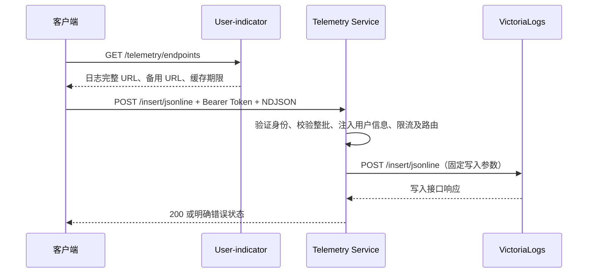

# 客户端日志上报接口设计

状态：接口设计草案，尚未实现或完成端到端验证。本期只涉及日志，不涉及性能指标与业务成果指标。

本文细化 [README.md](README.md) 中的日志链路。User-indicator 只分发 Telemetry Service endpoint；Telemetry Service 负责认证、字段校验、用户信息注入、统计、限流及代理写入 VictoriaLogs。客户端不直接访问 VictoriaLogs。

**前端（客户端）对接阅读指引：** 建议按下表顺序阅读，重点完成“获取上报地址 → 组织日志批次 → 上报 → 处理响应、重试和离线缓存”。客户端只对接 User-indicator 和 Telemetry，不直接对接 VictoriaLogs。

| 阅读范围 | 客户端需要关注的内容 |
| --- | --- |
| **第 1 节：核心约定** | 理解整体链路、NDJSON 格式和身份来源；客户端不指定存储地址、租户编号或流字段 |
| **第 2 节：分发 endpoint** | 获取完整上报 URL，处理采集开关、地址缓存与刷新、备用入口和发现失败；特别注意 `expires_in` 的单位是分钟 |
| **3.1 节：请求** | Bearer Token、Content-Type、可选 gzip、批量格式、大小与条数限制、时间窗口及推荐发送策略 |
| **3.2 节：客户端字段** | 全部字段的必填性、类型、枚举、长度约束，以及包含全部九个字段的完整客户端请求示例；表中的后台存储方式仅供参考 |
| **3.3 节的“Token 过期宽限策略”** | 发现接口需要实时有效 Token；上传接口的过期宽限由服务端配置，客户端优先使用新 Token；身份由 Token 提供，不写进日志正文 |
| **3.4 节：禁止客户端控制的字段与选项** | 不提交系统/身份字段、写入查询参数或 VictoriaLogs 控制头，避免请求被整批拒绝 |
| **3.6 节：响应与投递语义** | 成功响应、错误码和处理方式、`Retry-After`、`X-Request-ID`；理解超时重试可能重复写入，200 不等于逐条持久化证明 |
| **5.3 节：客户端退避和离线缓存** | 指数退避、随机抖动、失败冷却、本地缓存容量与过期淘汰；重试保持原事件时间和 `event_id` |

**按需参考：** 3.5 节展示客户端请求、上游请求与存储结果的对比，便于联调排查；第 7 节可用于核对联调验收项。3.3 节其余服务端身份处理、第 4 节、5.1/5.2/5.4 节及第 6 节主要面向服务端与运维，无需由客户端实现。

**限额说明：** 当前仅启用服务端配置的单用户日字节配额；文中标注“暂定、后续功能”的 QPS、字节速率及用户并发等数值不是当前生效的业务限额。客户端仍须遵守 3.1 节的请求格式、大小和时间窗口，并按实际错误响应处理。

## 1. 核心约定

- 复用 VictoriaLogs 的 `POST /insert/jsonline` 路径和 NDJSON 格式，不新增业务批次包装结构。
- 用户身份只依赖已验证 Token 中的 `universal_id`。它必须是非空字符串；缺失时拒绝上报。不以 `sub` 或 `subject_id` 兜底，不要求客户端提交用户 ID。
- `subject_id` 可由服务端从已验证 Token 的 `sub` 提取并注入普通字段；它是可选信息，不作为路由、限流或查询的必需条件，也不能代替 `universal_id`。
- 设备 ID 和客户端类型由客户端提供；它们是日志来源信息，不是可信身份或授权依据。
- 唯一流字段为受控枚举 `client_type`。`universal_id`、设备、工作目录、请求及会话标识均为普通字段。
- 客户端不能指定存储地址、租户编号、流字段或 VictoriaLogs 写入选项。代理必须重建上游请求，不能直接透传客户端请求。



## 2. User-indicator：分发 endpoint

### 2.1 请求

```http
GET /user-indicator/api/v1/telemetry/endpoints HTTP/1.1
Authorization: Bearer <access_token>
Accept: application/json
```

**接口归属：外部接口，面向客户端调用，必须进行实时 Token 认证。** 

User-indicator 的网关按请求当时的 Token 有效性实时认证并验签，不接受已过期 Token；
请不要每次上报日志都请求此接口，请求频率建议根据响应钟的expires_in来。

### 2.2 成功响应

沿用源码 `pkg/http/resp/response.go` 中的成功响应结构：

```http
HTTP/1.1 200 OK
Content-Type: application/json
Cache-Control: private, max-age=18000
```

```json
{
  "success": true,
  "code": "",
  "data": {
    "logs": {
      "enabled": true,
      "url": "https://telemetry.example.com/insert/jsonline",
      "fallback_urls": [],
      "protocol": "victorialogs-jsonline-v1"
    },
    "expires_in": 300
  }
}
```

| 字段 | 约定 |
| --- | --- |
| `logs.enabled` | 必存在布尔值，表示是否开启客户端日志采集；false 时客户端停止该链路的日志采集和上报 |
| `logs.url` | 必存在；开启时为完整 HTTPS 写入地址，客户端直接使用，不再拼接路径；关闭时为空字符串,注意,url可能是http,也可能是https,地址和路由均为服务端返回,不固定 |
| `logs.fallback_urls` | 必存在数组，默认且绝大多数部署都为 `[]`；仅显式配置备用入口时非空，按顺序尝试，与主地址具有相同认证、数据归属及配额语义 |
| `logs.protocol` | 固定为 `victorialogs-jsonline-v1`，表示本文定义的受限 JSONLine 协议 |
| `expires_in` | 缓存有效分钟数，默认 300 分钟（5 小时）；客户端按分钟计算有效期。HTTP `Cache-Control` 的 `max-age` 单位仍为秒，对应值为 `expires_in × 60`，默认 18000 |

采集关闭属于正常配置结果，返回 200 和 `logs.enabled=false`，同时 `url=""`、`fallback_urls=[]`；`protocol` 和 `expires_in` 保留。客户端不发新批次，也不补发缓存，已有缓存继续按本地容量和过期策略淘汰；仍按 `expires_in` 刷新发现配置，重新开启后才恢复采集和发送未过期缓存。该开关只控制本日志采集链路，不要求关闭客户端自身的本地运行日志。

User-indicator 只分发服务端配置的采集开关和 endpoint，不负责上传时的用户状态检查。Telemetry 必须读取相同配置并独立执行开关限制，不能依赖客户端自觉遵守缓存配置；关闭时返回 `403/LOG_COLLECTION_DISABLED`。开启但未配置可用入口仍返回 503，不能伪装成正常关闭。

不返回 VictoriaLogs 地址、存储凭据或含 Token 的 URL。不接受客户端传入任意目标 URL。多个 Telemetry 副本通过负载均衡提供一个稳定入口，不要求客户端保存副本列表。

异常响应沿用 `{ "success": false, "code": "...", "message": "..." }`。新增接口约定：未认证 `401/INVALID_TOKEN`，无采集权限 `403/TELEMETRY_FORBIDDEN`，未配置可用入口 `503/TELEMETRY_UNAVAILABLE`，发现接口限流 `429/RATE_LIMITED`。HTTP 状态以本文为准；现有通用错误 helper 默认返回 400，落地时需使用能设置相应 HTTP 状态的响应方式。

客户端在有效期内复用地址，刷新增加随机抖动。入口连接失败、404 或 410 时重新发现一次；429 不触发换地址绕过配额。发现失败且缓存过期时保留本地待发日志并退避，不自行猜测 URL。

## 3. Telemetry Service：日志上报

### 3.1 请求

**Token 必填：** 每次上报必须携带 `Authorization: Bearer <access_token>`。Telemetry Service 自行使用服务端配置的 JWK 公钥验签；Token 缺失返回 `401/INVALID_TOKEN`，到期检查遵循 3.3 的过期宽限策略。

```http
POST /insert/jsonline HTTP/1.1
Authorization: Bearer <access_token>
Content-Type: application/stream+json
Content-Encoding: gzip
```

请求体为 UTF-8 NDJSON，每行一个 JSON 对象，以换行分隔；不接受 JSON 数组或 `{ "logs": [...] }` 包装。支持 `application/stream+json` 与 `application/x-ndjson`；`Content-Encoding` 可省略或为 `gzip`。下例展示解压后的内容：

```jsonl
{"timestamp":"2026-09-16T17:00:00.123+08:00","message":"extension activated","level":"info","device_id":"device-8c4c","client_type":"vscode-plugin","client_version":"1.2.3","event_id":"01994d39-6f00-7000-8000-000000000001"}
{"timestamp":"2026-09-16T17:00:01.456+08:00","message":"request timed out","level":"error","device_id":"device-8c4c","client_type":"vscode-plugin","workspace_id":"workspace-f2a1","event_id":"01994d39-6f00-7000-8000-000000000002","attributes":{"operation":"completion","duration_ms":"30000"}}
```

示例时间仅说明格式，实际必须满足时间窗口。建议一批只包含同一设备和客户端类型；服务端仍逐行校验，不以第一行覆盖后续行。

#### 客户端请求限制

当前业务配额仅限制单个用户的单日日志存储上限，由后台配置；下表用户并发、请求/字节速率及租户配额均为暂定的后续功能，当前不启用。请求格式、大小、时间窗口等接口校验仍按本文执行。部署调整后应同步告知客户端；实际拒绝以服务端响应为准。`1 KiB = 1024` 字节，`1 MiB = 1024 KiB`，大小按 UTF-8 编码后的字节数计算，不按字符数计算。

| 限制项 | 客户端需要遵守的规则 |
| --- | --- |
| 请求体格式 | UTF-8 NDJSON，每行一个 JSON 对象；1～500 条，允许末尾换行，不允许中间空行；不使用 JSON 数组 |
| 单请求传输体积 | 请求体最多 1 MiB；gzip 时指压缩后体积，不压缩时原始请求体也不得超过 1 MiB |
| 单请求解压体积 | 最多 4 MiB；与传输体积限制同时满足，不能仅根据压缩后大小判断 |
| 单条日志大小 | 解压后单行 JSON 最多 64 KiB，包含所有字段；其中 message 最多 32 KiB，其他字段限制见 3.2 |
| 日志时间 | timestamp 为服务端接收时刻前 3 天至后 5 分钟，含边界；重试和离线补报不修改原时间 |
| 单设备并发建议 | 建议本地上传器最多 2 个在途请求；属于客户端发送建议，当前不按设备实施业务并发限额 |
| 同一用户并发 | **暂定，后续功能，当前不限制。** 规划值：所有设备、客户端类型和入口合计最多 4 个在途请求 |
| 同一用户请求频率 | **暂定，后续功能，当前不限制。** 规划值：持续速率最多 2 请求/秒，令牌桶突发容量为 10 个请求；重试也是请求 |
| 同一用户字节速率 | **暂定，后续功能，当前不限制。** 规划值：解压请求体持续速率最多 128 KiB/秒，令牌桶突发容量为 4 MiB；gzip 不减少该计量 |
| 同一用户单日日志存储上限 | **当前启用，后台可配置。** 按中国时区（Asia/Shanghai，UTC+8）自然日计量；100 MiB 仅为暂定参考值，不是固定限制，实际以上线后台配置为准。计量为通过校验且获准转发的客户端解压字节数，不含服务端新增字段 |
| 租户共享请求频率 | **暂定，后续功能，当前不限制。** 规划值：整个租户持续速率最多 100 请求/秒，突发容量 200 个请求，不是每个用户各享有一份 |
| 租户共享字节速率 | **暂定，后续功能，当前不限制。** 规划值：整个租户解压字节持续速率最多 10 MiB/秒，突发容量 20 MiB |
| 租户共享日配额 | **暂定，后续功能，当前不限制。** 规划值：每个中国时区（Asia/Shanghai，UTC+8）自然日 50 GiB，租户内所有用户共享 |
| 读取及等待时间 | 服务端请求读取超时为 10 秒，客户端总超时建议 30 秒；不能依靠长时间慢速上传占用连接 |
| URL 与请求头 | 使用发现接口返回的完整 URL，不追加查询参数；不得提交 VL-*、AccountID、ProjectID 等控制头，详见 3.4 |

当前单用户日存储额度按 `(tenant_id, issuer, universal_id)` 合并计算，换设备、client_type、endpoint 或 Telemetry 副本不会重置额度。表中暂定突发容量仅解释后续规划：它是短时允许的累计消耗量，不是可长期维持的每秒速率，当前不执行。日配额按中国时区（Asia/Shanghai）的自然日计算，每天北京时间 00:00 重置；日期归属以服务端准入计量时刻为准，不取客户端日志 timestamp，跨日重试计入重试准入时所在日；已经尝试转发的批次即使失败也不退还预扣日配额，重复提交可能再次计量。

**推荐发送策略：** 缓冲达到 100 条、256 KiB 解压体积或距上次发送 5 秒时，任一条件先满足即尝试发送非空批次；建议保持本地有界并发，日存储额度耗尽后暂停发送。客户端按需拆批，并对发送时间增加随机抖动。

**超限处理：** 大小或条数超限返回 `413/PAYLOAD_TOO_LARGE`，应拆批；单条超限不能靠拆批解决。当前单用户日存储额度耗尽返回 `429/QUOTA_EXCEEDED`，遵循 `Retry-After` 秒数等待；`429/RATE_LIMITED` 预留给后续速率/用户并发限制，当前不因这些暂定阈值拒绝请求，禁止立即循环重试或切换入口绕过。服务端资源不足时也可能返回 503，即使客户端未超自身配额。其他失败原因见 3.6；重试退避及离线缓存规则见 5.3。

### 3.2 客户端字段

| 字段 | 必需 | 类型及约束 | 解释 | 后台存储方式(客户端不关心,请忽略) |
| --- | --- | --- | --- | --- |
| `timestamp` | 是 | RFC3339 字符串，必须含时区，例如 `2026-09-16T17:00:00.123+08:00`；接收时刻前 3 天至后 5 分钟 | 客户端日志实际产生的时间；允许范围为服务端接收时刻前 3 天至后 5 分钟（含边界），超出范围整批拒绝；离线补报保留原时间 | 映射为 `_time` |
| `message` | 是 | 非空字符串，UTF-8 最多 32 KiB | 客户端的日志数据，即一条日志的正文内容，可包含事件描述、错误信息或异常堆栈 | 映射为 `_msg` |
| `level` | 是 | `trace/debug/info/warn/error/fatal`，小写 | 客户端日志的级别，表示该条日志的严重程度 | 普通字段 |
| `device_id` | 否 | 提供时为非空字符串，最多 128 字节；安装实例生成的稳定随机标识，不使用硬件敏感标识 | 产生日志的客户端设备或安装实例标识；可省略，省略后日志不包含设备归属信息 | 普通字段 |
| `client_type` | 是 | 枚举 `cs-cloud/vscode-plugin/jetbrains-plugin/cli-csc/cli-codex` | 产生日志的客户端产品类型，不包含版本号或用户标识 | 唯一流字段，同时可用于字段过滤 |
| `client_version` | 否 | 字符串，最多 64 字节 | 产生日志时客户端的软件版本号 | 普通字段，禁止成为流字段 |
| `workspace_id` | 否 | 字符串，最多 128 字节，建议使用不暴露本地路径的稳定标识 | 日志所属工作目录或项目的标识，不是本地目录的完整路径 | 普通字段 |
| `event_id` | 否 | 字符串，最多 128 字节，推荐客户端生成并在重试时保持不变 | 单条日志事件的标识；同一事件重试上报时保持不变 | 普通字段；不代表服务端自动去重 |
| `attributes` | 否 | 最多 24 个键值对；键匹配 `[a-z][a-z0-9_]{0,47}`，值为最多 1 KiB 的字符串 | 日志的扩展信息，以键值对表示，例如操作名 operation、耗时 duration_ms | 转为 `attributes.<key>` 普通字段 |

`+08:00` 表示 UTC+8；示例 `2026-09-16T17:00:00.123+08:00` 与 `2026-09-16T09:00:00.123Z` 表示同一时刻。客户端可以使用任意合法时区偏移，服务端按绝对时间判断窗口，不要求先转成 UTC 字符串。

`device_id` 不可用时直接省略，不发送空字符串或 `null`，服务端不伪造设备 ID，也不以用户 ID 代替。此时仅按用户和其他已有字段检索；用户配额和分片规则不受影响。客户端并发限制适用于本地上传器，即使省略设备 ID 也必须遵守。

顶层字段采用以上白名单。`attributes` 不允许嵌套对象、数组、空值、动态 ID 作为键或任意层级路径；代理明确展开为带 `attributes.` 前缀的扁平字段，避免与系统字段碰撞。除 `attributes` 外，各字段都不能是对象或数组。未知字段、重复 JSON 键、非法类型或枚举均整批返回 400；不能依赖 JSON 解码器“最后一个值覆盖前值”的行为。

客户端类型扩展必须先更新服务端枚举和协议配置，不把版本号、用户 ID、设备型号拼入 `client_type`。客户端字段不证明其真实设备或应用类型，不能据此提高授权或用户配额。

#### 完整客户端请求示例

以下示例包含全部九个客户端字段。后台存储映射由服务端处理，客户端只需遵守本节字段约定，不提交用户身份字段、存储租户头或写入查询参数。

```http
POST /insert/jsonline HTTP/1.1
Host: telemetry.example.com
Authorization: Bearer <access_token>
Content-Type: application/stream+json
```

```jsonl
{"timestamp":"2026-09-16T17:00:00.123+08:00","message":"请求失败\nError: connection timeout","level":"error","device_id":"device-8c4c","client_type":"vscode-plugin","client_version":"1.2.3","workspace_id":"workspace-f2a1","event_id":"event-000001","attributes":{"operation":"completion","duration_ms":"30000"}}
```

上面的 JSON 对象占一个物理行；message 中的 `\n` 是 JSON 转义字符，不是 NDJSON 行分隔符。批量发送时，每条日志各占一行，组成同一个请求体，不包装为 JSON 数组。示例时间仅用于说明格式，实际发送时须满足时间窗口。

需要压缩时添加 `Content-Encoding: gzip`，并将整个 NDJSON 请求体 gzip 压缩；不能只添加头部而发送未压缩内容。客户端请求经 Telemetry 转换后的对比见 3.5 节。

### 3.3 服务端用户与租户信息

1. Telemetry Service 自行使用服务端配置的固定 JWK 公钥验证 Bearer Token 签名，同时验证允许的算法、发行者、受众及 `nbf`（若存在）。本期不支持密钥轮换，不自动刷新或切换验签密钥；不信任 Token 自带的公钥或密钥地址。`exp` 按下述过期宽限策略验证，不能只做 Base64 解码。
2. 提取 `universal_id`，要求非空字符串、无首尾空白、最多 256 字节，不做可能合并两个用户的大小写转换。失败返回 `401/INVALID_IDENTITY`。
3. 从已验证 JWT 的 `tenant_id` claim 确定租户：字段存在时以 Token 值为准，要求非空、无首尾空白且最多 256 字节的字符串；字段缺失时使用固定业务租户 `default`。字段存在但为空、null 或类型非法时返回 `401/INVALID_IDENTITY`，不静默回退。禁止从客户端日志、查询参数或未经验证的头部覆盖租户。`default` 同样需要服务端存储映射及独立配额；Token 指定租户无权限时返回 403，尚未配置可写存储时返回 503，均不转写到 `default`。
4. 可选提取已验证 Token 的 `sub`，映射为日志字段 `subject_id`；`sub` 缺失时不注入该字段，存在时要求非空、无首尾空白且最多 256 字节的字符串，否则返回 `401/INVALID_IDENTITY`。对整批日志注入 `universal_id`、`tenant_id` 及存在时的 `subject_id`，均为普通字段；客户端不能自行提交或覆盖这些字段。
5. 用户路由及限流键使用 `(tenant_id, issuer, universal_id)`，避免发行者或租户间 ID 碰撞；同一个用户切换设备、入口或副本不会得到额外配额。若部署存在多个 issuer，额外注入普通字段 `identity_issuer`，查询用户时同时约束 issuer。

#### Token 过期宽限策略

User-indicator 的 endpoint 发现由网关执行实时认证及验签，Token 到期后网关即拒绝；Telemetry Service 专门允许日志补报使用过期不超过 N 天的 Token。配置项 `token_expiry_grace_days` 为服务端非负整数，N 天按 `N × 86400` 秒计算，不按自然日计算；N=0 表示不允许过期使用，具体部署值由服务端配置并在副本间保持一致。

- JWT 必须包含合法数值类型的 `exp`（Unix 秒）。以服务端接收请求时刻 `now` 判断：`now < exp + N × 86400` 时通过到期检查，到达或超过该边界返回 `401/TOKEN_EXPIRED`。不额外叠加未声明的到期宽限。
- 例如 N=3，Token 在 `2026-09-16T10:00:00+08:00` 到期，Telemetry 可在 `2026-09-19T10:00:00+08:00` 之前接受；User-indicator 的网关在原到期时刻起即拒绝。
- 宽限只作用于 `exp`，不跳过签名、issuer、audience、`nbf`、身份或授权检查；未来才生效的 Token 不因宽限而提前有效。若认证系统支持撤销或禁用，宽限不能覆盖明确的撤销/禁用结果。
- 已过期 Token 的租户与用户仍取该已验证 Token，不允许客户端更换身份。固定 JWK 公钥须能验证宽限期内的 Token，未知或已撤销密钥不能跳过验签；本期不支持通过轮换密钥兼容新旧 Token。
- 网关转发模式的 Telemetry 路由必须保留 Bearer Token 并交给 Telemetry 自行通过 JWK 验签，不能先用严格过期策略拦截；如网关额外认证，必须兼容相同宽限规则。User-indicator 的网关路由仍采用实时认证规则。
- Token 宽限与日志时间窗口相互独立：即使凭据通过宽限检查，日志仍须满足过去 3 天至未来 5 分钟的事件时间约束。

客户端优先使用新 Token；只有尚未刷新凭据时才利用日志宽限。缓存 endpoint 仍有效时可用宽限期 Token 上报；需要重新发现或 endpoint 缓存过期时，必须先获取实时有效 Token。不能因 Telemetry 宽限而延长 endpoint 缓存期限。

**两端认证职责：** `user-indicator/pkg/http/middleware/jwt.go` 只解析信息、不验签，符合其接收网关受信 Token 的部署方式；网关负责实时验签和有效期检查，必须限制绕过网关直接访问该外部接口。User-indicator 保持 endpoint 分发职责，不新增自身验签逻辑。Telemetry Service 无论直连还是经过网关，均自行使用固定 JWK 公钥验签，并执行相同的用户、租户及过期宽限校验。

### 3.4 禁止客户端控制的字段与选项

本期通过使用 `timestamp/message` 别名，连 `_time/_msg` 也不向客户端开放；这两个字段由服务端固定映射生成。

| 分类 | 禁止内容 | 处理 |
| --- | --- | --- |
| VictoriaLogs 系统字段 | `_time`、`_msg`、`_stream`、`_stream_id`，以及所有以下划线开头的字段 | 400，整批拒绝 |
| 服务端身份字段 | `universal_id`、`subject_id`、`tenant_id`、`identity_issuer` | 400，即使与 Token 相同也拒绝 |
| 写入查询参数 | `_stream_fields`、`_time_field`、`_msg_field`、`ignore_fields`、`extra_fields`、`debug`、`decolorize_fields`、`preserve_json_keys` 等 | 客户端写入 URL 不允许任何查询参数，出现即 400 |
| VictoriaLogs 控制头 | 所有 `VL-*`、`AccountID`、`ProjectID`（头名称不区分大小写） | 400，禁止透传 |
| 上游认证与目标 | 客户端 Basic 认证、存储地址、租户覆盖值 | 不接受；由服务端配置生成 |

`attributes` 的键规则和固定前缀同时阻止嵌套、点号等绕过。这里的“屏蔽”指不允许写入且明确返回错误，不是悄悄丢弃后返回成功。不能仅设置 `ignore_fields` 代替本地校验，因为控制参数本身也可能被客户端覆盖。

### 3.5 上游代理契约

**客户端的一切 HTTP 请求头都不会转发给日志管理器（VictoriaLogs）。** Telemetry 在入口读取必要头部以完成认证和解码，然后独立构建上游请求。即使上游使用同名头部，其值也由 Telemetry 根据服务端配置及实际输出内容重新生成，不复制客户端请求头。

Telemetry 对已校验、注入身份且展开扩展字段后的 NDJSON 发起：

```http
POST /insert/jsonline?_time_field=timestamp&_msg_field=message&_stream_fields=client_type HTTP/1.1
Content-Type: application/stream+json
AccountID: <server-mapped-uint32>
ProjectID: <server-mapped-uint32>
Authorization: <server-side-storage-credential>
```

`AccountID/ProjectID` 使用服务端持久化的租户映射；不能直接把任意字符串用户 ID 填入这两个头。两者是 VictoriaLogs 的存储租户标识，不是日志字段，也不作为用户分片单位。共享存储实例的不同业务租户必须映射为不同租户编号对，读取时使用相同编号对。不要默认全部写入 `0:0`。

上游 `Authorization` 来自服务端存储凭据，`AccountID/ProjectID` 来自可信租户映射；`Content-Type` 由输出协议决定，`Content-Encoding` 由 Telemetry 是否重新压缩决定，Host 和消息长度由上游地址及实际请求体生成。客户端 Bearer Token、Cookie、任意 `X-*`、转发头和控制参数均不传给存储。上游凭据只存于服务端配置。VictoriaLogs 只允许 Telemetry 和受控查询服务访问。

代理保留 JSONLine、gzip 支持和原生写入路径，但不是无校验字节透传：必须在发送前完成整批解析、校验及大小检查，防止一批中的前几行已写入、后几行才发现客户端错误。

#### 完整请求的转发与存储对比

沿用 3.2 节的完整客户端请求，假设服务端验证 JWT 后得到以下身份信息（仅展示相关 claims，不是完整 Token）：

```json
{
  "universal_id": "user-123",
  "tenant_id": "tenant-a",
  "sub": "subject-456"
}
```

假设服务端将 `tenant-a` 映射到 VictoriaLogs 存储租户 `AccountID=1001`、`ProjectID=1`，并配置 Basic 存储认证。Telemetry 完成整批校验后，重新构建如下请求；编号和认证方式仅为示例，实际由服务端配置决定。

```http
POST /insert/jsonline?_time_field=timestamp&_msg_field=message&_stream_fields=client_type HTTP/1.1
Host: victorialogs:9428
Authorization: Basic <base64-encoded-storage-credentials>
AccountID: 1001
ProjectID: 1
Content-Type: application/stream+json
```

```jsonl
{"timestamp":"2026-09-16T17:00:00.123+08:00","message":"请求失败\nError: connection timeout","level":"error","device_id":"device-8c4c","client_type":"vscode-plugin","client_version":"1.2.3","workspace_id":"workspace-f2a1","event_id":"event-000001","attributes.operation":"completion","attributes.duration_ms":"30000","universal_id":"user-123","tenant_id":"tenant-a","subject_id":"subject-456"}
```

| 项目 | 客户端 → Telemetry | Telemetry → VictoriaLogs |
| --- | --- | --- |
| URL | `/insert/jsonline`，不带查询参数 | 固定添加时间、消息和流字段映射参数 |
| 认证 | 用户的 Bearer Token | 服务端配置的存储凭据，不转发用户 Token |
| 存储租户 | 客户端不得指定 | 服务端添加 `AccountID`、`ProjectID` |
| `timestamp` | 客户端事件时间 | 值不变，字段名仍为 `timestamp` |
| `message` | 日志正文 | 内容不变，字段名仍为 `message`；通过 JSON 编码器重新转义 |
| `level` | 日志级别 | 值不变 |
| `device_id` | 可选设备标识 | 值不变；省略时不补值 |
| `client_type` | 受控客户端类型 | 值不变；通过固定 URL 参数指定为唯一流字段 |
| `client_version` | 可选客户端版本 | 值不变；省略时不补值 |
| `workspace_id` | 可选工作目录标识 | 值不变；省略时不补值 |
| `event_id` | 可选事件标识 | 值不变；不因此自动去重 |
| `attributes` | 字符串键值对象 | 展开为 `attributes.operation` 等扁平普通字段 |
| 用户身份 | 客户端日志体不得提供 | 从已验证 JWT 注入 `universal_id`、`tenant_id`；有 `sub` 时注入 `subject_id` |
| 压缩与长度 | 可选 gzip，遵守传输和解压大小限制 | 解压转换后重新构建正文；是否重新 gzip 由服务端决定，消息长度按实际输出生成 |

此示例按单 issuer 部署展示；多个 issuer 时，按 3.3 节额外注入 `identity_issuer`。示例上游正文未压缩；若服务端重新压缩，才添加自己的 `Content-Encoding: gzip`。身份注入、字段展开和重新编码会改变正文大小，上游不能机械套用客户端原始正文的大小限制。

对于批量请求，Telemetry 逐行执行同样的转换，全部校验通过后以一个 NDJSON 请求转发，不拆成每条日志一个请求。JSON 空白、字段顺序和转义写法可能变化，不承诺原始字节不变；业务字段内容按上表保留。

VictoriaLogs 根据固定参数将 `timestamp` 映射为 `_time`、`message` 映射为 `_msg`，生成流信息。通过受控查询工具携带相同存储租户编号回查时，结果类似：

```json
{
  "_time": "2026-09-16T09:00:00.123Z",
  "_msg": "请求失败\nError: connection timeout",
  "_stream": "{client_type=\"vscode-plugin\"}",
  "_stream_id": "<VictoriaLogs-generated-stream-id>",
  "level": "error",
  "device_id": "device-8c4c",
  "client_type": "vscode-plugin",
  "client_version": "1.2.3",
  "workspace_id": "workspace-f2a1",
  "event_id": "event-000001",
  "attributes.operation": "completion",
  "attributes.duration_ms": "30000",
  "universal_id": "user-123",
  "tenant_id": "tenant-a",
  "subject_id": "subject-456"
}
```

`timestamp/message` 是由 VictoriaLogs 按参数映射，不是 Telemetry 提前改名；上例 UTC 时间与客户端的 `+08:00` 时间表示同一时刻。`AccountID/ProjectID` 属于存储隔离信息，不会自动成为日志字段，日志中的 `tenant_id` 也不能代替查询所需的存储租户编号。本例是内部存储查询结果，不是新增客户端查询接口。

VictoriaLogs v1.52.0 实测会省略空字符串字段：可选字符串或 attributes 值为 `""` 时，入库回查可能表现为字段不存在，不能据此区分显式空字符串与未提供字段。上述非空值示例不受影响。

### 3.6 响应与投递语义

成功沿用 VictoriaLogs 风格，返回 `200 OK`，响应体为空；附加服务端生成的 `X-Request-ID` 用于排障。不添加逐条成功数组或承诺逐条持久化。

200 表示整批通过本地校验并且上游写入接口返回成功，**不代表逐条持久化证明、立即查询可见、强一致或 exactly-once**。VictoriaLogs 可能因保留期、服务端限制等丢弃行；部署参数必须与本协议兼容，并监控存储丢弃计数。

失败必须返回非 2xx HTTP 状态和 JSON 响应体，`Content-Type: application/json`。不能返回 200 加 `success=false`，也不能只给出无原因的空响应。示例：

```http
HTTP/1.1 403 Forbidden
Content-Type: application/json
X-Request-ID: server-generated-id
```

```json
{
  "success": false,
  "code": "USER_REPORTING_DISABLED",
  "message": "该用户已被禁止上报日志",
  "request_id": "server-generated-id"
}
```

`success` 固定为 false；`code` 是稳定的机器可读失败原因，客户端按它分支处理；`message` 必填，描述具体原因供用户或排障人员阅读，不能依赖其文案做程序判断；`request_id` 与响应头一致。校验错误可附加 `details.line`（从 1 开始）及 `details.field`，不回显日志值、完整 Token、密钥或底层异常堆栈。一次请求存在多个问题时只返回处理顺序中首个失败原因。

| HTTP | code | 失败原因 | 客户端处理 |
| --- | --- | --- | --- |
| 400 | `INVALID_LOG` | 非法 JSON、字段缺失/类型错误、非法枚举或重复键 | 修正请求，不重试原批次 |
| 400 | `TIMESTAMP_OUT_OF_RANGE` | 日志时间超出接收窗口 | 检查设备时钟，淘汰过期日志，不篡改原事件时间 |
| 400 | `RESERVED_FIELD` | 提交系统字段或服务端身份字段 | 删除禁止字段后重新构造批次 |
| 400 | `FORBIDDEN_PARAMETER` | 提交写入查询参数或受限控制头 | 修正请求，不重试原请求 |
| 401 | `INVALID_TOKEN` | Token 缺失、格式非法、exp 非法或其他未细分认证错误 | 获取有效凭据一次；仍失败则暂停发送 |
| 401 | `TOKEN_SIGNATURE_INVALID` | Token 签名验证失败 | 刷新凭据一次；仍失败则停止自动重试并排查认证配置 |
| 401 | `TOKEN_EXPIRED` | 已达到或超过服务端配置的过期宽限边界 | 获取新 Token 后再发，不能切换入口绕过 |
| 401 | `TOKEN_NOT_YET_VALID` | 尚未到达 nbf 生效时间 | 检查凭据和时钟，不立即重复发送 |
| 401 | `TOKEN_CLAIMS_INVALID` | issuer、audience 等认证声明不符合要求 | 使用正确发行者及受众的凭据 |
| 401 | `TOKEN_REVOKED` | 认证系统明确判定 Token 已撤销 | 重新认证；过期宽限不能豁免 |
| 401 | `INVALID_IDENTITY` | universal_id 缺失/非法，或存在但非法的 tenant_id/sub | 修复身份凭据，不修改日志冒充其他身份 |
| 403 | `USER_NOT_FOUND` | 已认证身份在所属租户中不存在 | 停止上报，待账号或租户成员关系修复后恢复 |
| 403 | `USER_REPORTING_DISABLED` | 用户被明确禁止上报日志 | 停止上报，待服务端解除限制后恢复，不自动循环重试 |
| 403 | `LOG_COLLECTION_DISABLED` | 服务端已关闭当前范围的日志采集 | 停止采集和上报，按周期刷新发现配置 |
| 403 | `TELEMETRY_FORBIDDEN` | 租户、账号或授权策略不允许采集 | 停止上报，不切换地址绕过 |
| 413 | `PAYLOAD_TOO_LARGE` | 压缩/解压大小、单条大小或批次行数超限 | 按字节/条数拆批；单条过大需裁剪后形成新事件或丢弃并计数 |
| 415 | `UNSUPPORTED_MEDIA_TYPE` | 不支持的 Content-Type 或 Content-Encoding | 修正编码和请求头 |
| 429 | `RATE_LIMITED` | 后续功能预留：请求速率、字节速率或用户并发超限；当前上传接口不启用 | 遵循 Retry-After，不换入口规避 |
| 429 | `QUOTA_EXCEEDED` | 当前用户单日日志存储额度耗尽；租户日配额为后续功能，当前不启用 | 按 Retry-After 等待配额恢复 |
| 502 | `UPSTREAM_ERROR` | 上游写入拒绝或异常 | 结果可能不确定，按退避策略处理 |
| 503 | `OVERLOADED` | 代理资源或存储并发已满 | 遵循 Retry-After，本地有界缓存并退避 |
| 503 | `STORAGE_UNAVAILABLE` | 无可写目标、存储不可用或熔断 | 遵循 Retry-After 并退避 |
| 503 | `AUTH_SERVICE_UNAVAILABLE` | 服务端 JWK 配置不可用或用户/授权状态服务不可用，无法可靠判断 | 退避重试；不能当作用户不存在或验签失败 |
| 503 | `RATE_LIMIT_SERVICE_UNAVAILABLE` | 共享限流组件不可用 | 退避重试，不无限放行 |
| 504 | `UPSTREAM_TIMEOUT` | 上游写入超时 | 可能已写入，重试可能产生重复 |
| 500 | `INTERNAL_ERROR` | 未预期的内部处理错误 | 携带 request_id 排障并有界退避，结果可能不确定 |

上传准入顺序为：验证 Token 及身份 → 检查采集开关 → 查询租户内用户是否存在及上报权限 → 整批校验及单用户日存储额度准入 → 转发（请求/字节速率及用户并发限制为后续功能，当前不执行）。`USER_NOT_FOUND` 和 `USER_REPORTING_DISABLED` 只能在 Token 已可信验证后返回；不能仅凭客户端传值判断。用户状态由 Telemetry 对接服务端权威用户/授权数据源，不给 User-indicator 的 endpoint 接口增加用户查询职责；具体数据源在实现前确定。允许短期有界缓存，默认最多 60 秒，并优先支持禁用事件主动失效；禁用生效延迟必须计入该缓存窗口。数据源明确返回不存在才使用 `USER_NOT_FOUND`，依赖超时或不可用使用 503。

对 429/可重试 503 返回 `Retry-After`。TLS/网络断开或网关在请求到达应用前拒绝时，客户端可能收不到上述 JSON，需保留传输错误处理；应用及网关可控的错误响应应统一为本契约。所有失败原因均不得通过返回内部凭据或存储细节解释。

本地 400/401/403/413/415/429 以及发送上游前的 503 保证没有转发。请求发出后的超时、连接中断或 5xx 不保证零写入；不把错误描述成事务回滚。上游错误响应统一转换，不能直接泄漏内部地址及存储响应内容。

一期采用同步有界代理，不引入异步队列或 202。Telemetry 不自动重试结果不确定的上游写入；客户端重试存在重复风险，`event_id` 仅辅助离线识别。日志统计须区分写入尝试和业务唯一事件。

## 4. 流字段与高基数设计

**结论：本场景只使用 `client_type` 作为流字段，用户及设备 ID 使用普通字段。** VictoriaLogs 对普通字段建立索引，仍可按用户、设备查询；普通字段不必加入 `_stream_fields` 才能搜索。

对于一个存储实例中的一个 `AccountID/ProjectID`，本期流标签组合最多为 5 种客户端类型，而不是“用户数 × 设备数 × 客户端类型 × 目录数”。同一类型的不同用户和设备共享流。跨存储租户或实例分别存在流，总量随存储租户数和实例数增加。

严格说，存储创建的是**实际出现的标签组合**，并非预先创建完整笛卡尔积；但把用户、设备、目录加入流字段仍会产生大量唯一组合。本协议从入口固定字段和枚举，防止出现这种增长。`level` 虽然低基数，本期也不加入流字段，以减少组合和协议变化。

VictoriaLogs 支持高基数普通字段，但这不代表零成本或不会过载。唯一值数量、全文索引、日志体积、查询跨度仍影响 CPU、内存、磁盘及查询延迟。不能仅凭低流数量作容量承诺；需要配额、保留期、磁盘告警和真实负载测试。

受控查询服务内部查询示例（不是新增客户端 API）：

```logsql
_time:1h {client_type="vscode-plugin"} universal_id:="user-123" device_id:="device-8c4c"
```

执行时仍需指定可信 `AccountID/ProjectID`，并按权限添加用户条件；多 issuer 部署增加 `identity_issuer` 精确条件。字段过滤不是授权机制。默认查询近 1 小时、限制返回行数；禁止客户端直接执行无界全库聚合。

## 5. 负载、限流与统计

当前仅启用后台可配置的单用户单日日志存储业务配额。用户并发、请求/字节速率和租户配额均为后续功能，数值暂定且当前不执行。请求校验和副本/存储资源保护仍保留；以下资源参数不是经压测确认的吞吐保证。服务端配置为准；网关不得提前启用本文标注为后续功能的业务限额。上线前用真实日志大小、压缩率和活跃用户比例校准。

### 5.1 请求与资源边界

| 项目 | 初始值/规则 |
| --- | --- |
| 单请求传输体积 | 最大 1 MiB，读取过程中执行，不只检查 Content-Length |
| 单请求解压体积 | 最大 4 MiB，流式解压时执行，防止压缩炸弹 |
| 单条日志 | 解压后最大 64 KiB，包含扩展字段 |
| 单批行数 | 1～500 条；允许末尾换行，不允许中间空行 |
| 时间窗口 | 过去 3 天至未来 5 分钟；须不超过 VictoriaLogs 实际保留期/未来时间容忍配置 |
| 请求读取超时 | 10 秒 |
| 上游连接/响应超时 | 连接 2 秒，上游总耗时 10 秒；代理总超时 25 秒，客户端 30 秒 |
| 客户端并发建议 | 建议每个设备最多 2 个在途批次，当前不按设备实施业务并发限额 |
| Telemetry 单副本 | 最多 32 个在途上传，无无界等待队列；内存不足时进一步降低 |
| 单上游存储 | 每副本最多 8 个并发写入，连接池复用；所有副本合计需纳入存储容量预算 |

4 MiB × 32 仅是原始解压体积上界，不包含 JSON 对象、重编码、gzip 及 HTTP 缓冲。并发上限需按实际内存放大倍数校准；耗尽时快速返回 503，不继续囤积请求。客户端建议按 100 条、256 KiB 解压体积或 5 秒任一条件先到即发送。

### 5.2 分层限制

**当前只启用单个用户的单日日志存储上限，数值由后台配置。** 下表其他业务限制均为暂定后续功能，当前不计限、不据此拒绝日志上报。

| 层级 | 状态及规则 |
| --- | --- |
| 认证前/IP 业务限流 | 暂定，后续功能，当前不启用额外的 IP 请求速率配额；连接资源及请求体大小保护仍按部署配置执行 |
| 用户并发及请求/字节速率 | 暂定，后续功能，当前不限制；规划为 2 请求/秒、突发 10，解压字节 128 KiB/秒、突发 4 MiB，在途最多 4 |
| 租户请求/字节速率 | 暂定，后续功能，当前不限制；规划为 100 请求/秒、突发 200，解压字节 10 MiB/秒、突发 20 MiB |
| 用户单日日志存储上限 | 当前启用，后台可配置；100 MiB/中国自然日仅为暂定参考值，实际限制读取后台配置，不硬编码在客户端 |
| 租户日配额 | 暂定，后续功能，当前不限制；规划为 50 GiB/中国自然日 |
| 副本与存储资源保护 | 保留并发、连接池、内存和存储健康保护；这是服务资源边界，不是单用户或租户的业务速率配额，耗尽返回 503 |

当前“单日日志存储上限”沿用逻辑日志体积口径：按**通过校验且获准转发的客户端解压字节数**预扣，排除服务端新增字段，不代表 VictoriaLogs 压缩后实际磁盘占用。gzip 不减少计量。转发前失败可退还，已经尝试转发则不退还；重复提交可能再次计量。另行统计上游成功响应量，不把预扣额度称为成功落库量。

后台配置项约定为 `user_daily_log_limit_bytes`（正整数字节数），由服务端读取；上线前必须明确配置值，100 MiB 只是暂定参考。配置调大后按新值准入，调小后不删除历史日志；若当天已用额度达到或超过新值，后续请求返回 429，直到额度调整或次日重置。所有副本使用一致的有效配置，不因更换入口获得额外额度。

日计量按 `(tenant_id, issuer, universal_id)` 汇总用户所有设备、客户端类型及入口，并使用跨副本共享的原子预扣（例如 Redis），保证并发检查不会超分额度。日期以服务端准入时的 Asia/Shanghai 日期分桶，每天北京时间 00:00 使用新的日期桶；旧桶设置有界清理期限以处理跨日仍在途的批次，退还只能操作原批次日期桶。共享配额组件故障时返回 503，不无限放行。

当前额度耗尽返回 `429/QUOTA_EXCEEDED`，`Retry-After` 为距下一个北京时间 00:00 的剩余秒数（向上取整）。后续实现速率/并发控制时，再增加共享令牌桶、可过期并发租约和 `RATE_LIMITED` 返回；上述暂定数值需重新评估并同步客户端文档后才可启用。

### 5.3 客户端退避和离线缓存

对可重试错误采用指数退避及 full jitter，基础 1 秒、上限 60 秒；有 `Retry-After` 时等待不少于该值。失败 5 次后进入至少 5 分钟冷却，之后继续有界重试。不同设备随机化批量发送时刻，避免整点集中重连。

本地缓存建议最多 50 MiB、最长 24 小时，先淘汰低级别日志；达到边界必须记录本地丢弃数量。重试保持 `event_id` 和原事件时间，不通过改时间绕过窗口。备用 endpoint 仅用于连接故障或持续服务不可用，并共享原配额；超时后切换仍可能重复写入。

### 5.4 监控与容量

建议输出低基数监控：请求数、接收/解压字节数、校验拒绝行数、获准转发行数、上游成功响应行数、限流次数、在途数、上游延迟、超时、存储丢弃及磁盘剩余空间。上游成功响应行数是接口级估算，不能称为精确落库行数。

Prometheus 标签仅使用受控 `client_type`、状态码类别、拒绝原因、配置内的目标编号；**不使用 universal_id、subject_id、device_id、event_id、workspace_id 或请求 ID 作为标签**。按用户的配额计数存在共享配额存储中，不导出为上万个 Prometheus 标签组合。租户维度也不默认作为无限增长的监控标签。

容量估算：`平均解压流量 = 活跃用户数 × 每用户每秒日志数 × 平均单条字节数`。例如 1 万活跃用户，每人每秒 0.1 条、每条 1 KiB，约 0.98 MiB/s、82.4 GiB/日未压缩日志；这不是 1 万个流。磁盘容量要根据实际压缩、索引开销和保留天数测量；50 GiB 租户日配额仅为后续暂定方案，当前未启用，不能据此推算现阶段总存储上界。

## 6. 路由、扩缩容与故障

Telemetry 按可信租户找到允许的 VictoriaLogs 实例集合，再以用户身份关联持久化用户组，一致性哈希分配用户组到实例，沿用 README 的分片设计。同一用户不同设备跟随同一用户组。

多副本共享分配表及版本。每批在准入时固定目标和路由版本，处理过程中不重新选目标。用户组或目标编号不加入流标签。存储失效时默认返回 503，不随意写入另一台造成历史位置失联。

扩缩容只改变切换后新接收批次的目标；保留用户组的历史目标记录供查询覆盖。离线补报也按接收时的当前分配写入，查询不能仅按事件时间推断唯一目标。存储多实例分片不等于数据副本高可用；若需要故障切换，须另行设计副本或可靠缓冲机制。

副本缩容先停止接收新请求，再等待在途批次结束。存储返回不可写、磁盘不足或持续超时时熔断，按目标隔离故障，使用有界半开探测恢复。

## 7. 验证依据与后续联调清单

### 7.1 当前已确认的事实

- 已阅读本地 User-indicator 的 `pkg/http/router.go`、`pkg/http/resp/response.go`、`pkg/http/middleware/jwt.go`：本文路径前缀、响应包装及认证差异基于这些源码。
- 用户提供的测试环境为 VictoriaLogs `v1.52.0`，地址 `http://127.0.0.1:9428`；本次只检查 `/health`，得到 `OK`。这不证明写入、鉴权和查询已经通过。
- 已检查该版本上游 `app/vlinsert/jsonline/jsonline.go`：JSONLine 按行处理，混合合法/非法行可能返回成功并仅写入合法部分。因此代理需要整批预校验，且不能把原生 200 宣称为逐行持久化确认。
- 已检查 `app/vlinsert/insertutil/common_params.go`：该版本支持本文固定的字段映射和流参数，也接受 `VL-*` 等控制头，因此必须禁止客户端控制这些选项。
- 本阶段没有修改 User-indicator 或 Telemetry 代码，也没有执行日志写入或容量压测。以下均为后续待验证项目，不是已通过的结果。

### 7.2 后续验收

| 场景 | 预期 |
| --- | --- |
| endpoint 发现、配置缺失、网关及直连 | 开启时返回完整 URL；未配置返回 503；两种入口身份及配额一致 |
| 开启/关闭日志采集、默认备用地址 | enabled 为布尔值，fallback_urls 通常为空；关闭返回 200、enabled=false、空 URL，客户端停采停报，Telemetry 拒绝旧缓存入口上传 |
| 用户不存在、用户禁报、Token 验签失败 | 分别返回 USER_NOT_FOUND、USER_REPORTING_DISABLED、TOKEN_SIGNATURE_INVALID，包含非空 message 和 request_id，无上游写入 |
| 用户状态或验签依赖不可用 | 返回 AUTH_SERVICE_UNAVAILABLE，不误报用户不存在或签名非法 |
| 单行、多行、gzip | 经 Telemetry 写入后能按时间、用户及设备查回，`message/timestamp` 正确映射 |
| 仅 universal_id 的合法 Token | 成功，不依赖 sub |
| Token 包含合法 sub | 服务端注入 subject_id 普通字段，路由及配额仍使用 universal_id |
| 固定 JWK 验签、无 Token、非匹配签名 | 合法签名通过；缺 Token 返回 INVALID_TOKEN；非匹配签名返回 TOKEN_SIGNATURE_INVALID，不自动轮换密钥 |
| 缺 universal_id、伪造签名、错误 issuer/audience、未到 nbf | 401，不向存储转发，宽限不绕过这些检查 |
| Token 未过期、过期但在 N 天内、恰好到宽限边界、超过边界、N=0 | Telemetry 前两种通过到期检查，边界及超过边界拒绝；N=0 到期即拒绝；User-indicator 对所有已过期 Token 拒绝 |
| Token 缺失/非法 exp，网关及直连的宽限策略 | 非法 exp 返回 401；两种上传入口到期判定一致 |
| JWT tenant_id 存在、缺失、非法、未配置 | 分别使用 Token 租户、default、401、503；不得覆盖或跨租户回退 |
| device_id 省略、空字符串、null | 省略可以上报；空字符串或 null 返回 400 |
| UTC+8 与 UTC 表示同一事件时刻 | 写入后时间相同，窗口判断一致 |
| 五种 client_type 枚举及旧值 vscode/jetbrains/cli/web/desktop | 新枚举均接受，旧值及任意未知值整批 400 |
| 伪造身份字段、系统字段、控制头、查询参数、重复键 | 整批 400，确认没有新增记录 |
| 前行合法、后行非法 | Telemetry 整批拒绝；另在隔离测试租户确认原生 JSONLine 的部分接收行为 |
| 1 万不同用户、设备、目录，固定 client_type | 查询 `_stream_id` 去重后仅 1 个流；增加第二种类型后为 2 个；验证用户字段仍可精确过滤 |
| 同样客户端类型、两个存储租户 | 分别使用租户编号查询，不能跨租户读取 |
| 超限大小、行数、gzip 膨胀、超出时间窗口 | 400 或 413；内存有界，无上游写入 |
| 后台配置用户日存储上限 | 调整配置后按新上限准入，调低不删除历史日志；不将暂定 100 MiB 硬编码为固定限制 |
| 暂定限制未启用 | 超过暂定用户速率/并发或租户配额数值时，不单因这些阈值拒绝；仍执行请求校验、单用户日存储额度和资源保护 |
| 中国时区日配额边界 | 北京时间 00:00 切换日期桶并恢复当日额度；Retry-After 指向该边界，跨日重试计入新一天 |
| 多副本、不同设备和备用入口并发 | 当前合并计算单用户日存储额度，不按副本数成倍放大；用户速率/并发及租户配额暂不执行 |
| 上游停机、慢响应、共享限流组件停机 | 502/503/504 符合契约，内存及连接数量有界 |
| 扩缩容与离线补报 | 新批次按新路由，历史记录和补报可通过历史目标集合检索 |
| 稳态与峰值压测 | 记录吞吐、P95/P99、CPU/内存、磁盘、拒绝率和实际流数，校准默认配置 |

后续数据测试使用专用 `AccountID/ProjectID`、唯一测试标识及短期数据生命周期，不混入业务租户。上线前还需明确：真实 Token 的发行者/受众、Token 过期宽限天数 N、default 及其他租户的存储映射、存储保留期、共享配额组件和容量实测值。

参考资料：

- [VictoriaLogs 数据写入与 HTTP 参数](https://docs.victoriametrics.com/victorialogs/data-ingestion/)
- [VictoriaLogs 字段与日志流概念](https://docs.victoriametrics.com/victorialogs/keyconcepts/)
- [v1.52.0 JSONLine 处理源码](https://github.com/VictoriaMetrics/VictoriaLogs/blob/v1.52.0/app/vlinsert/jsonline/jsonline.go)
- [v1.52.0 公共写入参数源码](https://github.com/VictoriaMetrics/VictoriaLogs/blob/v1.52.0/app/vlinsert/insertutil/common_params.go)
